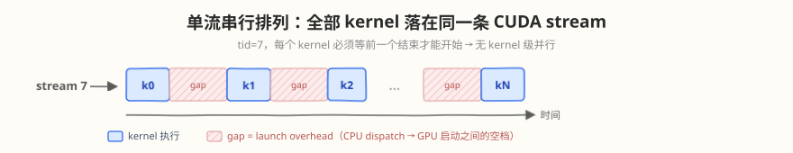
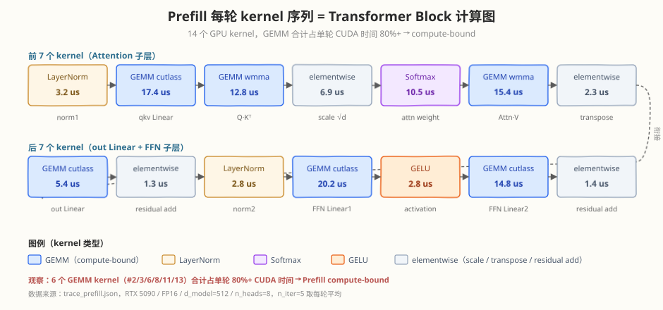
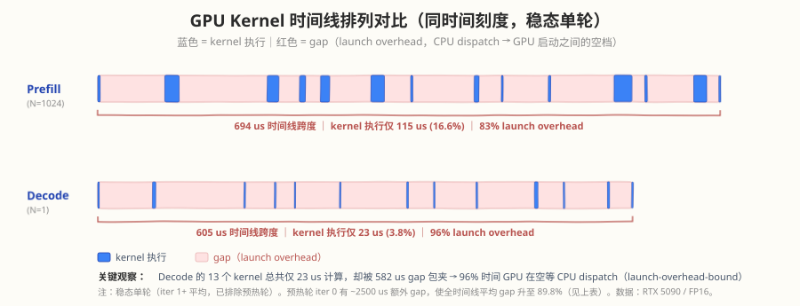

# Week 3 Day 1 — Transformer 推理流程 Profiling

> 对应 [Week 3 Day 1 晚间编程任务 + 练习题 2/3](../../week3/day1/README.md)

Day 1 的 profiling 有三个层次：torch.profiler（算子级）→ nsys（系统级时间线）→ ncu（kernel 级指标）。

## 1. torch.profiler 分析（算子级时间分解）

```bash
make profile
# 或
python3 trace_transformer.py
```

**输出内容**：
- Prefill 阶段（N=1024）top 算子时间表 → GEMM 占 60%+（compute-bound）
- Decode 阶段（N=1）top 算子时间表 → GEMM 占比下降，softmax/layernorm 上升
- Latency 对比：Prefill 单 token vs Decode 单 token
- torch.compile 对比（kernel fusion 效果）
- Chrome trace 文件（`trace_prefill.json` / `trace_decode.json`）

### 分析任务清单

1. 找出 Prefill 阶段 CUDA 时间 top3 算子（预期 `aten::mm`）
2. 找出 Decode 阶段 CUDA 时间 top3 算子（GEMM 占比下降）
3. 计算 Prefill 单 token 时间 vs Decode 单 token 时间
4. 在 Chrome trace 中观察 kernel 间隙（gap = launch overhead）

### GPU Kernel 时间线排列（Chrome trace 解析）

`trace_prefill.json` / `trace_decode.json` 是 `torch.profiler.export_chrome_trace` 导出的 Chrome trace（`chrome://tracing` 可加载）。下面解析其中的 GPU kernel 事件（`cat=kernel`），观察 **kernel 在时间线上的排列方式**。

> 采集环境：RTX 5090，FP16，d_model=512 / n_heads=8，`n_iter`：Prefill=5、Decode=10。

#### 1. 单流串行排列（无 kernel 级并行）

两个阶段的全部 kernel 都落在**同一条 CUDA stream**（`tid=7`）上，严格串行执行——每个 kernel 必须等前一个结束才能开始，没有 kernel 间的重叠/并行：



| 阶段 | kernel 总数 | 每轮 kernel 数 | 时间线跨度 | kernel 真正执行 | gap（launch overhead） |
|------|------------|---------------|-----------|----------------|----------------------|
| Prefill (N=1024) | 70 | 14 | 5650 us | 578 us (10.2%) | **5072 us (89.8%)** |
| Decode (N=1) | 130 | 13 | 6801 us | 233 us (3.4%) | **6568 us (96.6%)** |

> 关键：**整个时间线 90%+ 都是 gap**（CPU dispatch 一个 kernel 到 GPU 真正启动它之间的空档）。Decode 更极端——kernel 又小又多，96.6% 的时间 GPU 在"等下一个 kernel 被启动"，这是 launch-overhead-bound 的直接证据。

#### 2. 每轮 kernel 序列 = Transformer Block 计算图

每轮 forward 的 kernel 序列与模型计算图一一对应（Prefill 14 个 / Decode 13 个）。



**Prefill 每轮（14 kernels，compute-bound）**：

| # | kernel | 平均耗时 | 对应计算 |
|---|--------|---------|---------|
| 1 | LayerNorm | 3.2 us | norm1 |
| 2 | GEMM(cutlass tensorop) | 17.4 us | qkv Linear |
| 3 | GEMM(wmma) | 12.8 us | Q·Kᵀ |
| 4 | elementwise | 6.9 us | scale by √d |
| 5 | Softmax | 10.5 us | attn weight |
| 6 | GEMM(wmma) | 15.4 us | Attn·V |
| 7 | elementwise | 2.3 us | transpose+reshape |
| 8 | GEMM(cutlass) | 5.4 us | out Linear |
| 9 | elementwise | 1.3 us | residual add |
| 10 | LayerNorm | 2.8 us | norm2 |
| 11 | GEMM(cutlass) | 20.2 us | FFN Linear1 |
| 12 | GELU | 2.8 us | activation |
| 13 | GEMM(cutlass) | 14.8 us | FFN Linear2 |
| 14 | elementwise | 1.4 us | residual add |

GEMM（#2/3/6/8/11/13）合计占单轮 CUDA 时间的 **80%+**，符合 Prefill compute-bound 预期。

**Decode 每轮（13 kernels，memory / launch-overhead-bound）**：

| # | kernel | 平均耗时 | 对应计算 |
|---|--------|---------|---------|
| 1 | LayerNorm | 2.1 us | norm1 |
| 2 | gemv | 3.7 us | qkv Linear (M=1) |
| 3 | gemv | 1.6 us | Q·Kᵀ (M=1) |
| 4 | elementwise | 0.9 us | scale |
| 5 | Softmax | 1.0 us | attn weight |
| 6 | gemmk1 | 1.1 us | Attn·V (M=1) |
| 7 | gemv | 1.9 us | out Linear |
| 8 | elementwise | 1.1 us | residual add |
| 9 | LayerNorm | 1.9 us | norm2 |
| 10 | gemv | 3.7 us | FFN Linear1 |
| 11 | GELU | 0.9 us | activation |
| 12 | gemv | 2.6 us | FFN Linear2 |
| 13 | elementwise | 1.1 us | residual add |

同一组 Linear 在 Decode 下从 cutlass **GEMM 退化成 gemv**（M=1），耗时从 15-20 us 暴跌到 1-4 us——但这并非好事：算子变成访存密集，GPU SM 算力大量闲置。

#### 3. Launch overhead：kernel 越小越亏

| 指标 | Prefill | Decode |
|------|---------|--------|
| 单轮 kernel 执行总时间 | 116 us | 23 us |
| 单轮时间线跨度 | 1062 us | 613 us |
| 相邻 kernel 间 gap 中位数 | 51 us | 49 us |
| gap 占比 | 89% | **96%** |

相邻 kernel 间的 gap 中位数 ~50 us（CPU 端 dispatch 一个 op 的固有开销）。在 Prefill 里 kernel 平均 8 us、gap 压到 89%；在 Decode 里 kernel 平均仅 1.8 us，gap **27 倍于 kernel 本身**，96% 的时间线被 launch overhead 吃掉。

#### 4. 时间线排列示意图



#### 5. 排列方式带来的优化启示

1. **单流串行 = 无重叠**：当前全部 kernel 在一条 stream 上，CPU 串行 dispatch，GPU 与 CPU 间靠 launch gap 衔接。**多流（CUDA stream）+ 异步 launch** 可让 CPU 提前 dispatch 下一批 kernel，减少 GPU 空等。
2. **Decode 的 launch overhead 是首要瓶颈**：13 个 kernel 总共才 23 us 计算，却被 589 us gap 包夹。`torch.compile(mode="reduce-overhead")` 用 CUDA Graph 把整批 kernel 录制成图、一次性 replay，能消除绝大部分 launch gap——这正是练习 3 想验证的（本环境因 `duplicate template name` 失败，需在其它环境复现）。
3. **Kernel fusion 减少 kernel 数量**：14 个 kernel 中多个 `elementwise`（scale / transpose / residual add）可与相邻 GEMM / LayerNorm 融合，把 kernel 数从 14 降到 6-8，直接减少 6-8 个 ~50 us 的 launch gap。
4. **Prefill vs Decode 排列同构、耗时分布异构**：两者 kernel 序列同构（都是 Transformer Block 计算图），但 Prefill 是"GEMM 大、占主导"，Decode 是"gemv 小、gap 占主导"——同一模型在两阶段从 compute-bound 切换为 launch/memory-bound。

## 2. nsys 系统级时间线（练习 2）

```bash
make nsys           # 采集时间线
make nsys-stats     # 查看 kernel 统计
```

或手动运行：

```bash
nsys profile -o transformer_trace python3 trace_transformer.py
nsys stats -t cuda_gpu_kern_sum transformer_trace.nsys-rep
```

### nsys 观察要点

| 观察项 | Prefill 预期 | Decode 预期 | 含义 |
|--------|-------------|-------------|------|
| GEMM kernel 总时间占比 | > 60% | < 40% | Prefill GEMM 主导 |
| Softmax/LayerNorm 占比 | 10-20% | 30-50% | Decode 下相对上升 |
| kernel 间隙（gap） | < 10% | > 20% | Decode launch overhead 大 |
| SM 利用率（GUI 绿色 bar） | 高 | 低 | Decode memory-bound 的直观表现 |

## 3. ncu kernel 级分析

```bash
make ncu            # 分析所有关键 kernel
make ncu-gemm       # 只分析 GEMM kernel
make ncu-softmax    # 只分析 softmax kernel
```

### ncu 观察要点

| Kernel | 阶段 | sm__throughput 预期 | dram__throughput 预期 | 瓶颈类型 |
|--------|------|---------------------|----------------------|---------|
| GEMM (mm) | Prefill (N=1024) | **高**（>60%） | 中 | compute-bound |
| GEMM (mm) | Decode (N=1) | **低**（<20%） | **高**（>60%） | memory-bound |
| Softmax | 两阶段 | 低（<20%） | **高**（>60%） | memory-bound |
| LayerNorm | 两阶段 | 低（<20%） | **高**（>60%） | memory-bound |

### 关键洞察

1. **同一 GEMM kernel 在 Prefill/Decode 下瓶颈类型切换**：
   - Prefill：大矩阵 → AI 高 → compute-bound
   - Decode：M=1 → AI 极低 → memory-bound
2. **Softmax/LayerNorm 始终是 memory-bound**：与 M 无关，AI ≈ 0.4
3. **Decode 的 launch overhead 占比更大**：kernel 小而多，nsys 时间线中 gap 更明显

## 4. torch.compile 对比（练习 3）

`trace_transformer.py` 已内置 `torch.compile(model, mode="reduce-overhead")` 对比：

```python
compiled_model = torch.compile(model, mode="reduce-overhead")
```

**预期**：
- `torch.compile` 会融合 LayerNorm + GEMM 等相邻算子
- kernel 数量减少 30-50%
- Decode 阶段提升更明显（launch overhead 减少占比更大）

## 三层 Profiling 流程

```
① torch.profiler  →  找 top3 算子 + 算子级时间分解
② nsys             →  系统级时间线 + SM 利用率 + kernel 间隙
③ ncu              →  kernel 级 SM/DRAM throughput + stall reasons
```

> 💡 这三层是递进关系：torch.profiler 找"哪个算子慢"→ nsys 找"慢在时间线的哪里"→ ncu 找"为什么这个 kernel 慢"。
