# Week 1：GPU 执行本质 + Profiling

> 核心目标：建立 GPU 性能直觉 —— **性能 = Memory + 并行度**

| 项目 | 说明 |
|------|------|
| 前置要求 | 已安装 CUDA Toolkit 11.8+ / 12.x，Nsight Compute / Systems |
| 建议时长 | 每日 3~5 小时 |
| 本周产出 | 7 个 CUDA kernel、3+ Nsight Compute 报告、GPU 架构与性能笔记 |

---

## 🧭 本周学习地图


```
Day 1: GPU 执行模型（SM / Warp / SIMT）
        ↓
Day 2: Occupancy 与资源约束（寄存器 / 共享内存）
        ↓
Day 3: 源码分析 —— deviceQuery / occupancyCalculator
        ↓
Day 4: Memory Hierarchy（Global / Shared / Cache / Coalescing）
        ↓
Day 5: Bank Conflict 分析与 Padding 技巧
        ↓
Day 6: Nsight Profiling 实战（Compute + Systems）
        ↓
Day 7: 总结与复盘
```

---

## Day 1：GPU 执行模型基础

### 🎯 目标

通过今天的学习，你将：

1. 理解 GPU 与 CPU 在设计哲学上的根本差异
2. 掌握 SM、Warp、Grid、Block、Thread 的核心概念
3. 能独立写出并运行第一个 CUDA 程序
4. 理解 SIMT 执行模型及其对性能的影响
5. 学会计算线程总数、warp 数等基础指标

> 💡 **为什么重要**：GPU 执行模型是 AI Infra 的根基。后续所有 kernel 优化、推理系统调优，最终都回到 "硬件如何执行代码" 这个问题上。

---

### 学前导读：GPU 与 CPU 的不同

| 特性 | CPU | GPU |
|------|-----|-----|
| 核心数量 | 少（几到几十个） | 多（数千个） |
| 核心复杂度 | 复杂（大缓存、分支预测、乱序执行） | 简单（小缓存、顺序执行） |
| 设计目标 | 低延迟（Latency） | 高吞吐（Throughput） |
| 适合任务 | 串行、复杂逻辑 | 大规模并行计算 |
| 典型应用 | 操作系统、业务逻辑 | 深度学习、图形渲染、科学计算 |

#### 补充：如何理解 CPU 的低延迟 vs GPU 的高吞吐

表格里说 CPU 追求**低延迟（Latency）**，GPU 追求**高吞吐（Throughput）**。二者的核心区别可以概括为：

> **低延迟关心"一个任务多快做完"，高吞吐关心"一段时间内能做多少个任务"。**

更具体地说，**吞吐（Throughput）= 单位时间内完成的总工作量**。在 GPU 场景下常遇到三类吞吐指标：

| 指标 | 含义 | GPU 场景举例 |
|------|------|-------------|
| **计算吞吐** | 每秒完成的浮点运算次数 | TFLOPS（每秒万亿次浮点运算） |
| **内存吞吐** | 每秒读写的数据量 | GB/s（HBM/GDDR 带宽） |
| **任务吞吐** | 单位时间处理的任务数 | 每秒处理多少张图片、多少 token |

**形象类比**：

- **CPU 像跑车**：速度快、载的人少，适合紧急送一两个人（低延迟）。
- **GPU 像货运列车**：单辆车不快，但一次能拉几千节车厢，总体运量大（高吞吐）。

**为什么 GPU 能做到高吞吐？**

1. **核心数量多**：几千个 CUDA Core / Tensor Core 同时工作。
2. **核心简单**：去掉复杂分支预测、大缓存、乱序执行，省下的芯片面积用来堆更多核心。
3. **大量线程掩盖延迟**：当一个 warp 在等待内存数据时，warp scheduler 立刻换另一个 warp 执行，让计算单元尽量不空闲。

**一句话总结**：GPU 通过"人海战术"牺牲单线程延迟，换取整体吞吐量，所以适合深度学习这种大规模并行任务。

**关键洞察**：
- CPU 像一位经验丰富的教授，能快速处理复杂但数量不多的任务
- GPU 像一支庞大的学生队伍，每人只会做简单计算，但一起做能处理海量数据

AI 训练和推理中的矩阵运算、卷积、Attention 都是高度并行的，因此天然适合 GPU。

---

### 理论学习

#### 1.1 GPU 硬件层次总览

```
GPU
├── 多个 SM（Streaming Multiprocessor）
│   ├── CUDA Cores / Tensor Cores
│   ├── 寄存器文件（Register File）
│   ├── Shared Memory / L1 Cache
│   ├── Warp Scheduler
│   └── Load/Store 单元
├── L2 Cache（跨 SM 共享）
└── Global Memory（HBM / GDDR）
```

**SM 是 GPU 并行的基本单位**。一个 kernel 被切分为多个 block，每个 block 被分配到一个 SM 上执行。重要约束：
- 同一个 block **不能跨 SM**
- 一个 SM 可以同时执行多个 block
- 一个 SM 有硬件资源上限（寄存器、共享内存、最大 thread 数）

##### 为什么同一个 block 不能跨 SM？

因为 **block 是 GPU 资源共享和线程同步的基本单位，而这些资源都是 SM 私有的**。同一个 block 内的线程需要：

1. **共享同一块 Shared Memory**
2. **通过 `__syncthreads()` 直接同步**
3. **被同一个 Warp Scheduler 调度**

这三件事都只能在 **同一个 SM 内部** 完成，所以 block 不能被拆到不同 SM 上执行。

| 资源/机制 | 为什么必须在同一个 SM 内 |
|-----------|------------------------|
| **Shared Memory** | Shared Memory 是 SM 的私有片上内存，不同 SM 之间无法直接访问彼此的 Shared Memory。 |
| **`__syncthreads()`** | 这是 block 内所有线程的同步原语，依赖 SM 内部的硬件 barrier。跨 SM 同步没有这么轻量级的原语。 |
| **Warp Scheduler** | 一个 SM 内部有一个或多个 Warp Scheduler，负责调度该 SM 上的 warp。block 的 warp 必须归同一个 scheduler 管。 |
| **寄存器分配** | 每个 block 需要的寄存器总量需要在启动时从一个 SM 的寄存器文件里分配。 |
| **硬件调度粒度** | GPU 调度器以整个 block 为单位分配给 SM，这样设计最简单高效。 |

**形象类比**：把 **SM** 想象成一间教室，一个 **block** 就像一个班级。班级里的学生（threads）需要在**同一间教室**里上课，共用**同一块黑板**（Shared Memory），听**同一个老师**（Warp Scheduler）指挥。你不能让班级一半学生去 A 教室、另一半去 B 教室，否则他们没法共用黑板，也没法一起听讲。

**注意区分两个概念**：

| 说法 | 是否正确 |
|------|---------|
| 一个 block 不能跨 SM | ✅ 正确 |
| 一个 SM 只能运行一个 block | ❌ 错误。一个 SM 可以同时运行多个 block，只要资源（shared memory、寄存器、thread 数）够用。 |

> **一句话总结**：Block 是 SM 内部资源共享与同步的边界，因此同一个 block 的所有线程必须落在同一个 SM 上执行；但一个 SM 可以同时承载多个 block。

#### 1.2 SM 架构详解

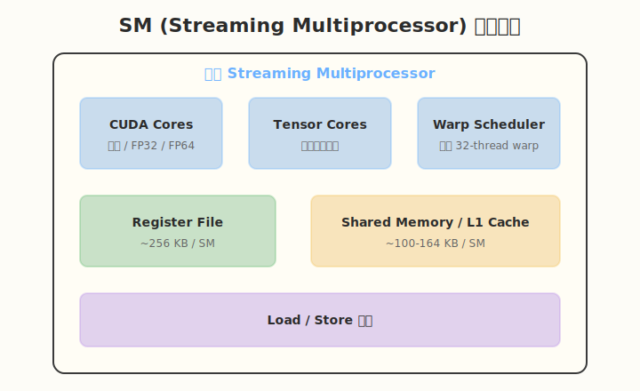

以 NVIDIA A100 为例：
- 108 个 SM
- 每个 SM：64 个 FP32 CUDA Cores、32 个 FP64 CUDA Cores、4 个 Tensor Core
- 每个 SM：256 KB 寄存器文件
- 每个 SM：最多 2048 个 thread / 64 个 warp / 32 个 block

**GPU 代际对比（A100 / H100 / H200）**：

| 指标 | A100 | H100 | H200 |
|------|------|------|------|
| 架构 | Ampere | Hopper | Hopper |
| 显存 | 80 GB HBM2e | 80 GB HBM3 | 141 GB HBM3e |
| 内存带宽 | ~2 TB/s | ~3.35 TB/s | ~4.8 TB/s |
| FP16 Tensor Core 算力 | 312 TFLOPS | 989 TFLOPS | 989 TFLOPS |
| SM 数量 | 108 | 132 | 132 |
| 典型场景 | 通用训练/推理 | 大规模训练 | 大模型推理、长上下文 |

**989 TFLOPS 是怎么算出来的？**

表格中 H100 / H200 的 **989 TFLOPS** 指的是 FP16 Tensor Core 峰值算力，且是启用了 **2:4 structured sparsity** 后的理论值。如果不启用稀疏化，dense 峰值为约 **495 TFLOPS**。

以 H100 SXM5 为例，计算方式如下：

```
峰值算力 = SM 数量 × 每 SM Tensor Core 数量
         × 每 Tensor Core 每周期 FMA 次数
         × 2（FMA 包含一次乘法和一次加法）
         × 时钟频率
         × 2（仅 sparse 峰值，利用 2:4 稀疏化带来的翻倍）
```

代入数值（以 sparse 峰值为例）：

| 参数 | 数值 |
|------|------|
| SM 数量 | 132 |
| 每 SM Tensor Core 数量 | 4 |
| 每 Tensor Core 每周期 FMA 次数 | 约 512 |
| FMA 折算操作数 | × 2 |
| 时钟频率 | 约 1.83 GHz |
| Structured Sparsity 翻倍 | × 2 |

```
132 × 4 × 512 × 2 × 1.83 × 10^9 × 2 ≈ 989 × 10^12 FLOPS = 989 TFLOPS
```

需要注意：

1. **这是理论峰值**，实际 kernel 能达到 50%–80% 已属优秀，受限于内存带宽、算子融合、warp divergence 等因素。
2. **稀疏化不是无条件翻倍**：2:4 structured sparsity 要求权重满足特定稀疏模式，且需要硬件和算法同时支持。
3. **FP8 峰值更高**：H100 / H200 在 FP8 精度下，sparse 峰值可达约 1979 TFLOPS，是大模型推理中常见的精度选择。

**H200 的核心价值不是算力翻倍，而是显存容量和带宽的大幅提升**。对于 LLM 推理，模型权重和 KV Cache 都占用大量显存，H200 的 141 GB 显存可以运行更大模型或支持更长上下文；同时更高的内存带宽能显著加速 memory-bound 的推理负载（如 Attention、采样阶段）。

**H200 的 SM 内部数据（Hopper 架构）**：

H200 与 H100 采用相同的 Hopper SM 设计，以 H200 为例：

- 132 个 SM
- 每个 SM：128 个 FP32 CUDA Cores、64 个 FP64 CUDA Cores、4 个 Fourth-Generation Tensor Core
- 每个 SM：256 KB 寄存器文件
- 每个 SM：最多 2048 个 thread / 64 个 warp / 32 个 block
- 每个 SM：最大 228 KB Shared Memory / L1 Cache（可配置）

与 A100 相比，Hopper 每个 SM 的 FP32 CUDA Core 数量从 64 提升到 128，Tensor Core 升级到第四代，支持 FP8 精度，矩阵乘加吞吐显著提高。

**Tensor Core** 是专门用于矩阵乘加的硬件单元，是现代深度学习算力的核心来源。

##### 核心概念对应关系：CUDA Core / Tensor Core / Thread / Warp / Block

理解 GPU 执行模型，关键是把**软件层面的线程组织**和**硬件层面的计算单元**对应起来：

| 概念 | 层级 | 作用 | 硬件/软件 |
|------|------|------|-----------|
| **CUDA Core** | 计算单元 | 执行标量 FP32/FP64/INT 运算，是 GPU 最基本的计算单元。 | 硬件 |
| **Tensor Core** | 计算单元 | 执行矩阵乘加（GEMM），如 D = A × B + C，是深度学习算力的主要来源。 | 硬件 |
| **Thread** | 软件执行单位 | CUDA 程序的最小执行单元，每个 thread 有独立的寄存器状态和指令地址。 | 软件 |
| **Warp** | 调度单位 | 32 个 thread 组成一个 warp，同一个 warp 内的线程被同一个 warp scheduler 调度，执行相同的指令。 | 硬件调度粒度 |
| **Block** | 协作单位 | 多个 warp 组成一个 block，block 内线程共享 Shared Memory，可通过 `__syncthreads()` 同步。 | 软件 |
| **Grid** | 启动单位 | 一个 kernel 启动的所有 block 组成 grid，覆盖整个计算任务。 | 软件 |
| **SM** | 执行引擎 | 一个 SM 包含多个 CUDA Core、Tensor Core、warp scheduler 和 Shared Memory，是 block 执行的物理载体。 | 硬件 |

**层次关系**：

```
Grid
 └── Block 0
 │    ├── Warp 0  (thread 0 ~ 31)
 │    ├── Warp 1  (thread 32 ~ 63)
 │    └── ...
 └── Block 1
      └── ...
```

**映射到硬件**：

- 一个 **thread** 最终映射到一个 **CUDA Core** 或 **Tensor Core** 上执行一次运算。
- 一个 **warp**（32 threads）被 **一个 warp scheduler** 同时发射执行，warp 内的线程共享指令流。
- 一个 **block** 被分配到 **一个 SM** 上执行，block 内的所有 warp 共享该 SM 的 Shared Memory 和寄存器文件。
- 一个 **grid** 由 GPU 根据可用 SM 数量动态调度执行。

**形象类比**：

- **Thread** = 一个工人
- **Warp** = 32 个工人组成的班组，必须同时做同一个动作
- **Block** = 一个车间（SM）内协同作业的所有工人班组，共用车间工具和黑板（Shared Memory）
- **Grid** = 整个工厂的所有车间共同完成的大订单
- **CUDA Core** = 工人的手，做具体计算
- **Tensor Core** = 专用机器，专门做矩阵乘法

#### 1.3 Warp 与 SIMT 执行模型

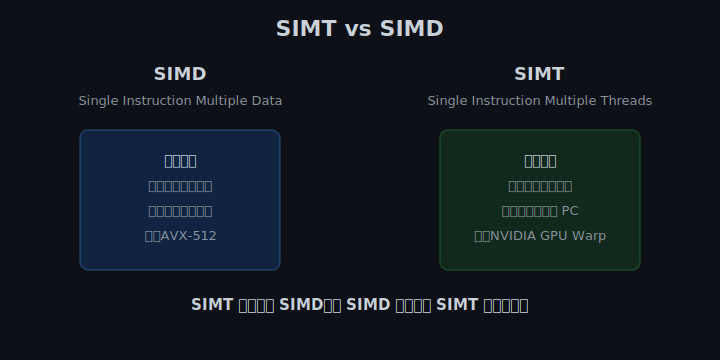

**SIMT（Single Instruction Multiple Threads）** 是 NVIDIA GPU 的执行方式：
- 一个 Warp 包含 32 个线程
- 同一个 Warp 内的 32 个线程执行**同一条指令**
- 但每个线程操作**不同的数据**（通过 threadIdx 区分）
- 每个线程有独立的寄存器状态和程序计数器

**SIMT vs SIMD**：
- SIMD：一条指令同时处理固定宽度的数据向量（如 AVX-512 一次处理 512 位数据）
- SIMT：一条指令同时被 32 个线程执行，每个线程可以有自己的数据地址和分支行为

> 你可以把 Warp 理解为 GPU 调度的"最小部队"，一个班 32 个人，必须做同一个动作，但每个人处理自己的一份数据。

#### 1.4 Warp Divergence（分支发散）

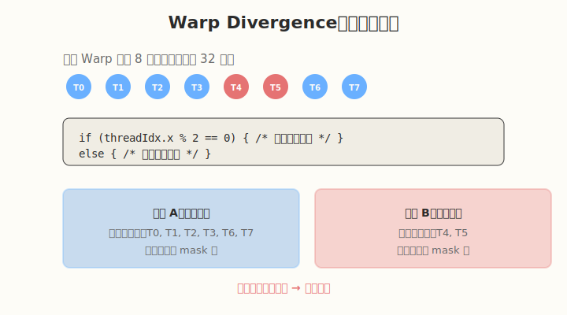

当 Warp 内线程遇到条件分支时：

```cuda
if (threadIdx.x % 2 == 0) {
    // 路径 A
} else {
    // 路径 B
}
```

Warp 会先执行路径 A（偶数线程工作，奇数线程被 mask 掉），再执行路径 B（奇数线程工作，偶数线程被 mask 掉）。这导致：
- 两条路径**串行执行**
- 有效算力减半
- 性能下降

**如何避免**：
- 尽量让相邻线程走相同分支
- 使用 warp-level primitive（如 `__ballot_sync`）处理分支
- 数据布局设计时考虑 warp 访问模式

#### 1.5 Grid / Block / Thread 层次结构

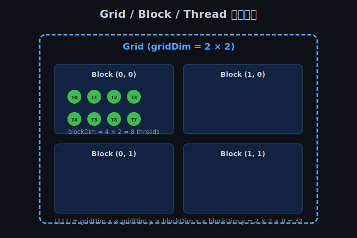

##### 什么是 Block？

**Block（线程块）** 是 GPU 上能够协同执行的一组线程的集合。一个 block 内的线程具有以下特征：

- **共享资源**：block 内的所有线程共享同一块 **Shared Memory**，访问速度远快于全局内存。
- **可以同步**：block 内的线程可以通过 `__syncthreads()` 进行全局同步，确保所有线程都到达某一点后再继续执行。
- **独立执行**：不同 block 之间无法直接共享 Shared Memory，也不能直接同步，彼此独立执行。
- **被分配到一个 SM**：启动 kernel 时，整个 block 会被调度到一个 SM 上执行，不能跨 SM。

**为什么需要 Block？**

GPU 把海量线程组织成 block，主要目的是：

1. **数据局部性**：block 内的线程可以复用 Shared Memory 中的数据，减少全局内存访问。
2. **协作能力**：block 内的线程可以相互配合，例如共同完成一个 tile 的矩阵乘法。
3. **可扩展性**：block 之间互不依赖，GPU 可以根据可用 SM 数量动态调度 block，实现任意规模的并行。

**Block 的硬件限制（以 NVIDIA A100 为例）**：

| 资源 | 每 SM 上限 |
|------|-----------|
| 最大 thread 数 | 2048 |
| 最大 warp 数 | 64 |
| 最大 block 数 | 32 |
| 寄存器文件 | 256 KB |
| Shared Memory | 最多 164 KB（可配置）|

这些限制决定了单个 block 的大小不能无限大。例如，一个 block 有 1024 个线程，每个线程用 64 个寄存器，则寄存器总量为 64 KB，仍在 SM 的 256 KB 寄存器文件内；但如果每个线程用 256 个寄存器，则一个 block 就需要 256 KB，一个 SM 同时就只能跑这一个 block。

**如何选择 block 大小？**

常见的选择原则：

- **warp 的整数倍**：block 内线程数最好是 32 的倍数（一个 warp 32 线程），避免最后一个 warp 出现无效线程。
- **常见配置**：128、256、512、1024 都是常用选择。
- **考虑资源占用**：线程数越多，每个 SM 能同时运行的 block 数越少；线程数太少，可能无法充分利用 SM 的 warp scheduler。
- **考虑算法需求**：如果 kernel 需要大量 Shared Memory 协作，block 太小会导致并行度不足；block 太大可能超过 SM 资源限制。

> **一句话总结**：Block 是 GPU 上"能共享资源、能相互同步、一起被调度到一个 SM"的线程集合，是连接软件并行逻辑与硬件执行资源的关键层次。

CUDA 使用三级层次组织并行：

```
Grid  -> 多个 Block
Block -> 多个 Thread
Thread -> 实际执行的线程
```

**关键内置变量**：

| 变量 | 含义 | 维度 |
|------|------|------|
| `gridDim` | Grid 中 block 的数量 | (x, y, z) |
| `blockDim` | Block 中 thread 的数量 | (x, y, z) |
| `blockIdx` | 当前 block 在 grid 中的坐标 | (x, y, z) |
| `threadIdx` | 当前 thread 在 block 中的坐标 | (x, y, z) |

**线程 ID 计算**：

1D grid + 1D block：
```cuda
int global_tid = blockIdx.x * blockDim.x + threadIdx.x;
```

2D grid + 2D block（常用于图像处理）：
```cuda
int row = blockIdx.y * blockDim.y + threadIdx.y;
int col = blockIdx.x * blockDim.x + threadIdx.x;
int global_tid = row * (gridDim.x * blockDim.x) + col;
```

**总线程数计算**：
```
total = gridDim.x * gridDim.y * gridDim.z *
        blockDim.x * blockDim.y * blockDim.z
```

**Warp 数计算**：
```
warps_per_block = ceil(blockDim.x * blockDim.y * blockDim.z / 32)
total_warps = warps_per_block * gridDim.x * gridDim.y * gridDim.z
```

#### 1.6 常用 CUDA Runtime API

| API | 作用 |
|-----|------|
| `cudaMalloc(&ptr, size)` | 在 GPU 上分配内存 |
| `cudaFree(ptr)` | 释放 GPU 内存 |
| `cudaMemcpy(dst, src, size, kind)` | 在 CPU/GPU 之间拷贝数据 |
| `cudaDeviceSynchronize()` | 等待所有 kernel 执行完成 |
| `cudaGetDeviceProperties(&prop, dev)` | 查询 GPU 属性 |

数据拷贝方向 `kind`：
- `cudaMemcpyHostToDevice`：CPU → GPU
- `cudaMemcpyDeviceToHost`：GPU → CPU
- `cudaMemcpyDeviceToDevice`：GPU → GPU

---

### Coding 任务：第一个 CUDA 程序

#### 任务 1：hello_gpu.cu

创建文件 `kernels/hello_gpu.cu`：

```cuda
#include <stdio.h>

// __global__ 表示这是一个 CUDA kernel，可以从 CPU 调用，在 GPU 上执行
__global__ void hello_gpu() {
    // 计算全局线程 ID（1D 情况）
    int global_tid = blockIdx.x * blockDim.x + threadIdx.x;

    printf("block=(%d,%d,%d), thread=(%d,%d,%d), global_tid=%d\n",
           blockIdx.x, blockIdx.y, blockIdx.z,
           threadIdx.x, threadIdx.y, threadIdx.z,
           global_tid);
}

int main() {
    // 定义 grid 和 block 大小
    dim3 grid(2, 2, 1);   // 2x2 = 4 个 block
    dim3 block(4, 2, 1);  // 每个 block 8 个 thread

    printf("Launching kernel: grid=(%d,%d,%d), block=(%d,%d,%d)\n",
           grid.x, grid.y, grid.z,
           block.x, block.y, block.z);
    printf("Total threads: %d\n",
           grid.x * grid.y * grid.z * block.x * block.y * block.z);

    // 启动 kernel：<<<grid, block>>>
    hello_gpu<<<grid, block>>>();

    // 等待 GPU 完成，否则 printf 输出可能不完整
    cudaDeviceSynchronize();

    return 0;
}
```

#### 任务 2：编译与运行

```bash
# 编译
nvcc -o hello_gpu kernels/hello_gpu.cu

# 运行
./hello_gpu
```

**预期输出**：
```
Launching kernel: grid=(2,2,1), block=(4,2,1)
Total threads: 32
block=(0,0,0), thread=(0,0,0), global_tid=0
block=(0,0,0), thread=(1,0,0), global_tid=1
...
```

> ⚠️ **注意**：如果没有 `cudaDeviceSynchronize()`，kernel 中的 `printf` 可能来不及输出程序就结束了。

#### 任务 3：验证线程总数

手动计算：
```
grid  = (2, 2, 1)  → 4 blocks
block = (4, 2, 1)  → 8 threads/block
total = 4 × 8 = 32 threads
warps = ceil(8 / 32) × 4 = 1 × 4 = 4 warps
```

检查程序输出是否与你计算的一致。

---

### 扩展实验

#### 实验 1：不同 grid/block 配置

修改 `dim3 grid(...)` 和 `dim3 block(...)`，观察输出：

| grid | block | 总线程数 | warp 数 |
|------|-------|---------|--------|
| (1,1,1) | (32,1,1) | 32 | 1 |
| (2,1,1) | (16,1,1) | 32 | 1 |
| (2,2,1) | (16,16,1) | 1024 | 32 |
| (4,1,1) | (256,1,1) | 1024 | 32 |
| (1,1,1) | (1024,1,1) | 1024 | 32 |

**思考问题**：
1. 为什么 block 大小通常取 32 的倍数？
   - 因为 warp 大小是 32，非 32 倍数会造成最后一个 warp 资源浪费。
2. 为什么 block 最大 thread 数一般为 1024？
   - 这是 GPU 硬件限制，由 `maxThreadsPerBlock` 决定。
3. 输出顺序有什么规律？
   - block 执行顺序不保证，同一个 block 内 thread 执行顺序也不保证。

#### 实验 2：2D 线程 ID 计算

实现一个 2D 版本的 kernel，计算每个线程的 2D 全局坐标：

```cuda
__global__ void hello_gpu_2d() {
    int row = blockIdx.y * blockDim.y + threadIdx.y;
    int col = blockIdx.x * blockDim.x + threadIdx.x;
    int width = gridDim.x * blockDim.x;
    int global_tid = row * width + col;

    printf("row=%d, col=%d, global_tid=%d\n", row, col, global_tid);
}
```

使用 `dim3 grid(2, 2)` 和 `dim3 block(4, 4)` 启动，验证 global_tid 是否连续。

#### 实验 3：线程数上限探索

尝试以下配置，观察是否能编译运行：
- `block(1024, 1, 1)` ✓
- `block(1024, 2, 1)` ✗（超过 1024 threads/block）
- `grid(100000, 1, 1)` ✓（grid 维度很大时通常也可以）

---

### 常见错误与调试

| 错误 | 原因 | 解决方法 |
|------|------|---------|
| 没有任何输出 | 缺少 `cudaDeviceSynchronize()` | 在 main 末尾添加 |
| `invalid configuration argument` | block 内线程数超过 1024 | 减小 block 大小 |
| 输出顺序混乱 | CUDA 不保证 block/thread 执行顺序 | 不要依赖执行顺序 |
| 编译错误 `__global__` 未识别 | 用 `.cu` 后缀，用 `nvcc` 编译 | 检查文件后缀和编译器 |

**调试技巧**：
- 先用少量线程（如 1 个 block，8 个 thread）测试
- 使用 `printf` 输出 thread 坐标和中间结果
- 确认 `cudaDeviceSynchronize()` 后再检查输出

---

### 验证 Checklist

- [ ] 能独立编译并运行 `hello_gpu.cu`
- [ ] kernel 能正确打印所有 thread 的坐标
- [ ] 理解 block 内 thread 数量与 warp 数量的关系：`warps = ceil(threads / 32)`
- [ ] 能计算一个 kernel launch 的总 thread 数
- [ ] 能解释 SIMT 与 SIMD 的区别
- [ ] 能解释什么是 warp divergence 以及如何避免
- [ ] 完成至少 2 组不同的 grid/block 配置实验

---

### 今日总结

Day 1 我们建立了 GPU 执行模型的基础认知：

1. **GPU 是吞吐导向的并行处理器**，与 CPU 的设计哲学不同
2. **SM 是 GPU 并行的基本单位**，包含 CUDA Core、Tensor Core、寄存器、共享内存等
3. **Warp 是调度基本单位**，一个 warp 32 个线程执行 SIMT
4. **分支发散会降低性能**，因为 warp 内不同分支需要串行执行
5. **Grid/Block/Thread 三级层次** 组织 CUDA 并行
6. **第一个 CUDA 程序** 让我们直观感受到线程的并行执行

掌握这些概念后，你才能理解为什么某些 CUDA 代码写得好、某些写得慢。

---

### 面试要点

1. **什么是 SIMT？与 SIMD 的区别？**
   - SIMT：Single Instruction Multiple Threads，32 个线程执行同一条指令，但各自处理不同数据
   - SIMD：Single Instruction Multiple Data，一条指令同时处理固定宽度的数据向量
   - SIMT 可以处理分支（虽然有 divergence 代价），SIMD 分支处理更困难

2. **Warp divergence 是什么？如何避免？**
   - 同一个 warp 内线程走不同分支，需要串行执行各分支
   - 避免方法：让相邻线程走相同分支、使用 warp-level primitive

3. **一个 block 最多多少 thread？为什么？**
   - 通常为 1024
   - 这是 GPU 硬件限制，由 `maxThreadsPerBlock` 决定

4. **如何计算一个 kernel 的总 thread 数？**
   - `gridDim.x * gridDim.y * gridDim.z * blockDim.x * blockDim.y * blockDim.z`

5. **CUDA 中 `__global__` 和 `__device__` 的区别？**
   - `__global__`：CPU 调用，GPU 执行（kernel 函数）
   - `__device__`：GPU 调用，GPU 执行（设备端辅助函数）

---

## Day 2：Occupancy 与资源约束

### 🎯 目标

通过今天的学习，你将：

1. 深入理解 Occupancy 的定义和物理意义
2. 掌握影响 Occupancy 的三大资源约束：寄存器、共享内存、block 大小
3. 学会使用 `cudaFuncGetAttributes` 获取 kernel 资源使用情况
4. 理解 register spilling 的危害和检测方法
5. 学会使用 `__launch_bounds__` 控制寄存器使用
6. 能用 CUDA Occupancy Calculator 计算理论 occupancy

> 💡 **为什么重要**：Day 1 知道了 GPU 如何执行代码，Day 2 要知道 GPU **能同时执行多少**代码。Occupancy 决定了 GPU 隐藏延迟的能力，是 kernel 调优的核心指标之一。

---

### 学前导读：为什么需要 Occupancy

GPU 执行指令时存在大量**延迟**：
- Global memory 访问：~400-800 cycles
- Shared memory 访问：~20-30 cycles
- 指令依赖、同步等也会带来延迟

如果 SM 上只驻留很少的 warp，当一个 warp 因为等待内存而停顿时，SM 可能没有别的 warp 可以切换执行，计算单元就会空转。

**Occupancy 衡量的是 SM 上同时活跃的 warp 数量占最大能力的比例**。更高的 occupancy 意味着有更多的 warp 可以轮换执行，从而更好地隐藏延迟。

但注意：**100% occupancy 不等于 100% 性能**。当 occupancy 足够高时（如 50% 以上），再提升 occupancy 的收益会递减，因为此时瓶颈可能在别的地方（如内存带宽、计算吞吐量）。

---

### 理论学习

#### 2.1 Occupancy 定义


```
Occupancy = Active Warp 数量 / SM 支持的最大 Warp 数量
```

**举例**：
- 假设一个 SM 最多支持 32 个 active warp
- 当前 kernel 让每个 SM 上驻留了 16 个 active warp
- 则 Occupancy = 16 / 32 = 50%

**关键认知**：
- Occupancy 是 **per-SM** 的概念
- 它描述的是资源利用率，不是直接的速度
- 低 occupancy 意味着 GPU 可能没有足够的 warp 来隐藏延迟

#### 2.2 影响 Occupancy 的三大资源约束


每个 SM 的资源是有限的，任一资源耗尽都会限制 occupancy：

| 资源 | 典型限制 | 影响 |
|------|---------|------|
| 寄存器文件 | ~256 KB / SM | 每个线程用的寄存器越多，同时驻留的线程越少 |
| 共享内存 | ~100-164 KB / SM | 每个 block 用的共享内存越多，同时驻留的 block 越少 |
| Block / Warp 数量 | 最大 block/SM、最大 warp/SM | block 太大或数量太多会触顶 |

**A100 具体参数示例**：
- 每个 SM 最大 warp 数：32
- 每个 SM 最大线程数：2048
- 每个 SM 最大 block 数：32
- 每个 SM 寄存器文件：256 KB
- 每个 SM 共享内存：最多 164 KB（可配置）

#### 2.3 寄存器分配与 Register Spilling


**寄存器分配规则**：
- 编译器根据 kernel 代码自动决定每个线程使用多少寄存器
- 寄存器文件总量 / 每个线程寄存器用量 = 最大同时线程数

**Register Spilling（寄存器溢出）**：
- 当编译器发现寄存器不够用时，会把一些变量放到 **local memory**
- Local memory 实际上在 **global memory** 中
- 访问延迟从 ~1 cycle 变成 ~400-800 cycles
- 性能会急剧下降

**如何检测 spilling**：

```bash
nvcc -Xptxas -v kernels/your_kernel.cu
```

输出中的 `lmem` 就是 local memory 使用量。如果 `lmem > 0`，说明发生了 spilling。

#### 2.4 Occupancy 与性能的关系


- **低 occupancy 区**：性能随 occupancy 提升明显，因为能更好地隐藏延迟
- **高 occupancy 区**：性能趋于平缓，此时瓶颈可能是内存带宽或计算吞吐量
- **经验法则**：不必盲目追求 100%，通常 50%-70% 以上就已经足够好

#### 2.5 `__launch_bounds__`

`__launch_bounds__` 是给编译器的提示，帮助它在寄存器使用和 occupancy 之间做权衡：

```cuda
__launch_bounds__(maxThreadsPerBlock, minBlocksPerMultiprocessor)
__global__ void my_kernel(...) { ... }
```

**作用**：
- 告诉编译器最大 block 大小
- 告诉编译器每个 SM 上至少要有多少个 block
- 编译器会根据这些约束分配寄存器，尽量满足 occupancy 要求

**代价**：
- 限制寄存器可能导致 spilling
- 或者编译器被迫使用更少的优化

---

### Coding 任务：测量 Occupancy

#### 任务 1：基础版 occupancy_test.cu

创建文件 `kernels/occupancy_test.cu`：

```cuda
#include <cuda_runtime.h>
#include <stdio.h>

__global__ void compute_intensive(const float* in, float* out, int n) {
    int idx = blockIdx.x * blockDim.x + threadIdx.x;
    float acc = 0.0f;

    // 展开循环，增加寄存器压力
    #pragma unroll 16
    for (int i = 0; i < n; ++i) {
        float v = in[(idx + i) % n];
        acc += v * v + 1.0f;
    }

    out[idx] = acc;
}

int main() {
    cudaFuncAttributes attr;
    cudaError_t err = cudaFuncGetAttributes(&attr, compute_intensive);
    if (err != cudaSuccess) {
        printf("Error: %s\n", cudaGetErrorString(err));
        return 1;
    }

    printf("=== Kernel Attributes ===\n");
    printf("Registers per thread: %d\n", attr.numRegs);
    printf("Shared memory per block: %zu bytes\n", attr.sharedSizeBytes);
    printf("Constant memory per block: %zu bytes\n", attr.constSizeBytes);
    printf("Local memory per thread: %zu bytes\n", attr.localSizeBytes);
    printf("Max threads per block: %d\n", attr.maxThreadsPerBlock);
    printf("=========================\n");

    // 运行一次以便 ncu 可以捕获
    const int N = 1 << 20;
    float *d_in, *d_out;
    cudaMalloc(&d_in, N * sizeof(float));
    cudaMalloc(&d_out, N * sizeof(float));

    int block_size = 256;
    int grid_size = (N + block_size - 1) / block_size;
    compute_intensive<<<grid_size, block_size>>>(d_in, d_out, 64);
    cudaDeviceSynchronize();

    cudaFree(d_in);
    cudaFree(d_out);
    return 0;
}
```

#### 任务 2：编译运行

```bash
# 编译
nvcc -o occupancy_test kernels/occupancy_test.cu

# 运行
./occupancy_test
```

**预期输出示例**：
```
=== Kernel Attributes ===
Registers per thread: 32
Shared memory per block: 0 bytes
Constant memory per block: 0 bytes
Local memory per thread: 0 bytes
Max threads per block: 1024
=========================
```

#### 任务 3：使用 ncu 查看 occupancy

```bash
ncu \
  --metrics \
    sm__occupancy.avg.pct_of_peak_sustained_elapsed,\
    sm__warps_active.avg.pct_of_peak_sustained_elapsed,\
    launch__registers_per_thread \
  ./occupancy_test
```

**关键指标解释**：
- `sm__occupancy.avg.pct_of_peak_sustained_elapsed`：实际 occupancy 百分比
- `launch__registers_per_thread`：每个线程的寄存器数

---

### 扩展实验

#### 实验 1：改变寄存器用量观察 occupancy 变化

创建三个版本的 kernel：

**版本 A：基础版**
```cuda
__global__ void version_a(const float* in, float* out, int n) {
    int idx = blockIdx.x * blockDim.x + threadIdx.x;
    float acc = 0.0f;
    for (int i = 0; i < n; ++i) {
        acc += in[(idx + i) % n];
    }
    out[idx] = acc;
}
```

**版本 B：增加局部变量**
```cuda
__global__ void version_b(const float* in, float* out, int n) {
    int idx = blockIdx.x * blockDim.x + threadIdx.x;
    float a = 0.0f, b = 0.0f, c = 0.0f, d = 0.0f;
    float e = 0.0f, f = 0.0f, g = 0.0f, h = 0.0f;
    for (int i = 0; i < n; ++i) {
        float v = in[(idx + i) % n];
        a += v; b += v * 2; c += v * 3; d += v * 4;
        e += v * 5; f += v * 6; g += v * 7; h += v * 8;
    }
    out[idx] = a + b + c + d + e + f + g + h;
}
```

**版本 C：使用 launch_bounds 强制限制**
```cuda
__launch_bounds__(256, 4)
__global__ void version_c(const float* in, float* out, int n) {
    // 与 version_b 相同代码
}
```

记录结果：

| 版本 | 寄存器/线程 | 理论 Occupancy | 实际 Occupancy | 是否 Spilling |
|------|------------|---------------|---------------|--------------|
| A | | | | |
| B | | | | |
| C | | | | |

#### 实验 2：用 CUDA Occupancy Calculator 验证

打开 CUDA Occupancy Calculator（Excel 文件，通常在 CUDA Samples 中），输入：
- CUDA Capability
- Block size
- Registers per thread
- Shared memory per block

对比理论 occupancy 和 ncu 测得的实际 occupancy。

#### 实验 3：检测 Register Spilling

用以下命令编译版本 B：

```bash
nvcc -Xptxas -v -o occupancy_test_b kernels/occupancy_test_b.cu
```

观察输出中是否有 `lmem`（local memory）非零。

如果看到类似：
```
ptxas info    : 0 bytes gmem
ptxas info    : Compiling entry function 'version_b' for 'sm_80'
ptxas info    : Function properties for version_b
    0 bytes stack frame, 0 bytes spill stores, 0 bytes spill loads
```

`spill stores/loads` 为 0 表示没有 spilling。

---

### 常见错误与调试

| 问题 | 原因 | 解决 |
|------|------|------|
| Occupancy 很低 | 寄存器使用过多 | 减少局部变量，或使用 `__launch_bounds__` |
| 性能反而下降 | `__launch_bounds__` 导致 spilling | 放宽 launch_bounds，或优化算法 |
| ncu 看不到 occupancy | 指标名称写错 | 使用 `sm__occupancy.avg.pct_of_peak_sustained_elapsed` |
| `cudaFuncGetAttributes` 返回错误 | kernel 名称写错 | 直接传函数名，不要加括号 |

---

### 验证 Checklist

- [ ] 能用 `cudaFuncGetAttributes` 获取寄存器使用量
- [ ] 理解为什么寄存器过多会降低 occupancy
- [ ] 能手动计算一个 kernel 的理论 occupancy
- [ ] 记录不同配置下的 occupancy 变化表
- [ ] 了解 CUDA Occupancy Calculator 的使用
- [ ] 能检测 register spilling
- [ ] 理解 `__launch_bounds__` 的使用场景和代价

---

### 今日总结

Day 2 我们深入理解了 GPU 的并行度：

1. **Occupancy = Active Warp / Max Warp per SM**，衡量 SM 上 warp 的活跃程度
2. **三大资源约束**：寄存器文件、共享内存、block/warp 数量上限
3. **寄存器过多** 会降低 occupancy，因为每个线程占用更多资源
4. **Register spilling** 会把变量放到 global memory，性能急剧下降
5. **`__launch_bounds__`** 可以强制编译器在寄存器和 occupancy 之间做权衡
6. **不必追求 100% occupancy**，通常足够高即可

掌握这些后，你就能分析一个 kernel 的资源使用情况，并判断它是否受 occupancy 限制。

---

### 面试要点

1. **Occupancy 越高越好吗？为什么？**
   - 不是。低 occupancy 会限制延迟隐藏能力，但当 occupancy 足够高后（如 50% 以上），继续提升收益递减。
   - 此时瓶颈可能在内存带宽、计算吞吐量或算法本身。

2. **寄存器 spilling 是怎么发生的？如何检测？**
   - 当编译器无法为所有变量分配寄存器时，会把部分变量放到 local memory（实际在 global memory）。
   - 检测方法：`nvcc -Xptxas -v` 查看 `lmem` 或 `spill stores/loads`。

3. **`__launch_bounds__` 的使用场景？**
   - 当 kernel 寄存器使用过多导致 occupancy 过低时，可以用它提示编译器限制寄存器。
   - 代价是可能导致 spilling 或更少的编译优化。

4. **影响 occupancy 的因素有哪些？**
   - 每个线程的寄存器数量
   - 每个 block 的共享内存数量
   - Block 大小和每个 SM 的 block 数量上限

5. **如何计算理论 occupancy？**
   - 使用 CUDA Occupancy Calculator
   - 或手动：根据 SM 资源限制，计算最多能同时驻留多少个 warp

---

## Day 3：源码分析 —— CUDA 官方 Samples

### 🎯 目标

通过今天的学习，你将：

1. 学会查找和运行 CUDA 官方 Samples
2. 掌握 `deviceQuery` 输出中每个字段的含义
3. 学会使用 `cudaGetDeviceProperties` 查询 GPU 属性
4. 掌握 CUDA Occupancy Calculator 的使用方法
5. 了解 CUDA C Programming Guide 第 5 章的核心内容
6. 能根据 GPU 参数计算峰值算力和显存带宽

> 💡 **为什么重要**：官方 Samples 是理解 GPU 硬件的"标准答案"。Day 1 和 Day 2 学的是概念，今天要用官方工具验证这些概念，并把你的 GPU 参数变成具体的数字。

---

### 学前导读：为什么要读官方代码

CUDA 官方提供了大量示例代码，它们不仅是学习材料，更是**最佳实践**。通过阅读官方代码，你可以：
- 了解 NVIDIA 推荐的编程模式
- 学习如何正确查询硬件属性
- 理解官方如何计算 occupancy
- 避免自己"重复造轮子"

今天的重点是**阅读和理解**，不是写大量代码。但你需要动手运行这些示例，把输出和你的 GPU 对应起来。

---

### 理论学习

#### 3.1 CUDA Samples 目录结构

CUDA Toolkit 安装后，Samples 通常位于以下位置之一：

```bash
# CUDA 11.x 及以前
/usr/local/cuda/samples/

# CUDA 12.x 可能的位置
/usr/local/cuda/extras/demo_suite/
```

如果找不到，可以用以下命令搜索：

```bash
find /usr/local/cuda -name "deviceQuery" 2>/dev/null
find / -name "deviceQuery" 2>/dev/null | head -5
```

常见 Samples 分类：

```
cuda/samples/
├── 0_Introduction/          # 入门示例
├── 1_Utilities/             # 工具类（deviceQuery, bandwidthTest 等）
├── 2_Concepts_and_Techniques/  # 技术概念
├── 3_CUDA_Features/         # CUDA 特性
├── 4_CUDA_Libraries/        # CUDA 库
└── 5_Simulations/           # 物理模拟
```

#### 3.2 deviceQuery 源码分析

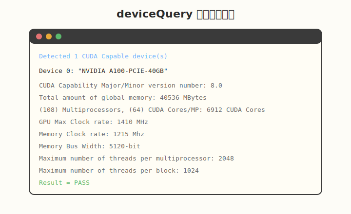

`deviceQuery` 的核心代码非常简单，只有两行：

```cuda
cudaGetDeviceCount(&deviceCount);
cudaGetDeviceProperties(&prop, dev);
```

但它输出的信息非常丰富。下面是重点字段的详细解释：

##### 基础信息

| 字段 | 含义 | 用途 |
|------|------|------|
| `name` | GPU 型号名称 | 如 "NVIDIA A100-PCIE-40GB" |
| `totalGlobalMem` | 全局显存总字节数 | 判断能加载多大的模型/数据 |
| `multiProcessorCount` | SM 数量 | 计算峰值算力 |
| `warpSize` | Warp 大小 | 通常为 32 |

##### 并行能力限制

| 字段 | 含义 | 用途 |
|------|------|------|
| `maxThreadsPerBlock` | 每个 block 最大线程数 | 通常为 1024 |
| `maxThreadsPerMultiProcessor` | 每个 SM 最大线程数 | A100 为 2048 |
| `maxBlocksPerMultiProcessor` | 每个 SM 最大 block 数 | A100 为 32 |
| `maxGridSize` | Grid 最大维度 | 决定能启动多少 block |

##### 内存相关

| 字段 | 含义 | 用途 |
|------|------|------|
| `sharedMemPerBlock` | 每个 block 最大共享内存 | Tiling 大小设计 |
| `sharedMemPerMultiprocessor` | 每个 SM 最大共享内存 | Occupancy 计算 |
| `regsPerBlock` | 每个 block 最大寄存器数 | 资源约束 |
| `memoryClockRate` | 显存时钟频率 | 计算显存带宽 |
| `memoryBusWidth` | 显存位宽 | 计算显存带宽 |

##### 计算能力

| 字段 | 含义 | 用途 |
|------|------|------|
| `major` / `minor` | 计算能力版本 | 决定可用的 CUDA 特性 |
| `clockRate` | GPU 核心频率 | 计算峰值算力 |
| `pciBusID` / `pciDeviceID` | PCI 总线信息 | 多 GPU 时区分设备 |

#### 3.3 自己写一个 mini deviceQuery

除了运行官方示例，你也可以自己写一个简化版：

```cuda
#include <cuda_runtime.h>
#include <stdio.h>

int main() {
    int deviceCount;
    cudaGetDeviceCount(&deviceCount);
    printf("Detected %d CUDA device(s)\n\n", deviceCount);

    for (int dev = 0; dev < deviceCount; ++dev) {
        cudaDeviceProp prop;
        cudaGetDeviceProperties(&prop, dev);

        printf("Device %d: %s\n", dev, prop.name);
        printf("  Compute Capability: %d.%d\n", prop.major, prop.minor);
        printf("  Total Global Memory: %.2f GB\n", prop.totalGlobalMem / (1024.0 * 1024 * 1024));
        printf("  Number of SMs: %d\n", prop.multiProcessorCount);
        printf("  Warp Size: %d\n", prop.warpSize);
        printf("  Max Threads per Block: %d\n", prop.maxThreadsPerBlock);
        printf("  Max Threads per SM: %d\n", prop.maxThreadsPerMultiProcessor);
        printf("  Max Blocks per SM: %d\n", prop.maxBlocksPerMultiProcessor);
        printf("  Shared Memory per Block: %zu KB\n", prop.sharedMemPerBlock / 1024);
        printf("  Registers per Block: %d\n", prop.regsPerBlock);
        printf("  Memory Clock Rate: %.0f MHz\n", prop.memoryClockRate / 1000.0);
        printf("  Memory Bus Width: %d bits\n", prop.memoryBusWidth);
        printf("  GPU Clock Rate: %.0f MHz\n\n", prop.clockRate / 1000.0);
    }

    return 0;
}
```

编译运行：

```bash
nvcc -o mini_device_query mini_device_query.cu
./mini_device_query
```

#### 3.4 CUDA Occupancy Calculator


CUDA Occupancy Calculator 是一个 Excel 工具，可以计算理论 occupancy。它通常位于：

```bash
/usr/local/cuda/tools/CUDA_Occupancy_Calculator.xls
```

或者在 NVIDIA 官网下载最新版。

**使用步骤**：
1. 输入 GPU 的 Compute Capability
2. 输入 Kernel 的参数：
   - Threads per block
   - Registers per thread
   - Shared memory per block
3. 读取结果：
   - Active Warps per SM
   - Occupancy (%)
   - Active Blocks per SM
   - 哪个资源是瓶颈

**示例**：
- GPU：A100 (Compute Capability 8.0)
- Block size：256 threads
- Registers per thread：64
- Shared memory per block：0

计算结果会显示：
- 理论 Occupancy：50%
- 瓶颈资源：Registers per thread

#### 3.5 CUDA C Programming Guide 第 5 章

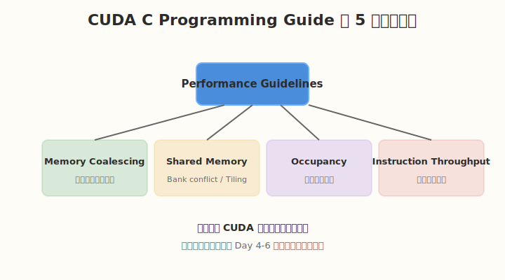

CUDA C Programming Guide 第 5 章（Performance Guidelines）是 CUDA 性能优化的核心章节。重点包括：

##### 5.1 Memory Coalescing（内存合并访问）
- 一个 warp 内线程访问连续地址时，合并为少量事务
- 非连续访问会导致多个事务，带宽利用率下降
- 这是 Day 4 的核心内容

##### 5.2 Shared Memory
- 共享内存比 global memory 快得多
- 注意 bank conflict
- 使用 tiling 技术重用数据
- 这是 Day 4-5 的核心内容

##### 5.3 Occupancy
- 与 Day 2 内容呼应
- 官方对 occupancy 的建议
- 如何平衡 occupancy 和 register usage

##### 5.4 Instruction Throughput
- 算术指令的吞吐量
- 特殊函数（sin, cos, exp 等）的代价
- 控制流指令的影响

**阅读建议**：
- 先通读一遍，建立整体框架
- 遇到 Day 4-6 的具体问题时，再回来查对应小节
- 重点关注官方提供的代码示例和图表

---

### Coding 任务

#### 任务 1：运行 deviceQuery

找到并运行官方 deviceQuery：

```bash
# 尝试路径 1
/usr/local/cuda/extras/demo_suite/deviceQuery

# 尝试路径 2
/usr/local/cuda/samples/1_Utilities/deviceQuery/deviceQuery

# 如果找不到，搜索
find /usr/local/cuda -name deviceQuery
```

**记录输出**：把输出保存到 `notes/my_gpu_info.md`，后续会经常用到。

#### 任务 2：创建自己的 mini_device_query

参考上面的代码，创建一个简化的 deviceQuery，只输出你最关心的字段：

```bash
nvcc -o kernels/mini_device_query kernels/mini_device_query.cu
./kernels/mini_device_query
```

#### 任务 3：使用 CUDA Occupancy Calculator

1. 找到 CUDA Occupancy Calculator Excel 文件
2. 输入你的 GPU 计算能力
3. 输入 Day 2 kernel 的参数
4. 记录理论 occupancy

#### 任务 4：编译 occupancyCalculator sample

```bash
cd /usr/local/cuda/samples/1_Utilities/occupancyCalculator
make
./occupancyCalculator
```

阅读源码，理解它是如何调用 `cudaOccupancyMaxPotentialBlockSize` 的。

---

### 扩展实验

#### 实验 1：计算你的 GPU 峰值算力

**理论 FP32 峰值算力**：

```
Peak FLOP/s = SM数量 × 每个SM的FP32 CUDA Cores × GPU频率 × 2
```

乘以 2 是因为 CUDA Core 通常每个 cycle 可以执行 2 条 FMA 指令。

以 A100 为例：
- SM 数量：108
- 每个 SM FP32 CUDA Cores：64
- GPU 频率：1.41 GHz

```
Peak FP32 = 108 × 64 × 1.41 × 2 = 19.49 TFLOP/s
```

**理论显存带宽**：

```
Bandwidth = memoryClockRate × memoryBusWidth / 8
```

以 A100 为例：
- memoryClockRate：1215 MHz = 1.215 × 10^9 Hz
- memoryBusWidth：5120 bits

```
Bandwidth = 1.215 × 10^9 × 5120 / 8 = 777.6 GB/s
```

> 注意：deviceQuery 输出的 memoryClockRate 单位是 kHz，需要转换。

#### 实验 2：对比不同 GPU 的参数

如果你有多块 GPU（或查看同学/同事的 GPU），对比以下参数：

| GPU | SM 数 | FP32 Cores/SM | 显存 | 带宽 | 计算能力 |
|-----|-------|--------------|------|------|---------|
| | | | | | |

思考：为什么不同 GPU 的架构差异这么大？

#### 实验 3：用 `cudaChooseDevice` 选择 GPU

在多 GPU 机器上，可以用 `cudaChooseDevice` 选择最合适的 GPU：

```cuda
#include <cuda_runtime.h>

int main() {
    cudaDeviceProp prop;
    memset(&prop, 0, sizeof(prop));
    prop.major = 7;  // 至少 Turing
    prop.minor = 0;

    int dev;
    cudaChooseDevice(&dev, &prop);
    printf("Best device: %d\n", dev);

    cudaSetDevice(dev);
    return 0;
}
```

---

### 常见错误与调试

| 问题 | 原因 | 解决 |
|------|------|------|
| deviceQuery 找不到 | CUDA Samples 未安装 | 重新安装 CUDA Toolkit 时勾选 Samples |
| 输出 `CUDA driver version is insufficient` | 驱动版本太低 | 升级 NVIDIA 驱动 |
| `cudaGetDeviceProperties` 返回错误 | device ID 无效 | 确保 dev 在 0 到 deviceCount-1 之间 |
| Occupancy Calculator 打不开 | 缺少 Excel | 使用在线版本或安装 LibreOffice |

---

### 验证 Checklist

- [ ] 能独立运行 `deviceQuery` 并解读所有输出字段
- [ ] 能自己写一个简化版 deviceQuery
- [ ] 理解自己 GPU 的硬件限制参数
- [ ] 能计算 GPU 的理论峰值算力
- [ ] 能计算 GPU 的理论显存带宽
- [ ] 用 CUDA Occupancy Calculator 验证 Day 2 的 occupancy
- [ ] 阅读 CUDA C Programming Guide 第 5 章至少一遍
- [ ] 画出自己 GPU 的 SM 架构简图

---

### 今日总结

Day 3 我们学会了用官方工具了解自己的 GPU：

1. **CUDA Samples** 是学习 CUDA 的最佳实践来源
2. **`deviceQuery`** 可以告诉我们 GPU 的所有硬件参数
3. **`cudaGetDeviceProperties`** 是在代码中查询 GPU 属性的核心 API
4. **CUDA Occupancy Calculator** 可以计算理论 occupancy
5. **Programming Guide 第 5 章** 是性能优化的官方指南
6. 我们学会了计算 GPU 的**峰值算力**和**显存带宽**

掌握这些后，你才能真正"了解你的武器"，知道它的极限在哪里。

---

### 面试要点

1. **如何计算显存带宽？**
   ```
   bandwidth = memoryClockRate * memoryBusWidth / 8
   ```
   注意单位转换：deviceQuery 输出的 memoryClockRate 是 kHz。

2. **如何计算 GPU 峰值算力？**
   ```
   Peak FLOP/s = SM数量 × 每个SM的FP32 CUDA Cores × GPU频率 × 2
   ```
   乘以 2 是因为每个 CUDA Core 每 cycle 可以执行 2 条 FMA。

3. **SM 数量、warp 大小、最大 block 数的关系？**
   - SM 数量 × 每个 SM 最大 warp 数 = GPU 总 warp 容量
   - Warp 大小通常为 32
   - 最大 block 数 × 每个 block 最大 thread 数 ≤ 每个 SM 最大 thread 数

4. **你当前 GPU 的峰值算力是多少？**
   - 需要运行 deviceQuery 获取具体参数后计算
   - 以 A100 为例：约 19.5 TFLOP/s (FP32)

5. **CUDA Occupancy Calculator 需要什么输入？**
   - GPU Compute Capability
   - Threads per block
   - Registers per thread
   - Shared memory per block

---

## Day 4：Memory Hierarchy 深入

### 🎯 目标

通过今天的学习，你将：

1. 深入理解 GPU 内存层次结构和各级延迟差异
2. 掌握 Global Memory Coalesced Access 的原理和写法
3. 理解 Stride Access 为什么降低带宽
4. 掌握 Shared Memory 的基本用法和 Tiling 思想
5. 实现矩阵转置的 naive 版本和 shared memory 优化版本
6. 能用 Nsight Compute 分析 memory throughput

> 💡 **为什么重要**：Day 1-3 让你理解了 GPU 的执行模型，从今天开始进入性能优化的核心领域。内存访问模式往往是 kernel 性能的第一瓶颈，理解内存层次是写出高性能 CUDA 代码的基础。

---

### 学前导读：为什么内存比计算更重要

GPU 的峰值算力增长非常快，但显存带宽增长相对缓慢。这导致了一个普遍现象：

```
峰值算力  >>  显存带宽能支撑的有效算力
```

也就是说，如果数据供应不上，GPU 的计算单元会大量空闲。这种现象称为 **memory-bound**。

**AI 中的例子**：
- Transformer 的 Attention 层：大量矩阵乘法，但中间结果频繁读写 HBM
- 大规模的 embedding lookup：计算少，访存多
- LayerNorm / Softmax：element-wise 操作，纯 memory-bound

理解内存层次，就是学会如何**用更快、更近的内存**来喂饱计算单元。

---

### 理论学习

#### 4.1 GPU 内存层次详解


```
Register（最快，容量最小）
  ↓
Shared Memory（快，可编程，~100 KB/SM）
  ↓
L1 Cache（自动）
  ↓
L2 Cache（跨 SM 共享）
  ↓
Global Memory（最慢，容量最大，即 HBM / GDDR）
```

**各级内存特点**：

| 内存类型 | 典型延迟 | 容量 | 是否可编程 | 生命周期 |
|---------|---------|------|-----------|---------|
| Register | ~1 cycle | ~256 KB/SM | 否（编译器管理） | thread |
| Shared Memory | ~20-30 cycles | ~100-164 KB/SM | 是 | block |
| L1 Cache | ~20-30 cycles | 与 Shared Memory 共享 | 否（自动） | - |
| L2 Cache | ~200 cycles | 数 MB ~ 数十 MB | 否（自动） | - |
| Global Memory | ~400-800 cycles | 数 GB ~ 数十 GB | 是（显式分配） | 程序 |

**关键洞察**：
- **Register 最快但不可控**：编译器自动分配，程序员通过代码影响使用量
- **Shared Memory 是可编程的高速缓存**：需要显式管理，用得好可以大幅减少 global memory 访问
- **L1/L2 是自动缓存**：透明工作，但不可控；理解它们有助于预测性能
- **Global Memory 是瓶颈**：大多数优化都是减少对它的访问

#### 4.2 Global Memory Coalesced Access

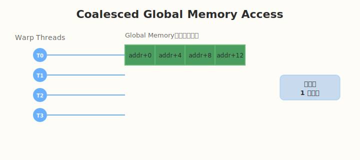

**Coalesced Access（合并访问）**：
- 当一个 warp 的 32 个线程同时访问 global memory 时，如果访问的地址是连续的，硬件会把这些访问合并成少量的 memory transaction。
- 理想情况下，32 个线程访问 128 字节连续地址（每个 float 4 字节），只需要 1 次 128 字节的事务。

**为什么能合并？**
- GPU 的 global memory 以 transaction 为单位访问（如 32/64/128 字节）
- 如果 warp 内线程访问的地址落在同一个 transaction 范围内，就合并为一次访问
- 连续地址意味着高合并率，高带宽利用率

**Coalesced 代码示例**：

```cuda
// ✅ Coalesced：线程 i 访问 x[i]
__global__ void coalesced_read(const float* x, float* y) {
    int idx = blockIdx.x * blockDim.x + threadIdx.x;
    y[idx] = x[idx];
}
```

#### 4.3 Stride Access（非合并访问）

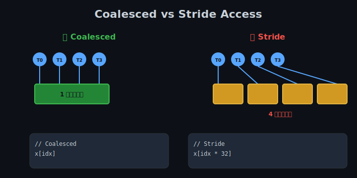

**Stride Access**：
- 当 warp 内线程访问的地址间隔较大时，每个线程访问落在不同的 memory transaction 中
- 导致一次 warp 访问产生多次 transaction
- 带宽利用率大幅下降

**Stride 代码示例**：

```cuda
// ❌ Stride：线程 i 访问 x[i * 32]，地址间隔 128 字节
__global__ void stride_read(const float* x, float* y) {
    int idx = blockIdx.x * blockDim.x + threadIdx.x;
    y[idx] = x[idx * 32];
}
```

**性能对比**：
- Coalesced：带宽利用率可达峰值带宽的 80-90%
- Stride：带宽利用率可能只有峰值带宽的 10-20%

#### 4.4 Shared Memory 与 Tiling


**Shared Memory 的作用**：
- 位于 SM 内部，速度接近 L1 cache
- 可被 block 内所有线程显式读写
- 用于缓存从 global memory 加载的数据，供 block 内线程复用

**Tiling（分块）思想**：
1. 把大问题分成小块（tile）
2. 一次把一个小块加载到 shared memory
3. 在 shared memory 上完成计算
4. 重复直到处理完所有 tile

**Tiling 的好处**：
- 减少 global memory 访问次数
- 把非连续的访问模式转换为连续的访问
- 在线程间共享数据，提高复用率

#### 4.5 L1 / L2 Cache 行为

**L1 Cache**：
- 每个 SM 一个
- 与 Shared Memory 共享物理存储
- 可配置比例：如 48 KB shared + 16 KB L1，或 96 KB shared + 0 KB L1
- 自动缓存 global memory 访问

**L2 Cache**：
- 所有 SM 共享
- 容量较大（数 MB 到数十 MB）
- 缓存所有 SM 的 global memory 访问
- 对数据复用有很好的效果

**Cache 与 Shared Memory 的区别**：

| 特性 | Cache | Shared Memory |
|------|-------|--------------|
| 管理 | 自动 | 显式 |
| 可预测性 | 低 | 高 |
| 控制粒度 | 缓存行 | 任意地址 |
| 适合场景 | 不规则访问 | 规则的数据复用 |

**编程建议**：
- 如果数据访问模式规则且可复用，优先用 Shared Memory
- 如果访问模式不规则，依赖 L1/L2 Cache
- 减少全局内存访问总是有效的

---

### Coding 任务：矩阵转置

矩阵转置是一个经典的内存访问优化问题。

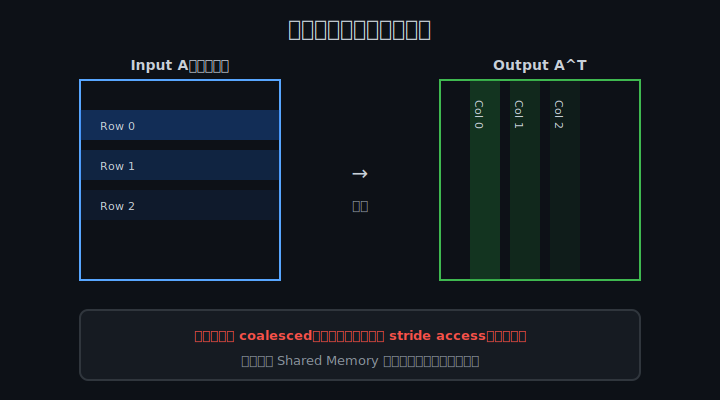

#### 任务 1：Naive 版本

创建 `kernels/transpose.cu`，实现 naive 转置：

```cuda
#include <cuda_runtime.h>
#include <stdio.h>
#include <stdlib.h>

__global__ void transpose_naive(const float* in, float* out, int width, int height) {
    int x = blockIdx.x * blockDim.x + threadIdx.x;
    int y = blockIdx.y * blockDim.y + threadIdx.y;
    if (x < width && y < height) {
        // 读：in[y * width + x] 是 coalesced（按行读）
        // 写：out[x * height + y] 是 stride access（按列写）
        out[x * height + y] = in[y * width + x];
    }
}

int main() {
    int width = 1024;
    int height = 1024;
    int size = width * height;

    float *h_in = (float*)malloc(size * sizeof(float));
    float *h_out = (float*)malloc(size * sizeof(float));
    for (int i = 0; i < size; ++i) h_in[i] = (float)i;

    float *d_in, *d_out;
    cudaMalloc(&d_in, size * sizeof(float));
    cudaMalloc(&d_out, size * sizeof(float));
    cudaMemcpy(d_in, h_in, size * sizeof(float), cudaMemcpyHostToDevice);

    dim3 block(32, 32);
    dim3 grid((width + block.x - 1) / block.x, (height + block.y - 1) / block.y);

    transpose_naive<<<grid, block>>>(d_in, d_out, width, height);
    cudaMemcpy(h_out, d_out, size * sizeof(float), cudaMemcpyDeviceToHost);

    // 简单验证
    bool ok = true;
    for (int y = 0; y < height && ok; ++y) {
        for (int x = 0; x < width; ++x) {
            if (h_out[x * height + y] != h_in[y * width + x]) {
                ok = false;
                break;
            }
        }
    }
    printf("Naive transpose: %s\n", ok ? "PASS" : "FAIL");

    free(h_in);
    free(h_out);
    cudaFree(d_in);
    cudaFree(d_out);
    return 0;
}
```

**Naive 版本的问题**：
- 读是 coalesced（按行连续读）
- 写是 stride access（按列写，地址间隔大）
- 写操作成为瓶颈

#### 任务 2：Shared Memory 优化版本

使用 shared memory tile 优化转置：

```cuda
#define TILE_DIM 32

__global__ void transpose_tiled(const float* in, float* out, int width, int height) {
    __shared__ float tile[TILE_DIM][TILE_DIM + 1];  // +1 避免 bank conflict

    int x = blockIdx.x * TILE_DIM + threadIdx.x;
    int y = blockIdx.y * TILE_DIM + threadIdx.y;

    // Coalesced read from global memory
    if (x < width && y < height) {
        tile[threadIdx.y][threadIdx.x] = in[y * width + x];
    }
    __syncthreads();

    // Transpose block coordinates
    x = blockIdx.y * TILE_DIM + threadIdx.x;
    y = blockIdx.x * TILE_DIM + threadIdx.y;

    // Coalesced write from shared memory
    if (x < height && y < width) {
        out[y * height + x] = tile[threadIdx.x][threadIdx.y];
    }
}
```

**优化原理**：
1. 先按行从 global memory 读入 shared memory（coalesced read）
2. 在 shared memory 中转置（无 global memory 访问）
3. 按行从 shared memory 写入 global memory（此时对应原矩阵的列，实现 coalesced write）

> 关于 `+1 padding` 的详细原理，请参考 Day 5 的 bank conflict 分析。

#### 任务 3：编译和性能测试

```bash
# 编译
nvcc -o transpose kernels/transpose.cu

# 运行
./transpose

# 使用 ncu 对比内存吞吐
ncu --metrics dram__throughput.avg.pct_of_peak_sustained_elapsed ./transpose
```

---

### 扩展实验

#### 实验 1：测量 coalesced vs stride 带宽

编写两个 kernel：

```cuda
__global__ void coalesced_copy(const float* in, float* out, int n) {
    int idx = blockIdx.x * blockDim.x + threadIdx.x;
    if (idx < n) out[idx] = in[idx];
}

__global__ void stride_copy(const float* in, float* out, int n, int stride) {
    int idx = blockIdx.x * blockDim.x + threadIdx.x;
    if (idx < n) out[idx] = in[(idx * stride) % n];
}
```

测试不同 stride（1, 2, 4, 8, 16, 32）下的 effective bandwidth。

#### 实验 2：不同 tile 大小对比

尝试不同的 `TILE_DIM`：
- 16x16
- 32x32
- 64x64

观察：
- 哪个 tile 大小最快？
- 哪个超过了 shared memory 限制？

#### 实验 3：分析 L1/L2 cache 效果

使用 ncu 查看以下指标：

```bash
ncu --metrics \
  l1tex__t_bytes_pipe_lsu_mem_global_op_ld.sum,\
  l1tex__t_bytes_pipe_lsu_mem_global_op_st.sum,\
  dram__bytes_read.sum,\
  dram__bytes_write.sum \
  ./transpose
```

对比 naive 和 tiled 版本的实际显存读写量。

---

### 常见错误与调试

| 问题 | 原因 | 解决 |
|------|------|------|
| 转置结果错误 | 索引计算错误 | 用 small matrix 验证 |
| shared memory 不够用 | tile 太大 | 减小 TILE_DIM |
| 性能提升不明显 | bank conflict | 参考 Day 5 加 padding |
| ncu 显示 bandwidth 很低 | 访问未合并 | 检查 thread 访问地址是否连续 |
| `__syncthreads()` 遗漏 | shared memory 数据未同步 | 在读写 shared memory 之间添加 |

---

### 验证 Checklist

- [ ] 理解 GPU 内存层次结构和各级延迟
- [ ] 能解释什么是 coalesced access
- [ ] 能解释 stride access 为什么降低性能
- [ ] 实现 naive 矩阵转置并验证正确性
- [ ] 实现 tiled 矩阵转置并验证正确性
- [ ] 用 Nsight Compute 对比两种版本的 memory throughput
- [ ] 理解 shared memory tiling 的核心思想
- [ ] 理解 L1/L2 cache 与 shared memory 的区别

---

### 今日总结

Day 4 我们深入理解了 GPU 内存层次：

1. **内存层次**：Register < Shared Memory < L1 < L2 < Global Memory，延迟递增
2. **Coalesced Access**：warp 内连续地址访问合并为少量事务，提高带宽
3. **Stride Access**：非连续访问导致多次事务，带宽利用率低
4. **Shared Memory Tiling**：把数据分块加载到 shared memory，减少 global memory 访问
5. **矩阵转置**：naive 写法写操作是 stride，tiled 写法通过 shared memory 实现 coalesced write
6. **Cache 与 Shared Memory**：cache 自动管理，shared memory 显式管理，各有利弊

掌握这些后，你就能分析一个 kernel 的内存访问模式，并判断它是否 memory-bound。

---

### 面试要点

1. **什么是 coalesced memory access？如何写出 coalesced 的代码？**
   - 一个 warp 内线程访问连续地址，合并为少量事务
   - 让 threadIdx.x 对应最内层维度，访问地址为 `base + threadIdx.x`

2. **矩阵转置为什么难做 coalesced？如何解决？**
   - 读按行是 coalesced，写按列是 stride
   - 用 shared memory tile 做中间缓冲，调整读写模式

3. **Shared memory 和 L1 cache 的区别？**
   - Shared memory 显式管理，可预测，适合规则数据复用
   - L1 cache 自动管理，透明，适合不规则访问

4. **为什么要用 tiling？**
   - 减少 global memory 访问次数
   - 把不规则访问转换为规则访问
   - 在线程间复用数据

5. **GPU 内存层次从快到慢是什么？**
   - Register → Shared Memory → L1 Cache → L2 Cache → Global Memory

---

## Day 5：Bank Conflict 分析与实践

### 🎯 目标

通过今天的学习，你将：

1. 理解 Shared Memory 的 bank 结构
2. 能识别各种 bank conflict 模式
3. 掌握使用 padding 消除 bank conflict 的方法
4. 能用 Nsight Compute 检测 bank conflict
5. 理解 bank conflict 对性能的影响
6. 能把 bank conflict 优化应用到矩阵转置等实际场景

> 💡 **为什么重要**：Day 4 我们用 shared memory 做 tiling 优化，但如果 tile 设计不当，会引入 bank conflict，反而降低性能。bank conflict 是 shared memory 优化中最容易踩的坑之一。

---

### 学前导读：为什么 shared memory 需要 bank

Shared memory 位于 SM 内部，速度很快（~20-30 cycles）。为了支持高并发访问，它被分成多个 **bank**，每个 bank 可以独立读写。

**理想情况**：一个 warp 的 32 个线程同时访问 32 个不同的 bank，这样可以在 1 个 cycle 内完成。

**实际情况**：如果多个线程访问同一个 bank，就需要串行处理，这就是 **bank conflict**。

---

### 理论学习

#### 5.1 Shared Memory Bank 结构

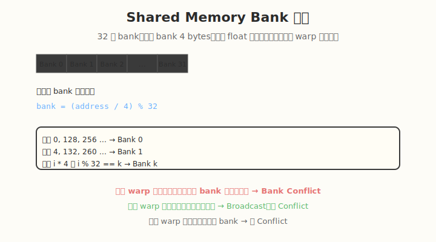

- Shared memory 被划分为 **32 个 bank**（每 bank 4 bytes）。
- 地址到 bank 的映射公式：
  ```
  bank = (address / 4) % 32
  ```
- 一个 warp 内不同线程同时访问 **同一个 bank 的不同地址** 时，会发生 bank conflict。
- 访问同一个地址（broadcast）不会 conflict。

**举例**：
- 地址 0, 128, 256 都映射到 Bank 0（因为 `(0/4)%32=0`, `(128/4)%32=0`）
- 地址 4, 132, 260 都映射到 Bank 1
- 对于 `float` 数组，`tile[i][j]` 中固定 `j` 改变 `i` 时，如果 `j` 不变，所有元素都在同一个 bank

#### 5.2 Bank Conflict 的几种模式

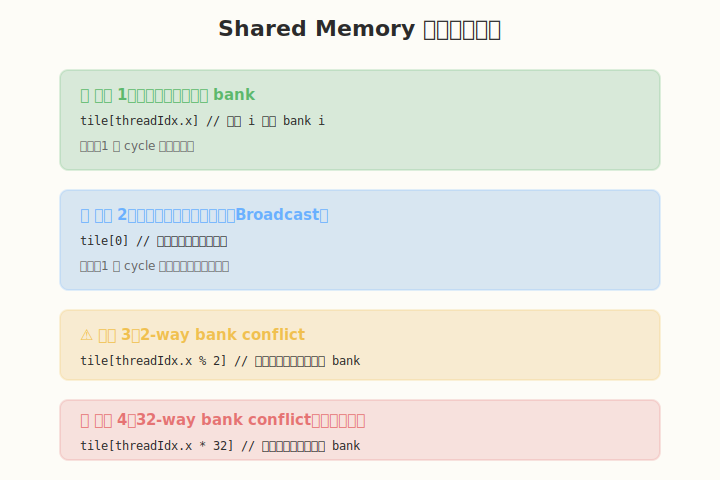

**模式 1：无 Conflict（每个线程访问不同 bank）**
```cuda
// 线程 i 访问 bank i
float v = tile[threadIdx.x];
```
- 32 个线程访问 32 个不同 bank
- 1 个 cycle 完成

**模式 2：Broadcast（所有线程访问同一地址）**
```cuda
// 所有线程读同一个地址
float v = tile[0];
```
- 虽然都在 Bank 0，但是同一地址
- GPU 有专门的广播机制
- 1 个 cycle 完成

**模式 3：2-way Conflict**
```cuda
// 线程分成两组，访问两个不同地址但同一 bank
float v = tile[threadIdx.x % 2];
```
- 16 个线程访问 bank 0 的地址 0
- 16 个线程访问 bank 0 的地址 1？不对，%2 得到 0 或 1
- 实际上是 2 个地址，分别在 bank 0 和 bank 1
- 这是 2-way conflict

**模式 4：32-way Conflict（最坏情况）**
```cuda
// 所有线程访问同一个 bank 的不同地址
float v = tile[threadIdx.x * 32];
```
- 线程 0 访问地址 0 → bank 0
- 线程 1 访问地址 32 → bank 0
- 线程 2 访问地址 64 → bank 0
- ...
- 所有 32 个线程都访问 bank 0
- 需要 32 个 cycle 串行完成

#### 5.3 Padding 技术


**问题根源**：
在矩阵转置中，我们经常需要：
```cuda
__shared__ float tile[TILE_DIM][TILE_DIM];
```

然后按列读：`tile[threadIdx.x][i]`，这时同一列的所有元素都在同一个 bank。

**解决方法**：
在列维度加 1：
```cuda
#define TILE_DIM 32
__shared__ float tile[TILE_DIM][TILE_DIM + 1];  // +1 padding
```

**原理**：
- 原来 `tile[i][j]` 的地址是 `i * TILE_DIM + j`，同一列 `j` 固定时，地址间隔 `TILE_DIM * 4 = 128 bytes`，都是 bank 0
- 加 padding 后，地址是 `i * (TILE_DIM + 1) + j`，同一列相邻元素的地址差是 `33 * 4 = 132 bytes`
- `132 / 4 = 33`，`33 % 32 = 1`，所以相邻行同一列会错开 1 个 bank
- 这样 32 个线程访问同一列时，分别访问 32 个不同 bank

**Padding 的代价**：
- 少量 shared memory 浪费（这里浪费了 `32 * 4 = 128 bytes`）
- 但换来了无 conflict 的高速访问

---

### Coding 任务：Bank Conflict 对比实验

#### 任务 1：创建 bank_conflict.cu

创建文件 `kernels/bank_conflict.cu`：

```cuda
#include <cuda_runtime.h>
#include <stdio.h>
#include <stdlib.h>

#define TILE_DIM 32
#define BLOCK_ROWS 8

// 故意制造 bank conflict 的版本：tile[TILE_DIM][TILE_DIM]
__global__ void conflict_read(float* out, const float* in) {
    __shared__ float tile[TILE_DIM][TILE_DIM];

    int col = threadIdx.x;
    for (int row = 0; row < TILE_DIM; row += BLOCK_ROWS) {
        tile[row + threadIdx.y][col] = in[(row + threadIdx.y) * TILE_DIM + col];
    }
    __syncthreads();

    // 同一 warp 内线程访问同一 column，产生 bank conflict
    for (int row = 0; row < TILE_DIM; row += BLOCK_ROWS) {
        out[(row + threadIdx.y) * TILE_DIM + col] = tile[col][row + threadIdx.y];
    }
}

// 使用 padding 消除 bank conflict：tile[TILE_DIM][TILE_DIM + 1]
__global__ void no_conflict_read(float* out, const float* in) {
    __shared__ float tile[TILE_DIM][TILE_DIM + 1];

    int col = threadIdx.x;
    for (int row = 0; row < TILE_DIM; row += BLOCK_ROWS) {
        tile[row + threadIdx.y][col] = in[(row + threadIdx.y) * TILE_DIM + col];
    }
    __syncthreads();

    for (int row = 0; row < TILE_DIM; row += BLOCK_ROWS) {
        out[(row + threadIdx.y) * TILE_DIM + col] = tile[col][row + threadIdx.y];
    }
}

int main() {
    const int N = TILE_DIM * TILE_DIM;
    float *h_in = (float*)malloc(N * sizeof(float));
    float *h_out = (float*)malloc(N * sizeof(float));
    for (int i = 0; i < N; ++i) h_in[i] = (float)i;

    float *d_in, *d_out;
    cudaMalloc(&d_in, N * sizeof(float));
    cudaMalloc(&d_out, N * sizeof(float));
    cudaMemcpy(d_in, h_in, N * sizeof(float), cudaMemcpyHostToDevice);

    dim3 block(TILE_DIM, BLOCK_ROWS);
    dim3 grid(1, 1);

    conflict_read<<<grid, block>>>(d_out, d_in);
    cudaDeviceSynchronize();

    no_conflict_read<<<grid, block>>>(d_out, d_in);
    cudaDeviceSynchronize();

    printf("Bank conflict kernels finished. Use ncu to compare metrics.\n");

    free(h_in);
    free(h_out);
    cudaFree(d_in);
    cudaFree(d_out);
    return 0;
}
```

#### 任务 2：编译运行

```bash
nvcc -o bank_conflict kernels/bank_conflict.cu
./bank_conflict
```

#### 任务 3：使用 ncu 检测 bank conflict

```bash
ncu \
  --metrics \
    l1tex__data_bank_conflicts_pipe_lsu_mem_shared_op_ld.sum,\
    l1tex__data_bank_conflicts_pipe_lsu_mem_shared_op_st.sum,\
    sm__cycles_elapsed.avg,\
    sm__throughput.avg.pct_of_peak_sustained_elapsed \
  ./bank_conflict
```

**预期结果**：
- `conflict_read` 的 bank conflict 数值远高于 `no_conflict_read`
- `conflict_read` 的执行 cycles 明显更多

---

### 扩展实验

#### 实验 1：不同 stride 的 bank conflict

测试以下访问模式，观察 bank conflict 程度：

```cuda
// 访问模式 1：无 conflict
float v = tile[threadIdx.x];

// 访问模式 2：2-way conflict
float v = tile[threadIdx.x % 2];

// 访问模式 3：4-way conflict
float v = tile[threadIdx.x % 4];

// 访问模式 4：32-way conflict（最坏）
float v = tile[threadIdx.x * 32];
```

记录每个模式的 bank conflict 计数和执行时间。

#### 实验 2：应用到矩阵转置

回到 Day 4 的矩阵转置代码，把 tile 从：
```cuda
__shared__ float tile[TILE_DIM][TILE_DIM];
```
改为：
```cuda
__shared__ float tile[TILE_DIM][TILE_DIM + 1];
```

对比修改前后的：
- bank conflict 计数
- memory throughput
- 总执行时间

#### 实验 3：不同 padding 大小

尝试不同的 padding：
```cuda
__shared__ float tile[TILE_DIM][TILE_DIM + 1];
__shared__ float tile[TILE_DIM][TILE_DIM + 2];
__shared__ float tile[TILE_DIM][TILE_DIM + 4];
```

观察：
- 是否都能消除 bank conflict？
- 哪种 padding 的 shared memory 利用率最高？

---

### 常见错误与调试

| 问题 | 原因 | 解决 |
|------|------|------|
| Bank conflict 计数高 | 访问模式导致多个线程同一 bank | 分析访问公式，加 padding 或调整索引 |
| Padding 后仍有 conflict | padding 大小不合适 | 确保 stride 与 32 互质 |
| Shared memory 不够用 | padding 浪费过多 | 减小 tile 大小或优化 padding |
| 性能没有提升 | 瓶颈不在 shared memory | 检查 global memory 或 compute 是否瓶颈 |
| `__syncthreads()` 位置不对 | 读写 shared memory 未同步 | 确保所有线程写完再读 |

---

### 验证 Checklist

- [ ] 理解 shared memory 的 bank 结构
- [ ] 能手动计算地址对应的 bank 编号
- [ ] 能识别 2-way、4-way、32-way bank conflict
- [ ] 实现 conflict 和 no-conflict 两个版本的 kernel
- [ ] Nsight Compute 中观察到 bank conflict 数值变化
- [ ] 冲突版本比无冲突版本慢 2x 以上
- [ ] 理解 padding 的原理和代价
- [ ] 能把 padding 应用到矩阵转置中

---

### 今日总结

Day 5 我们深入理解了 Shared Memory 的 bank conflict：

1. **Bank 结构**：32 个 bank，每 bank 4 bytes，地址映射为 `bank = (addr/4) % 32`
2. **Conflict 条件**：一个 warp 内多个线程访问同一 bank 的不同地址
3. **Broadcast 例外**：访问同一地址不 conflict
4. **Padding 技术**：在列维度加 1，让同一列的数据错开 bank
5. **检测方法**：用 Nsight Compute 的 `l1tex__data_bank_conflicts_pipe_lsu_mem_shared_op_ld.sum`
6. **实际应用**：矩阵转置等 shared memory tiling 场景必须考虑 bank conflict

掌握这些后，你才能安全地使用 shared memory 做性能优化，避免"优化了全局内存，却掉进 bank conflict 的坑"。

---

### 面试要点

1. **Shared memory 有多少个 bank？每个 bank 多大？**
   - 32 个 bank，每个 bank 4 bytes（现代 GPU）

2. **什么样的访问模式会产生 bank conflict？**
   - 一个 warp 内多个线程同时访问同一个 bank 的不同地址
   - 典型例子：`tile[threadIdx.x * 32]` 让所有线程访问 bank 0

3. **Padding 的代价是什么？**
   - 少量 shared memory 浪费
   - 但换来无 conflict 的高速访问

4. **Broadcast 会产生 bank conflict 吗？**
   - 不会。GPU 有专门的广播机制，一个 warp 内多个线程读同一地址是 1 个 cycle

5. **如何检测 bank conflict？**
   - Nsight Compute：`l1tex__data_bank_conflicts_pipe_lsu_mem_shared_op_ld.sum`
   - 观察执行 cycles 和 shared memory throughput

6. **矩阵转置为什么要加 padding？**
   - 无 padding 时，tile 同一列的数据都在同一个 bank
   - 转置时需要按列读取，导致 32-way bank conflict
   - 加 padding 后同一列数据错开 bank，避免 conflict

---

## Day 6：Nsight Profiling 实战

### 🎯 目标

通过今天的学习，你将：

1. 理解 Nsight Compute 和 Nsight Systems 的定位和区别
2. 掌握常用 `ncu` 命令和关键指标
3. 掌握常用 `nsys` 命令和时间线分析
4. 能用 Roofline 模型判断 kernel 瓶颈类型
5. 能对本 week's kernel 进行系统性的 profiling
6. 能写出一份完整的 profiling 报告

> 💡 **为什么重要**：前面的理论学习告诉你"应该怎么做"，而 profiling 告诉你"实际情况是什么"。没有 profiling，优化就是盲人摸象。Nsight 是 AI Infra 工程师的"听诊器"。

---

### 学前导读：为什么需要 profiling

写 CUDA 代码时，我们经常会有各种假设：
- "这个 kernel 应该是 memory-bound"
- "加了 shared memory 应该会更快"
- "这个优化应该能提升 2 倍"

但真实 GPU 执行时，情况可能完全不同。Profiling 的作用就是：
- **验证假设**：实际瓶颈到底在哪里
- **量化性能**：用数字说话，而不是感觉
- **发现隐藏问题**：如 bank conflict、low occupancy、launch overhead 等
- **指导优化方向**：避免在无效方向上浪费时间

** profiling 的黄金法则**：
> 不要猜测，要测量。

---

### 理论学习

#### 6.1 Nsight 工具家族


NVIDIA 提供了两个主要的 profiling 工具：

##### Nsight Compute (`ncu`)

- **粒度**：单个 kernel
- **用途**：分析 kernel 内部的详细硬件指标
- **适用场景**：
  - 判断 kernel 是 memory-bound 还是 compute-bound
  - 查看 occupancy、register usage、shared memory
  - 分析 memory throughput、compute throughput
  - 查看 bank conflict、cache hit rate
  - 生成 Roofline 图

##### Nsight Systems (`nsys`)

- **粒度**：整个应用
- **用途**：分析时间线、CPU/GPU 交互、kernel launch overhead
- **适用场景**：
  - 找到最耗时的 kernel
  - 分析 CPU 和 GPU 的并行情况
  - 查看 kernel launch overhead
  - 分析多个 stream 的并行执行
  - 端到端 latency 分析

**使用流程**：


1. 先用 **nsys** 找到最耗时的 kernel
2. 再用 **ncu** 深入分析该 kernel
3. 根据分析结果优化
4. 重复 profiling 验证效果

#### 6.2 常用 `ncu` 命令

##### 基础命令

```bash
# 基本 profiling，使用默认指标集
ncu ./your_kernel

# 指定单个指标
ncu --metrics sm__occupancy.avg.pct_of_peak_sustained_elapsed ./your_kernel

# 指定多个指标
ncu --metrics \
  sm__occupancy.avg.pct_of_peak_sustained_elapsed,\
  dram__throughput.avg.pct_of_peak_sustained_elapsed,\
  sm__throughput.avg.pct_of_peak_sustained_elapsed \
  ./your_kernel

# 生成完整报告
ncu --set full -o report ./your_kernel

# 用 GUI 打开报告
ncu-ui report.ncu-rep
```

##### 常用指标分类


| 类别 | 指标 | 含义 |
|------|------|------|
| 并行度 | `sm__occupancy.avg.pct_of_peak_sustained_elapsed` | Occupancy 百分比 |
| 并行度 | `sm__warps_active.avg.pct_of_peak_sustained_elapsed` | 活跃 warp 比例 |
| 并行度 | `launch__registers_per_thread` | 每个线程寄存器数 |
| 内存 | `dram__throughput.avg.pct_of_peak_sustained_elapsed` | 显存带宽利用率 |
| 内存 | `l1tex__t_bytes_pipe_lsu_mem_global_op_ld.sum` | Global load 字节数 |
| 内存 | `l1tex__data_bank_conflicts_pipe_lsu_mem_shared_op_ld.sum` | Shared memory load bank conflict |
| 计算 | `sm__throughput.avg.pct_of_peak_sustained_elapsed` | 计算单元利用率 |
| 计算 | `sm__cycles_elapsed.avg` | 执行周期数 |
| 延迟 | `gpu__time_duration.avg` | Kernel 执行时间 |

#### 6.3 常用 `nsys` 命令

```bash
# 基本时间线分析
nsys profile -o timeline ./your_app

# 打开 GUI 查看
nsys-ui timeline.nsys-rep

# 同时采集 CUDA 和 NVTX
nsys profile -o timeline --trace cuda,nvtx,osrt ./your_app

# 只统计 summary
nsys profile --stats=true ./your_app
```

**nsys 时间线重点**：
- `cudaLaunchKernel`：CPU 端 launch kernel 的时间
- `Kernel`：GPU 上实际执行的时间
- `cudaMemcpy`：数据传输时间
- `cudaStreamSynchronize`：同步等待时间

#### 6.4 如何判断瓶颈类型

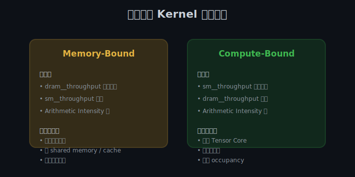

判断一个 kernel 是 memory-bound 还是 compute-bound 的方法：

**Memory-bound 特征**：
- `dram__throughput.avg.pct_of_peak_sustained_elapsed` 高（接近 80-100%）
- `sm__throughput.avg.pct_of_peak_sustained_elapsed` 低
- Arithmetic Intensity 低

**Compute-bound 特征**：
- `sm__throughput.avg.pct_of_peak_sustained_elapsed` 高
- `dram__throughput.avg.pct_of_peak_sustained_elapsed` 低
- Arithmetic Intensity 高

**Latency-bound 特征**：
- 两者都低
- 可能是 occupancy 太低，或依赖链太长

#### 6.5 Roofline 模型

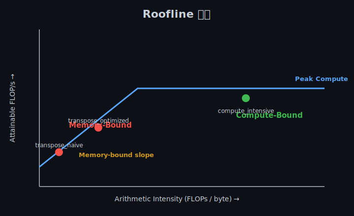

Roofline 图帮助判断 kernel 是 compute-bound 还是 memory-bound：

```
Attainable FLOP/s = min(Peak FLOP/s, AI * Peak Bandwidth)
```

- **Arithmetic Intensity (AI)** = FLOPs / bytes
- AI 低 → memory-bound（位于斜线区域）
- AI 高 → compute-bound（位于平顶区域）

**如何用 Roofline 指导优化**：
- 如果点在斜线区域：优化内存访问（coalescing、shared memory、减少读写）
- 如果点在平顶区域：优化计算（Tensor Core、指令优化）
- 如果点离平顶很远：还有很大优化空间

---

### Coding 任务：本周 kernel  profiling

#### 任务 1：profiling hello_gpu

```bash
cd /Users/chenbinbin/GitHub/aiinfra/week1
nvcc -o kernels/hello_gpu kernels/hello_gpu.cu
nsys profile -o profiles/day1_hello_gpu_timeline ./kernels/hello_gpu
```

**观察重点**：
- `cudaLaunchKernel` 的 CPU 耗时
- kernel 在 GPU 上的实际执行时长
- 多个 block 是否并行执行

#### 任务 2：profiling occupancy_test

```bash
ncu \
  --metrics \
    sm__occupancy.avg.pct_of_peak_sustained_elapsed,\
    launch__registers_per_thread,\
    launch__shared_mem_per_block_static,\
    sm__throughput.avg.pct_of_peak_sustained_elapsed \
  ./kernels/occupancy_test
```

**观察重点**：
- 实际 occupancy
- 每个线程寄存器数
- 计算单元利用率

#### 任务 3：profiling transpose

```bash
ncu \
  --metrics \
    dram__throughput.avg.pct_of_peak_sustained_elapsed,\
    l1tex__t_bytes_pipe_lsu_mem_global_op_ld.sum,\
    l1tex__t_bytes_pipe_lsu_mem_global_op_st.sum,\
    sm__cycles_elapsed.avg \
  ./kernels/transpose
```

**观察重点**：
- naive 和 optimized 版本的 dram throughput 差异
- global memory read/write 数据量
- 执行 cycle 数

#### 任务 4：profiling bank_conflict

```bash
ncu \
  --metrics \
    l1tex__data_bank_conflicts_pipe_lsu_mem_shared_op_ld.sum,\
    l1tex__data_bank_conflicts_pipe_lsu_mem_shared_op_st.sum,\
    sm__cycles_elapsed.avg \
  ./kernels/bank_conflict
```

**观察重点**：
- conflict 和 no-conflict 版本的 bank conflict 计数
- 执行 cycle 差异

---

### 扩展实验

#### 实验 1：生成完整 ncu 报告

对每个 kernel 生成完整报告：

```bash
ncu --set full -o profiles/day6_hello_gpu ./kernels/hello_gpu
ncu --set full -o profiles/day6_occupancy_test ./kernels/occupancy_test
ncu --set full -o profiles/day6_transpose ./kernels/transpose
ncu --set full -o profiles/day6_bank_conflict ./kernels/bank_conflict
```

用 ncu-ui 打开，阅读每个指标的详细说明。

#### 实验 2：绘制 Roofline 图

手动计算每个 kernel 的：
- FLOPs
- Bytes
- Arithmetic Intensity

然后在 Roofline 图上标出位置。可以使用 ncu 的 Roofline 图，也可以自己用 matplotlib 绘制。

#### 实验 3：分析 kernel launch overhead

用 nsys 查看：
- `cudaLaunchKernel` 到 kernel 开始执行的时间
- 这个时间占整个应用时间的比例
- 思考如何减少 launch overhead（如 CUDA Graph）

---

### 常见错误与调试

| 问题 | 原因 | 解决 |
|------|------|------|
| ncu 报错 `Failed to profile` | 权限问题或驱动不兼容 | 用 sudo 或检查驱动版本 |
| nsys 生成的报告很大 | 采集了太多 trace | 只采集需要的 trace，如 `--trace cuda` |
| 指标返回 N/A | 该指标在当前 GPU 上不可用 | 查看 ncu 文档确认支持的指标 |
| Roofline 图无法生成 | 缺少 FLOP 指标 | 使用 `--set full` 重新采集 |
| 报告打开后看不懂 | 指标太多 | 先看 occupancy、throughput、bank conflict 这几个核心指标 |

---

### 验证 Checklist

- [ ] 生成至少 3 个 kernel 的 Nsight Compute 报告
- [ ] 生成至少 1 个 Nsight Systems 时间线报告
- [ ] 能读取 Roofline 图并定位瓶颈类型
- [ ] 能判断 kernel 是 memory-bound / compute-bound / latency-bound
- [ ] 记录各 kernel 的 throughput 和 occupancy
- [ ] 整理 profiling 结果到 `profiles/week1_profile_summary.md`

---

### 今日总结

Day 6 我们学会了用专业工具分析 GPU 性能：

1. **Nsight Systems (`nsys`)**：应用级时间线分析，找耗时 kernel
2. **Nsight Compute (`ncu`)**：kernel 级详细指标分析
3. **核心指标**：occupancy、memory throughput、compute throughput、bank conflict
4. **瓶颈判断**：memory-bound、compute-bound、latency-bound
5. **Roofline 模型**：用 arithmetic intensity 判断优化方向
6. **工作流程**：nsys 定位 → ncu 深入 → 优化 → 再验证

掌握这些后，你就不再是"凭感觉优化"，而是"用数据驱动优化"。

---

### 面试要点

1. **如何判断一个 kernel 是 memory-bound 还是 compute-bound？**
   - 看 `dram__throughput` 和 `sm__throughput`
   - Memory-bound：memory throughput 高，compute throughput 低
   - Compute-bound：compute throughput 高，memory throughput 低
   - 也可以用 Roofline 模型：AI 低则 memory-bound，AI 高则 compute-bound

2. **Nsight Compute 和 Nsight Systems 的区别？**
   - Nsight Compute：kernel 级详细指标
   - Nsight Systems：应用级时间线，看 CPU/GPU 交互和整体流程

3. **Roofline 模型如何指导优化？**
   - 如果点在斜线区域（memory-bound）：优化内存访问
   - 如果点在平顶区域（compute-bound）：优化计算
   - 目标是让点尽量接近屋顶

4. **常用的 ncu 指标有哪些？**
   - `sm__occupancy.avg.pct_of_peak_sustained_elapsed`
   - `dram__throughput.avg.pct_of_peak_sustained_elapsed`
   - `sm__throughput.avg.pct_of_peak_sustained_elapsed`
   - `l1tex__data_bank_conflicts_pipe_lsu_mem_shared_op_ld.sum`

5. **nsys 时间线能看到什么？**
   - Kernel launch overhead
   - CPU 和 GPU 的执行时间线
   - CUDA API 调用顺序
   - 多个 stream 的并行情况

---

## Day 7：总结与复盘

### 🎯 目标

通过今天的学习，你将：

1. 系统梳理 Week 1 的所有核心知识点
2. 建立从"硬件执行模型"到"代码优化"的完整思路链
3. 整理出一份可复用的学习笔记和面试速查表
4. 发现本周学习中的薄弱环节，制定补漏计划
5. 为 Week 2 的 GEMM 优化做好准备

> 💡 **为什么重要**：Week 1 是整个 8 周计划的基石。如果 GPU 执行模型和内存层次理解不牢，后续 GEMM、Attention、推理系统都会吃力。Day 7 不是休息，而是把碎片知识连成网络。

---

### Week 1 知识地图

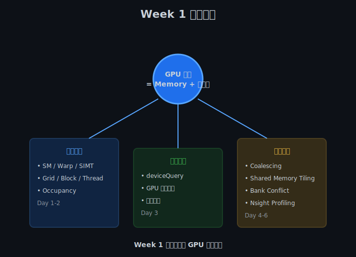

Week 1 的核心主线：

```
GPU 性能 = Memory + 并行度
```

围绕这个公式，我们学习了三大模块：

| 模块 | 天数 | 核心内容 |
|------|------|---------|
| 执行模型 | Day 1-2 | SM、Warp、SIMT、Grid/Block/Thread、Occupancy |
| 硬件认知 | Day 3 | deviceQuery、GPU 峰值算力、显存带宽 |
| 内存优化 | Day 4-6 | Coalescing、Shared Memory Tiling、Bank Conflict、Nsight Profiling |

---

### 核心概念串讲

#### 1. GPU 执行模型

**一句话**：GPU 以 warp 为单位执行 SIMT，一个 warp 32 个线程必须执行相同指令。

**关键概念链**：
```
GPU → SM → Warp（32 threads）→ Thread
Grid → Block → Thread
```

**性能启示**：
- 避免 warp divergence
- block 大小取 32 的倍数
- 理解 block 不能跨 SM

#### 2. Occupancy

**一句话**：Occupancy 衡量 SM 上同时活跃的 warp 比例，影响延迟隐藏能力。

**三大资源约束**：
- 寄存器数量
- 共享内存数量
- Block / warp 数量上限

**性能启示**：
- 不必追求 100% occupancy
- 寄存器过多会降低 occupancy
- Register spilling 会急剧降低性能

#### 3. 内存层次

**从快到慢**：
```
Register < Shared Memory < L1 Cache < L2 Cache < Global Memory
~1 cycle < ~30 cycles < ~30 cycles < ~200 cycles < ~400-800 cycles
```

**性能启示**：
- 多用 register 和 shared memory
- 减少 global memory 访问
- 让 global memory 访问 coalesced

#### 4. Coalescing 与 Bank Conflict

| 特性 | Coalescing | Bank Conflict |
|------|-----------|---------------|
| 发生位置 | Global Memory | Shared Memory |
| 优化目标 | 连续地址访问 | 不同 bank 访问 |
| 检测工具 | ncu memory throughput | ncu bank conflict 指标 |
| 解决方法 | 调整索引顺序 | Padding |

**性能启示**：
- Coalescing 提高 global memory 带宽利用率
- 避免 bank conflict 提高 shared memory 访问速度
- 矩阵转置是同时练习两者的经典例子

#### 5. Profiling

**一句话**：先用 nsys 找耗时 kernel，再用 ncu 分析该 kernel。

**瓶颈判断**：
- Memory-bound：`dram__throughput` 高
- Compute-bound：`sm__throughput` 高
- Latency-bound：两者都低

---

### GPU 性能优化决策树


面对一个性能问题，按以下流程思考：

1. **先 profiling**：不要猜测，用数据说话
2. **看 occupancy**：如果低，先优化 occupancy
3. **判断瓶颈**：memory-bound 还是 compute-bound
4. **针对性优化**：
   - Memory-bound → coalescing、shared memory、减少读写
   - Compute-bound → Tensor Core、指令优化
5. **再 profiling**：验证优化效果

---

### 总结任务

#### 任务 1：完成 Week 1 学习笔记

更新 `notes/week1_notes.md`，建议包含以下内容：

```markdown
# Week 1 学习笔记

## 1. GPU 执行模型
- SM：
- Warp：
- SIMT：
- Grid/Block/Thread：

## 2. 内存层次
| 类型 | 延迟 | 容量 | 可编程 |
|------|------|------|--------|
| Register | | | |
| Shared Memory | | | |
| L1 Cache | | | |
| L2 Cache | | | |
| Global Memory | | | |

## 3. Occupancy
- 定义：
- 影响因素：
- 优化方法：

## 4. Coalescing
- 定义：
- 写出 coalesced 代码的关键：

## 5. Bank Conflict
- 定义：
- 解决方法：

## 6. Nsight 常用命令
```bash
ncu --metrics ...
nsys profile -o ...
```

## 7. 本周实验记录
| Kernel | Occupancy | Memory Throughput | Compute Throughput | 瓶颈 |
|--------|-----------|-------------------|-------------------|------|
| | | | | |

## 8. 面试问题自测
- Q: 什么是 SIMT？
- A:
```

#### 任务 2：整理面试题库

针对每个核心概念，准备一个"30 秒回答版本"：

1. 什么是 SIMT？
2. 什么是 warp divergence？如何避免？
3. 什么是 occupancy？越高越好吗？
4. 什么是 coalesced access？
5. 什么是 bank conflict？如何解决？
6. 如何判断 kernel 是 memory-bound 还是 compute-bound？
7. ncu 和 nsys 的区别？
8. 什么是 Roofline 模型？

#### 任务 3：补完未完成的实验

对照 Week 1 完成标准，检查哪些还没做：

- [ ] 完成 4 个基础 CUDA kernel 编写与运行
- [ ] 完成 1 个 bank conflict 对比实验
- [ ] 生成 3+ Nsight Compute 报告
- [ ] 完成 `notes/week1_notes.md` 学习笔记
- [ ] 能用自己的话解释：SM、Warp、Occupancy、Coalescing、Bank Conflict
- [ ] 能使用 Nsight 定位 kernel 瓶颈类型

#### 任务 4：绘制关键图表

即使不提交，也建议手绘或在纸上画出：
1. GPU 内存层次结构图
2. SM 架构简图
3. Grid/Block/Thread 关系图
4. Coalesced vs Stride 访问示意图
5. Occupancy 与性能关系图
6. Roofline 简图

画图是检验理解深度的最好方法。

---

### 面试准备框架

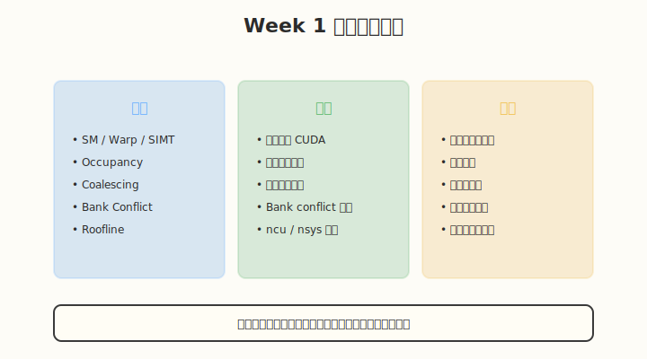

面试中回答技术问题，建议用这个结构：

1. **先给定义**：用一句话说清楚是什么
2. **解释原因**：为什么会出现这个现象
3. **举例说明**：结合实际代码或场景
4. **优化思路**：如果遇到这个问题怎么解决
5. **拓展联系**：和之前学过的概念联系起来

**示例**：

> **Q：什么是 bank conflict？**
>
> **A**：bank conflict 发生在 shared memory 访问时，一个 warp 内多个线程同时访问同一个 bank 的不同地址，导致访问需要串行化。
>
> 比如 `__shared__ float tile[32][32]`，如果按列读取 `tile[threadIdx.x][i]`，同一列的 32 个元素都在 bank 0，32 个线程都访问 bank 0，就会形成 32-way conflict。
>
> 解决方法是在列维度加 padding：`tile[32][33]`，这样同一列相邻行的元素会错开 bank，避免 conflict。
>
> 这和我们 Day 4 学的矩阵转置优化是同一个问题。

---

### 常见误区澄清

| 误区 | 正确理解 |
|------|---------|
| Occupancy 越高越好 | 足够高即可，100% 不意味着 100% 性能 |
| Shared memory 一定比 global memory 快 | 用得好才快，bank conflict 会抵消优势 |
| Coalescing 只对读有效 | 读写都重要 |
| 一个 block 越大越好 | 受限于 shared memory 和寄存器，通常 128/256 最优 |
| Profiling 是最后一步 | 应该是优化循环的起点和终点 |

---

### Week 1 → Week 2 衔接

Week 2 我们将学习 **GEMM 优化**。为了做好准备，请确保你掌握了：

1. **Grid/Block/Thread 层次**：GEMM 需要复杂的线程映射
2. **Shared Memory Tiling**：GEMM 的核心优化手段
3. **Coalesced Access**：GEMM 需要高效的全局内存访问
4. **Bank Conflict**：GEMM 的 shared memory 布局必须避免
5. **Nsight Profiling**：GEMM 优化需要数据驱动

如果你对这些概念还有模糊，建议回到对应 Day 重新做实验。

---

### 弹性安排

根据本周完成情况，选择以下一项或多项：

- **补进度**：完成未做的 coding 任务和实验
- **深入方向 1**：实现更复杂的 shared memory tiling（如 2D stencil）
- **深入方向 2**：用 ncu 详细分析一个实际 kernel 的所有指标
- **深入方向 3**：阅读 CUDA C Programming Guide 第 5 章全文
- **面试准备**：和同学互相模拟面试

---

### 今日总结

Day 7 我们完成了 Week 1 的系统复盘：

1. **知识地图**：把 SM、Warp、Occupancy、Coalescing、Bank Conflict、Profiling 连成网络
2. **优化决策树**：建立了从 profiling 到优化的完整思路
3. **学习笔记模板**：提供了 `week1_notes.md` 的结构
4. **面试准备框架**：概念 + 代码 + 表达三位一体
5. **Week 2 衔接**：明确了还需要巩固的基础

如果你能清晰回答以下两个问题，说明 Week 1 过关了：

1. **用一句话概括 GPU 性能优化的核心？**
   > 答案：减少慢速内存访问，提高并行度，让计算单元不空转。

2. **从硬件执行模型到代码，你的优化思路链是什么？**
   > 答案：先理解 SM/Warp 执行方式 → 写出避免 divergence 和 coalescing 的代码 → 用 shared memory tiling 减少 global memory 访问 → 避免 bank conflict → 用 ncu/nsys 验证瓶颈 → 针对性优化。

---

### 面试要点

1. **用一句话概括 GPU 性能优化的核心？**
   - 减少慢速内存访问，提高并行度，让计算单元不空转。

2. **从硬件执行模型到代码，你的优化思路链是什么？**
   - SM/Warp 执行方式 → 避免 divergence → coalesced access → shared memory tiling → 避免 bank conflict → profiling → 针对性优化。

3. **Week 1 你最大的收获是什么？**
   - 建立 GPU 性能直觉，能判断代码是 memory-bound 还是 compute-bound。

4. **如果让你优化一个未知 kernel，你会怎么做？**
   - 先用 nsys 找耗时 kernel，再用 ncu 分析 occupancy、memory throughput、compute throughput，判断瓶颈类型，然后针对性优化。

5. **Week 1 哪个实验让你印象最深刻？为什么？**
   - 建议选矩阵转置或 bank conflict，因为这两个实验同时涉及多个概念。

---

## 📁 本周目录结构

```
week1/
├── README.md              # 本文件：Week 1 完整指南
├── kernels/               # CUDA kernel 源码
│   ├── hello_gpu.cu
│   ├── occupancy_test.cu
│   ├── transpose.cu
│   └── bank_conflict.cu
├── profiles/              # Profiling 报告
│   └── week1_profile_summary.md
└── notes/                 # 学习笔记
    └── week1_notes.md
```

---

## 🔗 推荐资源

| 资源 | 说明 |
|------|------|
| [CUDA C Programming Guide](https://docs.nvidia.com/cuda/cuda-c-programming-guide/) | 官方权威文档 |
| [CUDA Samples](https://github.com/NVIDIA/cuda-samples) | 官方示例代码 |
| [Nsight Compute Docs](https://docs.nvidia.com/nsight-compute/) | Profiling 工具文档 |
| [Nsight Systems Docs](https://docs.nvidia.com/nsight-systems/) | 系统级 trace 文档 |
| [GPU Gems 3 - Chapter 31](https://developer.nvidia.com/gpugems/gpugems3/part-v-physics-simulation/chapter-31-fast-n-body-simulation-cuda) | 经典 CUDA 优化案例 |

---

## ✅ Week 1 完成标准

- [ ] 完成 4 个基础 CUDA kernel 编写与运行
- [ ] 完成 1 个 bank conflict 对比实验
- [ ] 生成 3+ Nsight Compute 报告
- [ ] 完成 `notes/week1_notes.md` 学习笔记
- [ ] 能用自己的话解释：SM、Warp、Occupancy、Coalescing、Bank Conflict
- [ ] 能使用 Nsight 定位 kernel 瓶颈类型

---

> 💡 **提示**：Week 1 是整个 8 周计划的基石。如果 GPU 执行模型和内存层次理解不牢，后续 GEMM、Attention、推理系统都会吃力。建议反复做 Day 4/5/6 的实验，直到能直觉地判断代码是 memory-bound 还是 compute-bound。
