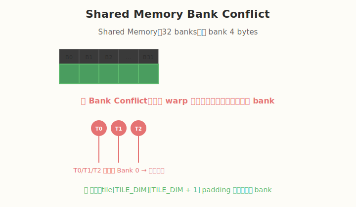

# Week 1：GPU 执行本质 + Profiling

> 核心目标：建立 GPU 性能直觉 —— **性能 = Memory + 并行度**

| 项目 | 说明 |
|------|------|
| 前置要求 | 已安装 CUDA Toolkit 11.8+ / 12.x，Nsight Compute / Systems |
| 建议时长 | 每日 3~5 小时 |
| 本周产出 | 7 个 CUDA kernel、3+ Nsight Compute 报告、GPU 架构与性能笔记 |

---

## 🧭 本周学习地图


```
Day 1: GPU 执行模型（SM / Warp / SIMT）
        ↓
Day 2: Occupancy 与资源约束（寄存器 / 共享内存）
        ↓
Day 3: 源码分析 —— deviceQuery / occupancyCalculator
        ↓
Day 4: Memory Hierarchy（Global / Shared / Cache / Coalescing）
        ↓
Day 5: Bank Conflict 分析与 Padding 技巧
        ↓
Day 6: Nsight Profiling 实战（Compute + Systems）
        ↓
Day 7: 总结与复盘
```

---

## Day 1：GPU 执行模型基础

### 🎯 目标

通过今天的学习，你将：

1. 理解 GPU 与 CPU 在设计哲学上的根本差异
2. 掌握 SM、Warp、Grid、Block、Thread 的核心概念
3. 能独立写出并运行第一个 CUDA 程序
4. 理解 SIMT 执行模型及其对性能的影响
5. 学会计算线程总数、warp 数等基础指标

> 💡 **为什么重要**：GPU 执行模型是 AI Infra 的根基。后续所有 kernel 优化、推理系统调优，最终都回到 "硬件如何执行代码" 这个问题上。

---

### 学前导读：GPU 与 CPU 的不同

| 特性 | CPU | GPU |
|------|-----|-----|
| 核心数量 | 少（几到几十个） | 多（数千个） |
| 核心复杂度 | 复杂（大缓存、分支预测、乱序执行） | 简单（小缓存、顺序执行） |
| 设计目标 | 低延迟（Latency） | 高吞吐（Throughput） |
| 适合任务 | 串行、复杂逻辑 | 大规模并行计算 |
| 典型应用 | 操作系统、业务逻辑 | 深度学习、图形渲染、科学计算 |

**关键洞察**：
- CPU 像一位经验丰富的教授，能快速处理复杂但数量不多的任务
- GPU 像一支庞大的学生队伍，每人只会做简单计算，但一起做能处理海量数据

AI 训练和推理中的矩阵运算、卷积、Attention 都是高度并行的，因此天然适合 GPU。

---

### 理论学习

#### 1.1 GPU 硬件层次总览

```
GPU
├── 多个 SM（Streaming Multiprocessor）
│   ├── CUDA Cores / Tensor Cores
│   ├── 寄存器文件（Register File）
│   ├── Shared Memory / L1 Cache
│   ├── Warp Scheduler
│   └── Load/Store 单元
├── L2 Cache（跨 SM 共享）
└── Global Memory（HBM / GDDR）
```

**SM 是 GPU 并行的基本单位**。一个 kernel 被切分为多个 block，每个 block 被分配到一个 SM 上执行。重要约束：
- 同一个 block **不能跨 SM**
- 一个 SM 可以同时执行多个 block
- 一个 SM 有硬件资源上限（寄存器、共享内存、最大 thread 数）

#### 1.2 SM 架构详解


以 NVIDIA A100 为例：
- 108 个 SM
- 每个 SM：64 个 FP32 CUDA Cores、32 个 FP64 CUDA Cores、4 个 Tensor Core
- 每个 SM：256 KB 寄存器文件
- 每个 SM：最多 2048 个 thread / 64 个 warp / 32 个 block

**Tensor Core** 是专门用于矩阵乘加的硬件单元，是现代深度学习算力的核心来源。

#### 1.3 Warp 与 SIMT 执行模型


**SIMT（Single Instruction Multiple Threads）** 是 NVIDIA GPU 的执行方式：
- 一个 Warp 包含 32 个线程
- 同一个 Warp 内的 32 个线程执行**同一条指令**
- 但每个线程操作**不同的数据**（通过 threadIdx 区分）
- 每个线程有独立的寄存器状态和程序计数器

**SIMT vs SIMD**：
- SIMD：一条指令同时处理固定宽度的数据向量（如 AVX-512 一次处理 512 位数据）
- SIMT：一条指令同时被 32 个线程执行，每个线程可以有自己的数据地址和分支行为

> 你可以把 Warp 理解为 GPU 调度的"最小部队"，一个班 32 个人，必须做同一个动作，但每个人处理自己的一份数据。

#### 1.4 Warp Divergence（分支发散）


当 Warp 内线程遇到条件分支时：

```cuda
if (threadIdx.x % 2 == 0) {
    // 路径 A
} else {
    // 路径 B
}
```

Warp 会先执行路径 A（偶数线程工作，奇数线程被 mask 掉），再执行路径 B（奇数线程工作，偶数线程被 mask 掉）。这导致：
- 两条路径**串行执行**
- 有效算力减半
- 性能下降

**如何避免**：
- 尽量让相邻线程走相同分支
- 使用 warp-level primitive（如 `__ballot_sync`）处理分支
- 数据布局设计时考虑 warp 访问模式

#### 1.5 Grid / Block / Thread 层次结构


CUDA 使用三级层次组织并行：

```
Grid  -> 多个 Block
Block -> 多个 Thread
Thread -> 实际执行的线程
```

**关键内置变量**：

| 变量 | 含义 | 维度 |
|------|------|------|
| `gridDim` | Grid 中 block 的数量 | (x, y, z) |
| `blockDim` | Block 中 thread 的数量 | (x, y, z) |
| `blockIdx` | 当前 block 在 grid 中的坐标 | (x, y, z) |
| `threadIdx` | 当前 thread 在 block 中的坐标 | (x, y, z) |

**线程 ID 计算**：

1D grid + 1D block：
```cuda
int global_tid = blockIdx.x * blockDim.x + threadIdx.x;
```

2D grid + 2D block（常用于图像处理）：
```cuda
int row = blockIdx.y * blockDim.y + threadIdx.y;
int col = blockIdx.x * blockDim.x + threadIdx.x;
int global_tid = row * (gridDim.x * blockDim.x) + col;
```

**总线程数计算**：
```
total = gridDim.x * gridDim.y * gridDim.z *
        blockDim.x * blockDim.y * blockDim.z
```

**Warp 数计算**：
```
warps_per_block = ceil(blockDim.x * blockDim.y * blockDim.z / 32)
total_warps = warps_per_block * gridDim.x * gridDim.y * gridDim.z
```

#### 1.6 常用 CUDA Runtime API

| API | 作用 |
|-----|------|
| `cudaMalloc(&ptr, size)` | 在 GPU 上分配内存 |
| `cudaFree(ptr)` | 释放 GPU 内存 |
| `cudaMemcpy(dst, src, size, kind)` | 在 CPU/GPU 之间拷贝数据 |
| `cudaDeviceSynchronize()` | 等待所有 kernel 执行完成 |
| `cudaGetDeviceProperties(&prop, dev)` | 查询 GPU 属性 |

数据拷贝方向 `kind`：
- `cudaMemcpyHostToDevice`：CPU → GPU
- `cudaMemcpyDeviceToHost`：GPU → CPU
- `cudaMemcpyDeviceToDevice`：GPU → GPU

---

### Coding 任务：第一个 CUDA 程序

#### 任务 1：hello_gpu.cu

创建文件 `kernels/hello_gpu.cu`：

```cuda
#include <stdio.h>

// __global__ 表示这是一个 CUDA kernel，可以从 CPU 调用，在 GPU 上执行
__global__ void hello_gpu() {
    // 计算全局线程 ID（1D 情况）
    int global_tid = blockIdx.x * blockDim.x + threadIdx.x;

    printf("block=(%d,%d,%d), thread=(%d,%d,%d), global_tid=%d\n",
           blockIdx.x, blockIdx.y, blockIdx.z,
           threadIdx.x, threadIdx.y, threadIdx.z,
           global_tid);
}

int main() {
    // 定义 grid 和 block 大小
    dim3 grid(2, 2, 1);   // 2x2 = 4 个 block
    dim3 block(4, 2, 1);  // 每个 block 8 个 thread

    printf("Launching kernel: grid=(%d,%d,%d), block=(%d,%d,%d)\n",
           grid.x, grid.y, grid.z,
           block.x, block.y, block.z);
    printf("Total threads: %d\n",
           grid.x * grid.y * grid.z * block.x * block.y * block.z);

    // 启动 kernel：<<<grid, block>>>
    hello_gpu<<<grid, block>>>();

    // 等待 GPU 完成，否则 printf 输出可能不完整
    cudaDeviceSynchronize();

    return 0;
}
```

#### 任务 2：编译与运行

```bash
# 编译
nvcc -o hello_gpu kernels/hello_gpu.cu

# 运行
./hello_gpu
```

**预期输出**：
```
Launching kernel: grid=(2,2,1), block=(4,2,1)
Total threads: 32
block=(0,0,0), thread=(0,0,0), global_tid=0
block=(0,0,0), thread=(1,0,0), global_tid=1
...
```

> ⚠️ **注意**：如果没有 `cudaDeviceSynchronize()`，kernel 中的 `printf` 可能来不及输出程序就结束了。

#### 任务 3：验证线程总数

手动计算：
```
grid  = (2, 2, 1)  → 4 blocks
block = (4, 2, 1)  → 8 threads/block
total = 4 × 8 = 32 threads
warps = ceil(8 / 32) × 4 = 1 × 4 = 4 warps
```

检查程序输出是否与你计算的一致。

---

### 扩展实验

#### 实验 1：不同 grid/block 配置

修改 `dim3 grid(...)` 和 `dim3 block(...)`，观察输出：

| grid | block | 总线程数 | warp 数 |
|------|-------|---------|--------|
| (1,1,1) | (32,1,1) | 32 | 1 |
| (2,1,1) | (16,1,1) | 32 | 1 |
| (2,2,1) | (16,16,1) | 1024 | 32 |
| (4,1,1) | (256,1,1) | 1024 | 32 |
| (1,1,1) | (1024,1,1) | 1024 | 32 |

**思考问题**：
1. 为什么 block 大小通常取 32 的倍数？
   - 因为 warp 大小是 32，非 32 倍数会造成最后一个 warp 资源浪费。
2. 为什么 block 最大 thread 数一般为 1024？
   - 这是 GPU 硬件限制，由 `maxThreadsPerBlock` 决定。
3. 输出顺序有什么规律？
   - block 执行顺序不保证，同一个 block 内 thread 执行顺序也不保证。

#### 实验 2：2D 线程 ID 计算

实现一个 2D 版本的 kernel，计算每个线程的 2D 全局坐标：

```cuda
__global__ void hello_gpu_2d() {
    int row = blockIdx.y * blockDim.y + threadIdx.y;
    int col = blockIdx.x * blockDim.x + threadIdx.x;
    int width = gridDim.x * blockDim.x;
    int global_tid = row * width + col;

    printf("row=%d, col=%d, global_tid=%d\n", row, col, global_tid);
}
```

使用 `dim3 grid(2, 2)` 和 `dim3 block(4, 4)` 启动，验证 global_tid 是否连续。

#### 实验 3：线程数上限探索

尝试以下配置，观察是否能编译运行：
- `block(1024, 1, 1)` ✓
- `block(1024, 2, 1)` ✗（超过 1024 threads/block）
- `grid(100000, 1, 1)` ✓（grid 维度很大时通常也可以）

---

### 常见错误与调试

| 错误 | 原因 | 解决方法 |
|------|------|---------|
| 没有任何输出 | 缺少 `cudaDeviceSynchronize()` | 在 main 末尾添加 |
| `invalid configuration argument` | block 内线程数超过 1024 | 减小 block 大小 |
| 输出顺序混乱 | CUDA 不保证 block/thread 执行顺序 | 不要依赖执行顺序 |
| 编译错误 `__global__` 未识别 | 用 `.cu` 后缀，用 `nvcc` 编译 | 检查文件后缀和编译器 |

**调试技巧**：
- 先用少量线程（如 1 个 block，8 个 thread）测试
- 使用 `printf` 输出 thread 坐标和中间结果
- 确认 `cudaDeviceSynchronize()` 后再检查输出

---

### 验证 Checklist

- [ ] 能独立编译并运行 `hello_gpu.cu`
- [ ] kernel 能正确打印所有 thread 的坐标
- [ ] 理解 block 内 thread 数量与 warp 数量的关系：`warps = ceil(threads / 32)`
- [ ] 能计算一个 kernel launch 的总 thread 数
- [ ] 能解释 SIMT 与 SIMD 的区别
- [ ] 能解释什么是 warp divergence 以及如何避免
- [ ] 完成至少 2 组不同的 grid/block 配置实验

---

### 今日总结

Day 1 我们建立了 GPU 执行模型的基础认知：

1. **GPU 是吞吐导向的并行处理器**，与 CPU 的设计哲学不同
2. **SM 是 GPU 并行的基本单位**，包含 CUDA Core、Tensor Core、寄存器、共享内存等
3. **Warp 是调度基本单位**，一个 warp 32 个线程执行 SIMT
4. **分支发散会降低性能**，因为 warp 内不同分支需要串行执行
5. **Grid/Block/Thread 三级层次** 组织 CUDA 并行
6. **第一个 CUDA 程序** 让我们直观感受到线程的并行执行

掌握这些概念后，你才能理解为什么某些 CUDA 代码写得好、某些写得慢。

---

### 面试要点

1. **什么是 SIMT？与 SIMD 的区别？**
   - SIMT：Single Instruction Multiple Threads，32 个线程执行同一条指令，但各自处理不同数据
   - SIMD：Single Instruction Multiple Data，一条指令同时处理固定宽度的数据向量
   - SIMT 可以处理分支（虽然有 divergence 代价），SIMD 分支处理更困难

2. **Warp divergence 是什么？如何避免？**
   - 同一个 warp 内线程走不同分支，需要串行执行各分支
   - 避免方法：让相邻线程走相同分支、使用 warp-level primitive

3. **一个 block 最多多少 thread？为什么？**
   - 通常为 1024
   - 这是 GPU 硬件限制，由 `maxThreadsPerBlock` 决定

4. **如何计算一个 kernel 的总 thread 数？**
   - `gridDim.x * gridDim.y * gridDim.z * blockDim.x * blockDim.y * blockDim.z`

5. **CUDA 中 `__global__` 和 `__device__` 的区别？**
   - `__global__`：CPU 调用，GPU 执行（kernel 函数）
   - `__device__`：GPU 调用，GPU 执行（设备端辅助函数）

---

## Day 2：Occupancy 与资源约束

### 🎯 目标
理解 Occupancy 的概念，掌握寄存器、共享内存、block 大小对并行度的影响。

### 理论学习

#### 2.1 Occupancy 定义

```
Occupancy = Active Warp 数量 / SM 支持的最大 Warp 数量
```

- 100% occupancy 不意味着 100% 性能，但 **低 occupancy 容易隐藏延迟能力不足**。
- 每个 SM 同时能驻留的 warp 数受限于：
  - 寄存器文件大小（如 A100 每个 SM 256 KB）
  - Shared memory 大小（如 A100 每个 SM 164 KB，可配置）
  - Block 大小与数量上限

#### 2.2 寄存器分配

- 每个线程的寄存器使用量由编译器自动决定。
- 若单个线程使用寄存器过多，SM 上同时驻留的 warp 数减少，occupancy 下降。
- 若寄存器不够用，会发生 **register spilling**，数据被放到 local memory（实际是 global memory），性能急剧下降。

#### 2.3 `__launch_bounds__`

用于给编译器提示最大 block 大小和最小 warp 数，帮助编译器在寄存器分配上做出权衡：

```cuda
__launch_bounds__(maxThreadsPerBlock, minBlocksPerMultiprocessor)
__global__ void my_kernel(...) { ... }
```

### Coding 任务

创建 `kernels/occupancy_test.cu`：

```cuda
#include <cuda_runtime.h>
#include <stdio.h>

__global__ void compute_intensive(float* out, const float* in, int n) {
    int idx = blockIdx.x * blockDim.x + threadIdx.x;
    float sum = 0.0f;
    #pragma unroll
    for (int i = 0; i < n; ++i) {
        sum += in[(idx + i) % n];
    }
    out[idx] = sum;
}

int main() {
    cudaFuncAttributes attr;
    cudaFuncGetAttributes(&attr, compute_intensive);
    printf("Registers per thread: %d\n", attr.numRegs);
    printf("Shared memory per block: %zu\n", attr.sharedSizeBytes);
    printf("Const memory per block: %zu\n", attr.constSizeBytes);
    return 0;
}
```

编译运行：

```bash
nvcc -o occupancy_test kernels/occupancy_test.cu && ./occupancy_test
```

然后使用 `ncu` 查看 occupancy：

```bash
ncu --metrics sm__warps_active.avg.pct_of_peak_sustained_elapsed ./occupancy_test
```

### 扩展实验

修改 kernel，增加局部变量数量，重新编译并观察 `numRegs` 变化。

| 版本 | 寄存器/线程 | 理论 Occupancy | 备注 |
|------|------------|---------------|------|
| 基础版 | - | - | 基准 |
| 增加局部变量 | - | - | 寄存器增加 |
| 使用 `__launch_bounds__` | - | - | 强制限制寄存器 |

### 验证 Checklist

- [ ] 能用 `cudaFuncGetAttributes` 获取寄存器使用量
- [ ] 理解为什么寄存器过多会降低 occupancy
- [ ] 记录不同配置下的 occupancy 变化表
- [ ] 了解 CUDA Occupancy Calculator 的使用

### 面试要点

- Occupancy 越高越好吗？为什么？
- 寄存器 spilling 是怎么发生的？如何检测？
- `__launch_bounds__` 的使用场景？

---

## Day 3：源码分析 —— CUDA 官方 Samples

### 🎯 目标
学会从官方示例中读取 GPU 硬件属性，理解 occupancy 的官方计算方式。

### 阅读内容

1. **CUDA Samples 中的 `deviceQuery`**
   - 路径：`/usr/local/cuda/samples/1_Utilities/deviceQuery`
   - 或 CUDA 12  toolkit 路径：`/usr/local/cuda/extras/demo_suite/deviceQuery`

2. **CUDA Samples 中的 `occupancyCalculator`**
   - 路径：`/usr/local/cuda/samples/1_Utilities/occupancyCalculator`

3. **CUDA C Programming Guide 第 5 章（Performance Guidelines）**
   - 重点关注：
     - Memory coalescing
     - Shared memory
     - Occupancy
     - Instruction throughput

### 关键源码分析

`deviceQuery` 主要调用：

```cuda
cudaGetDeviceCount(&deviceCount);
cudaGetDeviceProperties(&prop, dev);
```

重点字段：

| 字段 | 含义 |
|------|------|
| `multiProcessorCount` | SM 数量 |
| `maxThreadsPerMultiProcessor` | 每个 SM 最大线程数 |
| `maxThreadsPerBlock` | 每个 block 最大线程数 |
| `sharedMemPerBlock` | 每个 block 最大共享内存 |
| `regsPerBlock` | 每个 block 最大寄存器数 |
| `warpSize` | Warp 大小（通常为 32） |
| `clockRate` | GPU 时钟频率 |
| `memoryClockRate` | 显存时钟频率 |
| `memoryBusWidth` | 显存位宽 |

### 任务

运行 deviceQuery：

```bash
/usr/local/cuda/extras/demo_suite/deviceQuery
```

记录你的 GPU 参数，并手绘 SM 架构简图。

### 验证 Checklist

- [ ] 能独立运行 `deviceQuery` 并解读所有输出字段
- [ ] 理解自己 GPU 的硬件限制参数
- [ ] 画出自己 GPU 的 SM 架构简图
- [ ] 用 CUDA Occupancy Calculator 验证 Day 2 的 occupancy

### 面试要点

- 如何计算显存带宽？`bandwidth = memoryClockRate * memoryBusWidth / 8`
- SM 数量、warp 大小、最大 block 数的关系？
- 你当前 GPU 的峰值算力是多少？

---

## Day 4：Memory Hierarchy 深入

### 🎯 目标
掌握 GPU 内存层次结构，理解 coalesced access 和 shared memory tiling。

### 理论学习

#### 4.1 GPU 内存层次


```
Register（最快，容量最小）
  ↓
Shared Memory（快，可编程，~100 KB/SM）
  ↓
L1 Cache（自动）
  ↓
L2 Cache（跨 SM 共享）
  ↓
Global Memory（最慢，容量最大，即 HBM / GDDR）
```

典型延迟：

| 内存类型 | 延迟 |
|---------|------|
| Register | ~1 cycle |
| Shared Memory | ~20-30 cycles |
| L1 Cache | ~20-30 cycles |
| L2 Cache | ~200 cycles |
| Global Memory | ~400-800 cycles |

#### 4.2 Global Memory Coalesced Access

- 一个 warp 的 32 个线程同时访问 global memory 时，若访问地址连续，会合并成少量事务（transaction）。
- 非连续访问（stride access）会导致多个 memory transaction，带宽利用率大幅下降。


### Coding 任务

创建 `kernels/transpose.cu`，实现矩阵转置：

1. **Naive 版本**：直接按行读、按列写
2. **Shared Memory 优化版**：使用 32x32 或 32x33 tile + padding

```cuda
// Naive transpose
__global__ void transpose_naive(const float* in, float* out, int width, int height) {
    int x = blockIdx.x * blockDim.x + threadIdx.x;
    int y = blockIdx.y * blockDim.y + threadIdx.y;
    if (x < width && y < height) {
        out[x * height + y] = in[y * width + x];
    }
}
```

优化版请参考 Day 5 的 bank conflict 处理。

### 测试命令

```bash
nvcc -o transpose kernels/transpose.cu && ./transpose
ncu --metrics dram__throughput.avg.pct_of_peak_sustained_elapsed \
    ./transpose
```

### 验证 Checklist

- [ ] naive 版本存在 stride access，带宽低
- [ ] 优化版利用 shared memory + 合并写入
- [ ] 用 Nsight Compute 对比两种版本的 memory throughput

### 面试要点

- 什么是 coalesced memory access？如何写出 coalesced 的代码？
- 矩阵转置为什么难做 coalesced？如何解决？
- Shared memory 和 L1 cache 的区别？

---

## Day 5：Bank Conflict 分析与实践

### 🎯 目标
理解 shared memory bank 结构，能识别并消除 bank conflict。

### 理论学习

#### 5.1 Shared Memory Bank 结构

- Shared memory 被划分为 32 个 bank（每 bank 4 bytes）。
- 一个 warp 内不同线程同时访问 **同一个 bank 的不同地址** 时，会发生 bank conflict。
- 访问同一个地址（broadcast）不会 conflict。



#### 5.2 Padding 技术

在 tile 的列维度加 1，可以让数据在 bank 上错开，避免 conflict：

```cuda
#define TILE_DIM 32
__shared__ float tile[TILE_DIM][TILE_DIM + 1];  // +1 padding
```

### Coding 任务

创建 `kernels/bank_conflict.cu`：

```cuda
#define TILE_DIM 32

__global__ void conflict_kernel(float* out, const float* in) {
    __shared__ float tile[TILE_DIM][TILE_DIM];  // 无 padding，会产生 bank conflict
    int tid = threadIdx.x;
    for (int i = 0; i < TILE_DIM; ++i) {
        tile[i][tid] = in[i * TILE_DIM + tid];
    }
    __syncthreads();
    for (int i = 0; i < TILE_DIM; ++i) {
        out[i * TILE_DIM + tid] = tile[i][tid];
    }
}
```

以及无 conflict 版本，将 tile 声明为 `tile[TILE_DIM][TILE_DIM + 1]`。

### Nsight Compute 指标

```bash
ncu --metrics \
  l1tex__data_bank_conflicts_pipe_lsu_mem_shared_op_ld.sum,\
  l1tex__data_bank_conflicts_pipe_lsu_mem_shared_op_st.sum,\
  sm__cycles_elapsed.avg \
  ./bank_conflict
```

### 验证 Checklist

- [ ] Nsight Compute 中观察到 `l1tex__data_bank_conflicts_pipe_lsu_mem_shared_op_ld.sum` 数值变化
- [ ] 冲突版本比无冲突版本慢 2x 以上
- [ ] 理解 padding 的原理和代价（ slight shared memory 浪费）

### 面试要点

- Shared memory 有多少个 bank？每个 bank 多大？
- 什么样的访问模式会产生 bank conflict？
- Padding 的代价是什么？

---

## Day 6：Nsight Profiling 实战

### 🎯 目标
熟练使用 Nsight Compute 和 Nsight Systems 分析 kernel 性能。

### 工具介绍

| 工具 | 粒度 | 用途 |
|------|------|------|
| Nsight Compute (`ncu`) | Kernel 级 | 单个 kernel 的详细指标 |
| Nsight Systems (`nsys`) | 应用级 | 时间线、CPU/GPU 交互、kernel launch overhead |

### 常用 `ncu` 命令

```bash
# 基本指标
ncu ./your_kernel

# 指定指标
ncu --metrics \
  sm__occupancy.avg.pct_of_peak_sustained_elapsed,\
  dram__throughput.avg.pct_of_peak_sustained_elapsed,\
  sm__throughput.avg.pct_of_peak_sustained_elapsed \
  ./your_kernel

# 生成报告
ncu --set full -o report ./your_kernel
ncu-ui report.ncu-rep
```

### 常用 `nsys` 命令

```bash
# 生成时间线报告
nsys profile -o timeline ./your_app
nsys-ui timeline.nsys-rep
```

### 本周 Profiling 任务

对以下 kernel 进行 profiling：

1. `hello_gpu.cu`：观察 kernel launch 时间
2. `occupancy_test.cu`：观察 occupancy
3. `transpose.cu`：观察 memory throughput
4. `bank_conflict.cu`：观察 bank conflict

### Roofline 模型


Roofline 图帮助判断 kernel 是 compute-bound 还是 memory-bound：

```
Attainable FLOP/s = min(Peak FLOP/s, AI * Peak Bandwidth)
```

- **Arithmetic Intensity (AI)** = FLOPs / bytes
- AI 低 → memory-bound
- AI 高 → compute-bound

### 验证 Checklist

- [ ] 生成至少 3 个 kernel 的 Nsight Compute 报告
- [ ] 能读取 Roofline 图并定位瓶颈类型（memory-bound / compute-bound）
- [ ] 能使用 Nsight Systems 查看 kernel launch 时间线
- [ ] 记录各 kernel 的 throughput 和 occupancy 到 `profiles/week1_profile_summary.md`

### 面试要点

- 如何判断一个 kernel 是 memory-bound 还是 compute-bound？
- Nsight Compute 和 Nsight Systems 的区别？
- Roofline 模型如何指导优化？

---

## Day 7：总结与复盘

### 🎯 目标
整理 Week 1 所学，形成可复用的知识资产。

### 总结任务

1. **绘制 GPU 内存层次结构图**
2. **绘制 Occupancy 与性能关系图**
3. **整理 Week 1 学习笔记** 到 `notes/week1_notes.md`

### 建议输出

在 `notes/week1_notes.md` 中至少包含：

- GPU 执行模型要点
- 内存层次与延迟表
- Occupancy 影响因素
- Coalescing 与 Bank Conflict 对比
- Nsight 常用命令速查表

### 弹性安排

- 补完未完成的 coding 任务
- 深入某个感兴趣的方向（如尝试更复杂的 shared memory tiling）

### 面试要点

- 用一句话概括 GPU 性能优化的核心？
- 从硬件执行模型到代码，你的优化思路链是什么？

---

## 📁 本周目录结构

```
week1/
├── README.md              # 本文件：Week 1 完整指南
├── kernels/               # CUDA kernel 源码
│   ├── hello_gpu.cu
│   ├── occupancy_test.cu
│   ├── transpose.cu
│   └── bank_conflict.cu
├── profiles/              # Profiling 报告
│   └── week1_profile_summary.md
└── notes/                 # 学习笔记
    └── week1_notes.md
```

---

## 🔗 推荐资源

| 资源 | 说明 |
|------|------|
| [CUDA C Programming Guide](https://docs.nvidia.com/cuda/cuda-c-programming-guide/) | 官方权威文档 |
| [CUDA Samples](https://github.com/NVIDIA/cuda-samples) | 官方示例代码 |
| [Nsight Compute Docs](https://docs.nvidia.com/nsight-compute/) | Profiling 工具文档 |
| [Nsight Systems Docs](https://docs.nvidia.com/nsight-systems/) | 系统级 trace 文档 |
| [GPU Gems 3 - Chapter 31](https://developer.nvidia.com/gpugems/gpugems3/part-v-physics-simulation/chapter-31-fast-n-body-simulation-cuda) | 经典 CUDA 优化案例 |

---

## ✅ Week 1 完成标准

- [ ] 完成 4 个基础 CUDA kernel 编写与运行
- [ ] 完成 1 个 bank conflict 对比实验
- [ ] 生成 3+ Nsight Compute 报告
- [ ] 完成 `notes/week1_notes.md` 学习笔记
- [ ] 能用自己的话解释：SM、Warp、Occupancy、Coalescing、Bank Conflict
- [ ] 能使用 Nsight 定位 kernel 瓶颈类型

---

> 💡 **提示**：Week 1 是整个 8 周计划的基石。如果 GPU 执行模型和内存层次理解不牢，后续 GEMM、Attention、推理系统都会吃力。建议反复做 Day 4/5/6 的实验，直到能直觉地判断代码是 memory-bound 还是 compute-bound。
