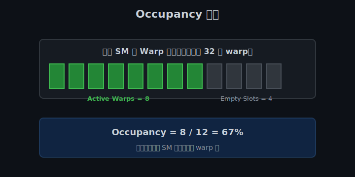
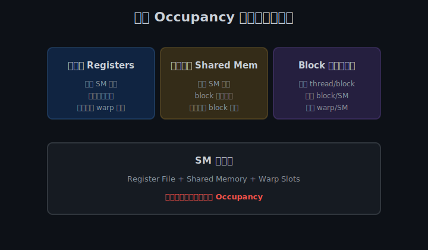
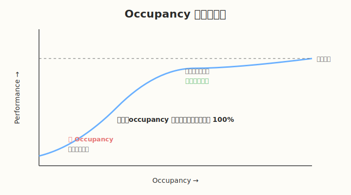

## Day 2：Occupancy 与资源约束

### 🎯 目标

通过今天的学习，你将：

1. 深入理解 Occupancy 的定义和物理意义
2. 掌握影响 Occupancy 的三大资源约束：寄存器、共享内存、block 大小
3. 学会使用 `cudaFuncGetAttributes` 获取 kernel 资源使用情况
4. 理解 register spilling 的危害和检测方法
5. 学会使用 `__launch_bounds__` 控制寄存器使用
6. 能用 CUDA Occupancy Calculator 计算理论 occupancy

> 💡 **为什么重要**：Day 1 知道了 GPU 如何执行代码，Day 2 要知道 GPU **能同时执行多少**代码。Occupancy 决定了 GPU 隐藏延迟的能力，是 kernel 调优的核心指标之一。

---

### 学前导读：为什么需要 Occupancy

GPU 执行指令时存在大量**延迟**：
- Global memory 访问：~400-800 cycles
- Shared memory 访问：~20-30 cycles
- 指令依赖、同步等也会带来延迟

如果 SM 上只驻留很少的 warp，当一个 warp 因为等待内存而停顿时，SM 可能没有别的 warp 可以切换执行，计算单元就会空转。

**Occupancy 衡量的是 SM 上同时活跃的 warp 数量占最大能力的比例**。更高的 occupancy 意味着有更多的 warp 可以轮换执行，从而更好地隐藏延迟。

但注意：**100% occupancy 不等于 100% 性能**。当 occupancy 足够高时（如 50% 以上），再提升 occupancy 的收益会递减，因为此时瓶颈可能在别的地方（如内存带宽、计算吞吐量）。

---

### 理论学习

#### 2.1 Occupancy 定义



```
Occupancy = Active Warp 数量 / SM 支持的最大 Warp 数量
```

**举例**：
- 假设一个 SM 最多支持 32 个 active warp
- 当前 kernel 让每个 SM 上驻留了 16 个 active warp
- 则 Occupancy = 16 / 32 = 50%

**关键认知**：
- Occupancy 是 **per-SM** 的概念
- 它描述的是资源利用率，不是直接的速度
- 低 occupancy 意味着 GPU 可能没有足够的 warp 来隐藏延迟

##### 如何理解"低 occupancy 意味着没有足够的 warp 隐藏延迟"？

理解这句话要抓住两个概念：**延迟（Latency）** 和 **延迟隐藏（Latency Hiding）**。

**第一步：GPU 操作有很大的延迟**

| 操作 | 大致延迟 |
|------|---------|
| 寄存器访问 | ~1 cycle |
| Shared Memory 访问 | ~20–30 cycles |
| L2 Cache 访问 | ~100–200 cycles |
| Global Memory 访问 | ~400–800 cycles |

当一个 warp 从 Global Memory 读数据时，从发出请求到数据返回可能需要几百个 cycle。这段时间里，这个 warp 只能干等。

**第二步：Warp Scheduler 通过切换 warp 来隐藏延迟**

一个 SM 同时驻留很多 warp，但同一时刻只有少部分在执行。当一个 warp 因为等内存而卡住时，Warp Scheduler 会把它换下去，换一个准备好的 warp 上来：

```text
cycle 0:   warp 0 执行 load（发起 Global Memory 请求）
cycle 1:   warp 0 进入等待状态
cycle 2:   warp scheduler 切换到 warp 1 执行
...
cycle 400: 数据还没回来，继续换 warp 2、warp 3 ... 执行
cycle 800: warp 0 的数据回来了，再切换回 warp 0 继续
```

只要总有其他 warp 可以切换，SM 的计算单元就不会空闲，仿佛"延迟被藏起来了"。

**第三步：低 occupancy 的问题**

如果 occupancy 太低，比如一个 SM 上只驻留了 4 个 warp：

```text
warp 0: 等内存中...
warp 1: 等内存中...
warp 2: 等内存中...
warp 3: 也等内存中...
```

所有 warp 都在等内存，没有可切换的 warp，计算单元只能空转。

**形象类比**：

> 把 SM 想象成工厂车间，warp 是工人小组。
> - 高 occupancy：车间里有 60 个小组，A 组等货时，B/C/D 组马上接上，机器不空闲。
> - 低 occupancy：车间里只有 2 个小组，A、B 组都在等货，全车间停工。

**为什么不是 occupancy 越高越好？**

当 occupancy 足够高时（如 50%–70%），通常已经有足够的 warp 隐藏延迟。再往上提升，可能遇到其他瓶颈：

- **内存带宽瓶颈**：数据来不及从显存搬过来
- **计算吞吐量瓶颈**：计算单元已经满负荷
- **资源代价**：增加 occupancy 需要减少每个线程的寄存器/共享内存，可能触发 register spilling

所以 Occupancy 是**必要但不充分**的条件：太低会 stall，太高不一定更快。

> 💡 **一句话总结**：低 occupancy 意味着 SM 上可轮换的 warp 太少，所有 warp 同时等待内存时，计算单元无事可做，性能下降。

#### 2.2 影响 Occupancy 的三大资源约束



每个 SM 的资源是有限的，任一资源耗尽都会限制 occupancy：

| 资源 | 典型限制 | 影响 |
|------|---------|------|
| 寄存器文件 | ~256 KB / SM | 每个线程用的寄存器越多，同时驻留的线程越少 |
| 共享内存 | ~100-164 KB / SM | 每个 block 用的共享内存越多，同时驻留的 block 越少 |
| Block / Warp 数量 | 最大 block/SM、最大 warp/SM | block 太大或数量太多会触顶 |

**A100 具体参数示例**：
- 每个 SM 最大 warp 数：64
- 每个 SM 最大线程数：2048
- 每个 SM 最大 block 数：32
- 每个 SM 寄存器文件：256 KB
- 每个 SM 共享内存：最多 164 KB（可配置）

#### 2.3 寄存器分配与 Register Spilling


**寄存器分配规则**：
- 编译器根据 kernel 代码自动决定每个线程使用多少寄存器
- 寄存器文件总量 / 每个线程寄存器用量 = 最大同时线程数

**Register Spilling（寄存器溢出）**：
- 当编译器发现寄存器不够用时，会把一些变量放到 **local memory**
- Local memory 实际上在 **global memory** 中
- 访问延迟从 ~1 cycle 变成 ~400-800 cycles
- 性能会急剧下降

**如何检测 spilling**：

```bash
nvcc -Xptxas -v kernels/your_kernel.cu
```

输出中的 `lmem` 就是 local memory 使用量。如果 `lmem > 0`，说明发生了 spilling。

#### 2.4 Occupancy 与性能的关系



- **低 occupancy 区**：性能随 occupancy 提升明显，因为能更好地隐藏延迟
- **高 occupancy 区**：性能趋于平缓，此时瓶颈可能是内存带宽或计算吞吐量
- **经验法则**：不必盲目追求 100%，通常 50%-70% 以上就已经足够好

#### 2.5 `__launch_bounds__`

`__launch_bounds__` 是给编译器的**显式提示**，告诉它这个 kernel 启动时的资源约束，让编译器在**寄存器使用**和 **occupancy** 之间做权衡。

##### 语法

```cuda
__launch_bounds__(maxThreadsPerBlock, minBlocksPerMultiprocessor)
__global__ void my_kernel(...) { ... }
```

| 参数 | 含义 | 例子 |
|------|------|------|
| `maxThreadsPerBlock` | 这个 kernel 运行时每个 block 的最大线程数 | `256` |
| `minBlocksPerMultiprocessor` | 每个 SM 上至少要同时运行多少个 block | `4` |

第二个参数可以省略，只写 `__launch_bounds__(maxThreadsPerBlock)`。

##### 它到底在做什么？

GPU 每个 SM 的寄存器文件总量是固定的。编译器在编译 kernel 时会决定每个线程用多少寄存器。寄存器越多，单个线程越快；但同时能驻留的线程就越少，occupancy 就越低。

`__launch_bounds__` 让编译器"提前知道"启动配置：

```text
最大寄存器/线程 ≈ 每个 SM 的寄存器文件总量 / (maxThreadsPerBlock × minBlocksPerMultiprocessor)
```

如果 kernel 代码需要的寄存器超过这个上限，编译器就会：
1. **减少寄存器使用**：把部分变量放到 local memory（即 register spilling）
2. **或使用更保守的优化**：避免生成需要太多寄存器的代码

##### 为什么需要它？

默认情况下，编译器只按"每个线程最多 255 个寄存器"来优化。它不会主动考虑 occupancy。一个 kernel 可能用了 128 个寄存器，跑得很顺，但因为寄存器多，每个 SM 同时驻留的线程少，导致 latency hiding 不足。

`__launch_bounds__` 就是告诉编译器："我这个 kernel 需要高 occupancy，请把寄存器压下来。"

##### 示例 1：限制寄存器，提升 occupancy

假设一个 kernel 逻辑复杂，编译器默认给它分配了 96 个寄存器：

```cuda
// 不限制寄存器：编译器可能用很多寄存器
__global__ void compute_default(const float* in, float* out, int n) {
    int idx = blockIdx.x * blockDim.x + threadIdx.x;
    float a = 0, b = 0, c = 0, d = 0;
    float e = 0, f = 0, g = 0, h = 0;
    // ... 复杂计算
    out[idx] = a + b + c + d + e + f + g + h;
}
```

如果希望每个 SM 上至少同时跑 4 个 block，每个 block 256 线程，可以加：

```cuda
__launch_bounds__(256, 4)
__global__ void compute_limited(const float* in, float* out, int n) {
    int idx = blockIdx.x * blockDim.x + threadIdx.x;
    float a = 0, b = 0, c = 0, d = 0;
    float e = 0, f = 0, g = 0, h = 0;
    // ... 复杂计算
    out[idx] = a + b + c + d + e + f + g + h;
}
```

以 A100 为例：

```text
每个 SM 寄存器文件 = 256 KB = 65536 个 32-bit 寄存器
限制后最大寄存器/线程 = 65536 / (256 × 4) = 64
```

编译器会努力把每个线程的寄存器控制在 64 个以内。如果代码本身需要更多，就会发生 spilling。

##### 示例 2：故意制造 register spilling

参考 [week1/day2/exercise/register_spill.cu](exercise/register_spill.cu)：

```cuda
__launch_bounds__(128, 8)
__global__ void spill_kernel(const float* in, float* out, int n) {
    int idx = blockIdx.x * blockDim.x + threadIdx.x;

    float acc[80];  // 80 个 float，编译器想全部放寄存器
    #pragma unroll
    for (int i = 0; i < 80; i++) {
        acc[i] = in[(idx + i) % n];
    }

    float sum = 0.0f;
    #pragma unroll
    for (int i = 0; i < 80; i++) {
        sum += acc[i] * acc[i] + 1.0f;
    }

    out[idx] = sum;
}
```

编译验证：

```bash
nvcc -Xptxas -v week1/day2/exercise/register_spill.cu
```

输出：

```text
ptxas info    : Function properties for _Z12spill_kernelPKfPfi
    296 bytes stack frame, 488 bytes spill stores, 488 bytes spill loads
ptxas info    : Used 64 registers, 340 bytes cmem[0], 4 bytes cmem[2]
```

`spill stores` 和 `spill loads` 非零，说明发生了 register spilling。

如果把 `__launch_bounds__(128, 8)` 去掉：

```text
ptxas info    : Function properties for _Z15no_spill_kernelPKfPfi
    0 bytes stack frame, 0 bytes spill stores, 0 bytes spill loads
ptxas info    : Used 96 registers, 340 bytes cmem[0], 4 bytes cmem[2]
```

没有 spilling，但用了 96 个寄存器。

##### 使用场景总结

| 场景 | 是否使用 `__launch_bounds__` | 原因 |
|------|---------------------------|------|
| kernel 是 memory-bound | 可以考虑 | 高 occupancy 有助于隐藏内存延迟 |
| kernel 是 compute-bound | 谨慎使用 | 限制寄存器可能导致 spilling，反而更慢 |
| occupancy 明显不足 | 推荐 | 明确告诉编译器需要更多驻留 warp |
| 寄存器用量已经很低 | 不需要 | 用了也无效 |

##### 注意事项

1. **只是提示，不是强制**：编译器会尽量满足，但不保证一定满足。
2. **可能触发 spilling**：过度限制寄存器会让变量溢出到 local memory，性能暴跌。
3. **需要实际测试**：加或不加 `__launch_bounds__`，最终要看 ncu 的实际 occupancy 和性能指标。
4. **通常写在 kernel 定义前**：
   ```cuda
   __launch_bounds__(256, 4)
   __global__ void my_kernel(...) { ... }
   ```

> 💡 **一句话总结**：`__launch_bounds__` 是 occupancy 调优的工具，它用"限制寄存器"换取"更多驻留 warp"，但使用过度会触发 register spilling，需要实测权衡。

---

### Coding 任务：测量 Occupancy

#### 任务 1：基础版 occupancy_test.cu

创建文件 [kernels/occupancy_test.cu](kernels/occupancy_test.cu)：

```cuda
#include <cuda_runtime.h>
#include <stdio.h>

__global__ void compute_intensive(const float* in, float* out, int n) {
    int idx = blockIdx.x * blockDim.x + threadIdx.x;
    float acc = 0.0f;

    // 展开循环，增加寄存器压力
    #pragma unroll 16
    for (int i = 0; i < n; ++i) {
        float v = in[(idx + i) % n];
        acc += v * v + 1.0f;
    }

    out[idx] = acc;
}

int main() {
    cudaFuncAttributes attr;
    cudaError_t err = cudaFuncGetAttributes(&attr, compute_intensive);
    if (err != cudaSuccess) {
        printf("Error: %s\n", cudaGetErrorString(err));
        return 1;
    }

    printf("=== Kernel Attributes ===\n");
    printf("Registers per thread: %d\n", attr.numRegs);
    printf("Shared memory per block: %zu bytes\n", attr.sharedSizeBytes);
    printf("Constant memory per block: %zu bytes\n", attr.constSizeBytes);
    printf("Local memory per thread: %zu bytes\n", attr.localSizeBytes);
    printf("Max threads per block: %d\n", attr.maxThreadsPerBlock);
    printf("=========================\n");

    // 运行一次以便 ncu 可以捕获
    const int N = 1 << 20;
    float *d_in, *d_out;
    cudaMalloc(&d_in, N * sizeof(float));
    cudaMalloc(&d_out, N * sizeof(float));

    int block_size = 256;
    int grid_size = (N + block_size - 1) / block_size;
    compute_intensive<<<grid_size, block_size>>>(d_in, d_out, 64);
    cudaDeviceSynchronize();

    cudaFree(d_in);
    cudaFree(d_out);
    return 0;
}
```

##### 深入理解 `#pragma unroll 16`

代码中有一行：

```cuda
// 展开循环，增加寄存器压力
#pragma unroll 16
for (int i = 0; i < n; ++i) {
    float v = in[(idx + i) % n];
    acc += v * v + 1.0f;
}
```

**什么是 `#pragma unroll`？**

`#pragma unroll` 是 CUDA C/C++ 中的编译器指令，告诉编译器**把循环体展开**。

普通循环每次迭代执行一次循环体：

```text
迭代 0: 加载 v, 计算 acc += v*v + 1
迭代 1: 加载 v, 计算 acc += v*v + 1
迭代 2: 加载 v, 计算 acc += v*v + 1
...
```

`#pragma unroll 16` 会让编译器把循环体复制 16 份，每次迭代处理 16 个元素：

```text
一次大迭代:
  加载 v0, v1, v2, ..., v15
  acc += v0*v0 + 1
  acc += v1*v1 + 1
  ...
  acc += v15*v15 + 1
```

这样可以减少循环控制开销（i 的递增、边界判断、跳转），增加指令级并行（ILP）。

**`#pragma unroll` 的几种写法**：

| 写法 | 含义 |
|------|------|
| `#pragma unroll 16` | 展开 16 倍 |
| `#pragma unroll 4` | 展开 4 倍 |
| `#pragma unroll` | 完全展开（仅当循环次数是编译期常量时有效） |
| `#pragma unroll 1` | 不展开 |

**为什么 `#pragma unroll` 会增加寄存器使用量？**

关键在 `float v = in[(idx + i) % n];` 这行。

- 不展开时，每次循环只有一个 `v` 是"活着的"，编译器可以复用同一个寄存器。
- 展开后，同时有多个 `v` 需要保留（比如 16 个），编译器需要更多寄存器来存放这些同时活跃的变量。

此外，`acc += v * v + 1.0f` 展开后也会产生更多中间结果，进一步增加寄存器需求。

**对比实验**

把 `#pragma unroll` 改成不同倍数，观察寄存器数量变化：

```cuda
#pragma unroll 1   // 不展开
#pragma unroll 4   // 展开 4 倍
#pragma unroll 16  // 展开 16 倍
#pragma unroll     // 完全展开（n 是变量时，实际行为取决于编译器）
```

用 `nvcc -Xptxas -v` 编译后，某 GPU 上的结果：

| unroll 倍数 | 寄存器/线程 | 是否 spilling |
|------------|-----------|--------------|
| 1（不展开） | 16 | 否 |
| 4 | 27 | 否 |
| 16 | 32 | 否 |
| 完全展开 | 27 | 否 |

可以看到：
- **unroll 倍数越大，寄存器用量通常越多**
- 但寄存器增加到一定程度后，编译器会优化或复用，不一定线性增长
- 本例中没有触发 spilling，但如果继续增大 unroll 倍数或增加更多局部变量，就可能 spill

**unroll 的 trade-off**

| 方面 | 不展开 | 过度展开 |
|------|--------|---------|
| 循环开销 | 大 | 小 |
| 指令级并行 | 低 | 高 |
| 寄存器用量 | 少 | 多 |
| 代码体积 | 小 | 大 |
| 风险 | 低 | 可能 spilling、instruction cache 压力 |

**使用建议**：

1. **memory-bound 的 kernel**：适度 unroll 可以提高 ILP，隐藏内存延迟。
2. **compute-bound 的 kernel**：unroll 通常有好处，但要监控寄存器用量。
3. **循环体本身寄存器压力大**：慎用大倍数 unroll，避免 spilling。
4. **先用 `nvcc -Xptxas -v` 检查**：确认没有 spilling 后再决定最终 unroll 倍数。

> 💡 **一句话总结**：`#pragma unroll 16` 让编译器把循环体复制 16 份，减少循环开销、提升并行度，但同时会让更多变量同时"活着"，从而增加寄存器用量。

#### 任务 2：编译运行

```bash
# 编译
nvcc -o occupancy_test kernels/occupancy_test.cu

# 运行
./occupancy_test
```

预期输出示例：

```text
=== Kernel Attributes ===
Registers per thread: 32
Shared memory per block: 0 bytes
Constant memory per block: 0 bytes
Local memory per thread: 0 bytes
Max threads per block: 1024
=========================
```

#### 任务 3：使用 ncu 查看 occupancy

```bash
ncu \
  --metrics \
    sm__occupancy.avg.pct_of_peak_sustained_elapsed,\
    sm__warps_active.avg.pct_of_peak_sustained_elapsed,\
    launch__registers_per_thread \
  ./occupancy_test
```

**关键指标解释**：
- `sm__occupancy.avg.pct_of_peak_sustained_elapsed`：实际 occupancy 百分比
- `launch__registers_per_thread`：每个线程的寄存器数

#### 任务 4：LeetGPU 在线题目 —— ReLU

**题目链接**：<https://leetgpu.com/challenges/relu>

**题目概述**：

给定长度为 N 的浮点数组 input，对其逐元素应用 ReLU 激活函数：output[i] = max(0, input[i])。

**约束条件**：`1 ≤ N ≤ 10,000,000`，数组元素范围 `[-1000.0, 1000.0]`

**难度**：简单　**标签**：CUDA、Element-wise、Activation、Register Pressure

**与今日知识的关联**：

本题代码极简（单条 fmaxf），适合观察 block size 与寄存器用量对 Occupancy 的影响。用 ncu 对比不同 blockDim 下的 achieved occupancy，直接验证 Day 2 的理论。

**解题思路**：

1D grid + 1D block，每个线程处理一个元素。关键不是算力而是内存带宽，用 ncu 观察 memory throughput 和 occupancy 随 block size 的变化。

**参考实现**：

```cuda
__global__ void relu_kernel(const float* input, float* output, int N) {
    int idx = blockIdx.x * blockDim.x + threadIdx.x;
    if (idx < N) {
        output[idx] = fmaxf(input[idx], 0.0f);
    }
}
```

> 💡 提交后在 [LeetGPU ReLU 题目](https://leetgpu.com/challenges/relu)上记录通过耗时，用 ncu 对比不同 block size / tile size 的性能差异。完整题解见 [ReLU 题解](../../LeetGPU/leetgpu-relu-solution.md)。

---

### 扩展实验

#### 实验 1：改变寄存器用量观察 occupancy 变化

创建三个版本的 kernel：

**版本 A：基础版**
```cuda
__global__ void version_a(const float* in, float* out, int n) {
    int idx = blockIdx.x * blockDim.x + threadIdx.x;
    float acc = 0.0f;
    for (int i = 0; i < n; ++i) {
        acc += in[(idx + i) % n];
    }
    out[idx] = acc;
}
```

**版本 B：增加局部变量**
```cuda
__global__ void version_b(const float* in, float* out, int n) {
    int idx = blockIdx.x * blockDim.x + threadIdx.x;
    float a = 0.0f, b = 0.0f, c = 0.0f, d = 0.0f;
    float e = 0.0f, f = 0.0f, g = 0.0f, h = 0.0f;
    for (int i = 0; i < n; ++i) {
        float v = in[(idx + i) % n];
        a += v; b += v * 2; c += v * 3; d += v * 4;
        e += v * 5; f += v * 6; g += v * 7; h += v * 8;
    }
    out[idx] = a + b + c + d + e + f + g + h;
}
```

**版本 C：使用 launch_bounds 强制限制**
```cuda
__launch_bounds__(256, 4)
__global__ void version_c(const float* in, float* out, int n) {
    // 与 version_b 相同代码
}
```

记录结果：

| 版本 | 寄存器/线程 | 理论 Occupancy | 实际 Occupancy | 是否 Spilling |
|------|------------|---------------|---------------|--------------|
| A | | | | |
| B | | | | |
| C | | | | |

#### 实验 2：用 CUDA Occupancy Calculator 验证

打开 CUDA Occupancy Calculator（Excel 文件，通常在 CUDA Samples 中），输入：
- CUDA Capability
- Block size
- Registers per thread
- Shared memory per block

对比理论 occupancy 和 ncu 测得的实际 occupancy。

#### 实验 3：检测 Register Spilling

用以下命令编译版本 B：

```bash
nvcc -Xptxas -v -o occupancy_test_b kernels/occupancy_test_b.cu
```

观察输出中是否有 `lmem`（local memory）非零。

如果看到类似：
```
ptxas info    : 0 bytes gmem
ptxas info    : Compiling entry function 'version_b' for 'sm_80'
ptxas info    : Function properties for version_b
    0 bytes stack frame, 0 bytes spill stores, 0 bytes spill loads
```

`spill stores/loads` 为 0 表示没有 spilling。

---

### 常见错误与调试

| 问题 | 原因 | 解决 |
|------|------|------|
| Occupancy 很低 | 寄存器使用过多 | 减少局部变量，或使用 `__launch_bounds__` |
| 性能反而下降 | `__launch_bounds__` 导致 spilling | 放宽 launch_bounds，或优化算法 |
| ncu 看不到 occupancy | 指标名称写错 | 使用 `sm__occupancy.avg.pct_of_peak_sustained_elapsed` |
| `cudaFuncGetAttributes` 返回错误 | kernel 名称写错 | 直接传函数名，不要加括号 |

---

### 验证 Checklist

- [ ] 能用 `cudaFuncGetAttributes` 获取寄存器使用量
- [ ] 理解为什么寄存器过多会降低 occupancy
- [ ] 能手动计算一个 kernel 的理论 occupancy
- [ ] 记录不同配置下的 occupancy 变化表
- [ ] 了解 CUDA Occupancy Calculator 的使用
- [ ] 能检测 register spilling
- [ ] 理解 `__launch_bounds__` 的使用场景和代价

---

### 今日总结

Day 2 我们深入理解了 GPU 的并行度：

1. **Occupancy = Active Warp / Max Warp per SM**，衡量 SM 上 warp 的活跃程度
2. **三大资源约束**：寄存器文件、共享内存、block/warp 数量上限
3. **寄存器过多** 会降低 occupancy，因为每个线程占用更多资源
4. **Register spilling** 会把变量放到 global memory，性能急剧下降
5. **`__launch_bounds__`** 可以强制编译器在寄存器和 occupancy 之间做权衡
6. **不必追求 100% occupancy**，通常足够高即可

掌握这些后，你就能分析一个 kernel 的资源使用情况，并判断它是否受 occupancy 限制。

---

### 面试要点

1. **Occupancy 越高越好吗？为什么？**
   - 不是。低 occupancy 会限制延迟隐藏能力，但当 occupancy 足够高后（如 50% 以上），继续提升收益递减。
   - 此时瓶颈可能在内存带宽、计算吞吐量或算法本身。

2. **寄存器 spilling 是怎么发生的？如何检测？**
   - 当编译器无法为所有变量分配寄存器时，会把部分变量放到 local memory（实际在 global memory）。
   - 检测方法：`nvcc -Xptxas -v` 查看 `lmem` 或 `spill stores/loads`。

3. **`__launch_bounds__` 的使用场景？**
   - 当 kernel 寄存器使用过多导致 occupancy 过低时，可以用它提示编译器限制寄存器。
   - 代价是可能导致 spilling 或更少的编译优化。

4. **影响 occupancy 的因素有哪些？**
   - 每个线程的寄存器数量
   - 每个 block 的共享内存数量
   - Block 大小和每个 SM 的 block 数量上限

5. **如何计算理论 occupancy？**
   - 使用 CUDA Occupancy Calculator
   - 或手动：根据 SM 资源限制，计算最多能同时驻留多少个 warp

---
