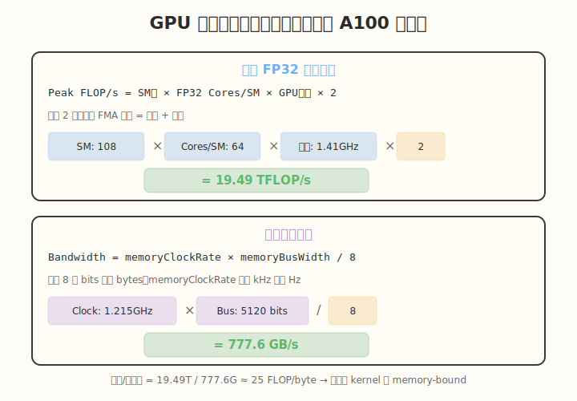
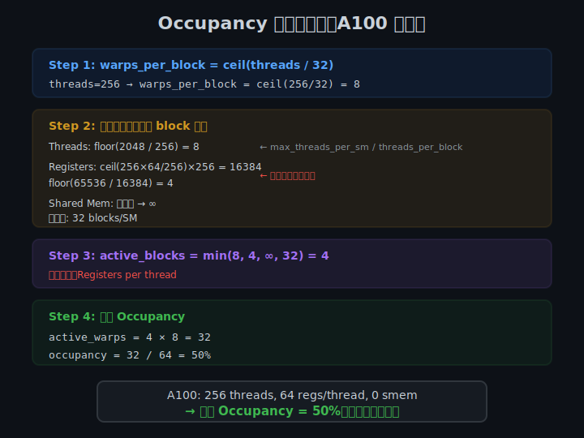

## Day 3：认识你的 GPU —— deviceQuery 与 Occupancy 计算

### 🎯 目标

通过今天的学习，你将：

1. 学会查找和运行 CUDA 官方 Samples，理解 NVIDIA 推荐的编程模式
2. 掌握 `deviceQuery` 输出中每个字段的含义，能在代码中用 `cudaGetDeviceProperties` 查询
3. 能根据 GPU 参数计算**峰值算力**和**显存带宽**，建立「理论上限」直觉
4. 掌握 CUDA Occupancy Calculator 的使用方法，理解四步手算流程
5. 能手算 kernel 的**理论 Occupancy**，并用 `cudaOccupancyMaxActiveBlocksPerMultiprocessor` 验证
6. 理解寄存器、共享内存、block size 三种资源约束如何成为 occupancy 瓶颈

> 💡 **为什么重要**：Day 1 和 Day 2 学的是执行模型与 Occupancy 概念，今天要把这些概念落到具体数字上。只有先「认识你的 GPU」——知道它的 SM 数量、寄存器上限、共享内存上限、带宽和算力——后续调优才有依据。面试中「如何计算 GPU 峰值算力」「如何手算 Occupancy」都是高频题。

---

### 🗺️ 今日学习路径

```
运行 deviceQuery → 查 GPU 硬件参数
        ↓
计算峰值算力 + 显存带宽（建立理论上限直觉）
        ↓
用 Occupancy Calculator 算理论 Occupancy（四步法）
        ↓
手算 Occupancy 练习 + occupancy_verify.cu 验证
```

---

### 学前导读：为什么要读官方代码

CUDA 官方提供了大量示例代码，它们不仅是学习材料，更是**最佳实践**。通过阅读官方代码，你可以：

- 了解 NVIDIA 推荐的编程模式
- 学习如何正确查询硬件属性
- 理解官方如何计算 occupancy
- 避免自己「重复造轮子」

今天的重点是**阅读、运行和理解**，不是写大量代码。你需要把官方工具的输出和自己的 GPU 对应起来。

---

### 理论学习

#### 3.1 CUDA Samples 与 deviceQuery

CUDA Toolkit 安装后，Samples 通常位于以下位置之一：

```bash
# CUDA 11.x 及以前
/usr/local/cuda/samples/

# CUDA 12.x 可能的位置
/usr/local/cuda/extras/demo_suite/
```

如果找不到，可以用以下命令搜索：

```bash
find /usr/local/cuda -name "deviceQuery" 2>/dev/null
find / -name "deviceQuery" 2>/dev/null | head -5
```

常见 Samples 分类：

```
cuda/samples/
├── 0_Introduction/             # 入门示例
├── 1_Utilities/                # 工具类（deviceQuery, bandwidthTest 等）
├── 2_Concepts_and_Techniques/  # 技术概念
├── 3_CUDA_Features/            # CUDA 特性
├── 4_CUDA_Libraries/           # CUDA 库
└── 5_Simulations/              # 物理模拟
```

`deviceQuery` 的核心代码只有两行：

```cuda
cudaGetDeviceCount(&deviceCount);
cudaGetDeviceProperties(&prop, dev);
```

但它的输出信息非常丰富。下面是 deviceQuery 的典型输出（以 A100 为例）：


##### 字段详解

###### 基础信息

| 字段 | 含义 | 用途 |
|------|------|------|
| `name` | GPU 型号名称 | 如 "NVIDIA A100-PCIE-40GB" |
| `totalGlobalMem` | 全局显存总字节数 | 判断能加载多大的模型/数据 |
| `multiProcessorCount` | SM 数量 | 计算峰值算力 |
| `warpSize` | Warp 大小 | 通常为 32 |

###### 并行能力限制

| 字段 | 含义 | 用途 |
|------|------|------|
| `maxThreadsPerBlock` | 每个 block 最大线程数 | 通常为 1024 |
| `maxThreadsPerMultiProcessor` | 每个 SM 最大线程数 | A100 为 2048 |
| `maxBlocksPerMultiProcessor` | 每个 SM 最大 block 数 | A100 为 32 |
| `maxGridSize` | Grid 最大维度 | 决定能启动多少 block |

###### 内存相关

| 字段 | 含义 | 用途 |
|------|------|------|
| `sharedMemPerBlock` | 每个 block 最大共享内存 | Tiling 大小设计 |
| `sharedMemPerMultiprocessor` | 每个 SM 最大共享内存 | Occupancy 计算 |
| `regsPerBlock` | 每个 block 最大寄存器数 | 资源约束 |
| `memoryClockRate` | 显存时钟频率 | 计算显存带宽 |
| `memoryBusWidth` | 显存位宽 | 计算显存带宽 |

###### 计算能力

| 字段 | 含义 | 用途 |
|------|------|------|
| `major` / `minor` | 计算能力版本 | 决定可用的 CUDA 特性 |
| `clockRate` | GPU 核心频率 | 计算峰值算力 |
| `pciBusID` / `pciDeviceID` | PCI 总线信息 | 多 GPU 时区分设备 |

---

#### 3.2 自己写一个 mini deviceQuery

除了运行官方示例，你也可以自己写一个简化版：

```cuda
#include <cuda_runtime.h>
#include <stdio.h>

int main() {
    int deviceCount;
    cudaGetDeviceCount(&deviceCount);
    printf("Detected %d CUDA device(s)\n\n", deviceCount);

    for (int dev = 0; dev < deviceCount; ++dev) {
        cudaDeviceProp prop;
        cudaGetDeviceProperties(&prop, dev);

        printf("Device %d: %s\n", dev, prop.name);
        printf("  Compute Capability: %d.%d\n", prop.major, prop.minor);
        printf("  Total Global Memory: %.2f GB\n", prop.totalGlobalMem / (1024.0 * 1024 * 1024));
        printf("  Number of SMs: %d\n", prop.multiProcessorCount);
        printf("  Warp Size: %d\n", prop.warpSize);
        printf("  Max Threads per Block: %d\n", prop.maxThreadsPerBlock);
        printf("  Max Threads per SM: %d\n", prop.maxThreadsPerMultiProcessor);
        printf("  Max Blocks per SM: %d\n", prop.maxBlocksPerMultiProcessor);
        printf("  Shared Memory per Block: %zu KB\n", prop.sharedMemPerBlock / 1024);
        printf("  Registers per Block: %d\n", prop.regsPerBlock);
        printf("  Memory Clock Rate: %.0f MHz\n", prop.memoryClockRate / 1000.0);
        printf("  Memory Bus Width: %d bits\n", prop.memoryBusWidth);
        printf("  GPU Clock Rate: %.0f MHz\n\n", prop.clockRate / 1000.0);
    }

    return 0;
}
```

编译运行：

```bash
nvcc -o mini_device_query mini_device_query.cu
./mini_device_query
```

> 💡 这个 mini 版就是 [day3/exercise/mini_device_query.cu](exercise/mini_device_query.cu)，你可以直接编译运行。

---

#### 3.3 从 deviceQuery 计算 GPU 峰值算力与显存带宽

拿到 deviceQuery 的输出后，第一件事就是算出 GPU 的理论上限。这两个数字是后续所有性能分析的基准——如果你的 kernel 只达到了峰值算力的 5%，说明还有巨大的优化空间。



##### 理论 FP32 峰值算力

```text
Peak FLOP/s = SM数量 × 每个SM的FP32 CUDA Cores × GPU频率 × 2
```

乘以 2 是因为一条 FMA（Fused Multiply-Add）指令包含乘法与加法两次浮点运算。

以 A100 为例：
- SM 数量：108
- 每个 SM FP32 CUDA Cores：64
- GPU 频率：1.41 GHz

```text
Peak FP32 = 108 × 64 × 1.41 × 2 = 19.49 TFLOP/s
```

##### 理论显存带宽

```text
Bandwidth = memoryClockRate × memoryBusWidth / 8
```

除以 8 是将 bits 转换为 bytes。以 A100 为例：
- memoryClockRate：1215 MHz = 1.215 × 10⁹ Hz
- memoryBusWidth：5120 bits

```text
Bandwidth = 1.215 × 10⁹ × 5120 / 8 = 777.6 GB/s
```

> ⚠️ 注意：`memoryClockRate` 的单位是 kHz，计算前需要先转换成 Hz。

##### 算力带宽比：判断 kernel 类型

有了峰值算力和带宽，可以计算**算术强度平衡点**：

```text
Balance Point = Peak FLOP/s / Peak Bandwidth
A100: 19.49T / 777.6G ≈ 25 FLOP/byte
```

这意味着：如果一个 kernel 每读取 1 byte 数据做的浮点运算**少于 25 次**，它就是 **memory-bound**；**多于 25 次**则是 **compute-bound**。大多数深度学习 kernel（Softmax、LayerNorm、Attention）都是 memory-bound。

> 💡 **面试技巧**：能说出自己 GPU 的峰值算力、带宽和平衡点，是 AI Infra 工程师的基本功。Day 6 的 Roofline 模型会深入用到这个概念。

---

#### 3.4 CUDA Occupancy Calculator

CUDA Occupancy Calculator 是一个 Excel 工具，可以计算理论 occupancy。它通常位于：

```bash
/usr/local/cuda/tools/CUDA_Occupancy_Calculator.xls
```

或者在 NVIDIA 官网下载最新版。


**使用步骤**：
1. 输入 GPU 的 Compute Capability
2. 输入 Kernel 的参数：
   - Threads per block
   - Registers per thread
   - Shared memory per block
3. 读取结果：
   - Active Warps per SM
   - Occupancy (%)
   - Active Blocks per SM
   - 哪个资源是瓶颈

**示例**：
- GPU：A100 (Compute Capability 8.0)
- Block size：256 threads
- Registers per thread：64
- Shared memory per block：0

计算结果会显示：
- 理论 Occupancy：50%
- 瓶颈资源：Registers per thread

---

#### 3.5 Occupancy 手算四步法

理论 occupancy 的核心是先看 **一个 SM 上最多能同时驻留多少个 block**，再换算成 warp。手算分为四步：



##### 步骤 1：计算每个 block 占用的 warp 数

```text
warps_per_block = ceil(threads_per_block / 32)
```

##### 步骤 2：分别从四种资源算出 block 上限

| 资源 | 限制公式 |
|------|---------|
| Threads / Warps | `blocks_from_threads = floor(max_threads_per_sm / threads_per_block)` |
| Registers | `regs_per_block = ceil(threads_per_block * regs_per_thread / reg_granularity) * reg_granularity`<br>`blocks_from_regs = floor(max_regs_per_sm / regs_per_block)` |
| Shared Memory | `smem_per_block = ceil(smem_per_block / smem_granularity) * smem_granularity`<br>`blocks_from_smem = floor(max_smem_per_sm / smem_per_block)` |
| 架构硬上限 | `max_blocks_per_sm` |

> **Granularity 说明**：A100 (CC 8.0) 上寄存器分配按 **256 个寄存器/block** 对齐，共享内存按 **1024 bytes/block** 对齐。具体数值随 Compute Capability 变化。

##### 步骤 3：取最小值得到 Active Blocks

```text
active_blocks = min(blocks_from_threads, blocks_from_regs, blocks_from_smem, max_blocks_per_sm)
```

**瓶颈资源**就是让 `active_blocks` 取到最小值的那一项。

##### 步骤 4：换算成 Active Warps 和 Occupancy

```text
active_warps = active_blocks * warps_per_block
occupancy = active_warps / max_warps_per_sm * 100%
```

##### 完整示例（A100, CC 8.0）

参数：threads=256, regs_per_thread=64, smem=0

| 资源 | 计算 | blocks |
|------|------|--------|
| Threads | floor(2048 / 256) | 8 |
| Registers | ceil(256×64/256)×256 = 16384 → floor(65536 / 16384) | **4** ← 瓶颈 |
| Shared Memory | 未使用 | ∞ |
| 硬上限 | — | 32 |

```text
active_blocks = min(8, 4, ∞, 32) = 4
active_warps  = 4 × 8 = 32
occupancy     = 32 / 64 = 50%
```

> 💡 上述计算基于 SM 资源上限做简化建模，用于**理解原理和快速估算**。要得到与硬件完全一致的精确值，建议使用官方 CUDA Occupancy Calculator 或 `cudaOccupancyMaxActiveBlocksPerMultiprocessor`。

---

#### 3.6 用代码查询 Occupancy：`cudaOccupancyMaxActiveBlocksPerMultiprocessor`

除了手算和 Excel 工具，CUDA Runtime API 提供了直接查询的函数：

```cuda
int numBlocks;
cudaOccupancyMaxActiveBlocksPerMultiprocessor(
    &numBlocks,       // 输出：每 SM 最多能驻留多少个 block
    myKernel,         // kernel 函数指针
    blockSize,        // 每 block 线程数
    dynamicSmemBytes  // 动态共享内存字节数
);
```

这个函数会考虑所有资源约束（寄存器、共享内存、线程数、block 数），返回精确的 `active_blocks`。它比手算更准确，因为编译器可能对寄存器做了额外优化。

[day3/exercise/occupancy_verify.cu](exercise/occupancy_verify.cu) 就是用来对比手算与 API 结果的验证程序。

---

#### 3.7 Occupancy 为什么重要

Occupancy 衡量的是一个 SM 上同时活跃的 warp 数量占最大能力的比例。更高的 occupancy 意味着有更多的 warp 可以轮换执行，从而更好地**隐藏延迟**。

| 操作 | 大致延迟 |
|------|---------|
| 寄存器访问 | ~1 cycle |
| Shared Memory 访问 | ~20–30 cycles |
| L2 Cache 访问 | ~100–200 cycles |
| Global Memory 访问 | ~400–800 cycles |

当一个 warp 等待 Global Memory 数据返回时，Warp Scheduler 可以切换到另一个准备好的 warp 执行。如果 SM 上驻留的 warp 太少，所有 warp 同时等待时计算单元就会空转。

但注意：**100% occupancy 不等于 100% 性能**。当 occupancy 足够高时（如 50%–75%），再提升的收益会递减，因为瓶颈可能在内存带宽或计算吞吐量上。

> 💡 **经验法则**：不必盲目追求 100% occupancy。通常 50%–75% 就已足够隐藏大部分延迟。如果提高 occupancy 需要牺牲寄存器（导致 spilling），反而会降低性能。

---

### Coding 任务

#### 任务 1：运行 deviceQuery

找到并运行官方 deviceQuery：

```bash
# 尝试路径 1
/usr/local/cuda/extras/demo_suite/deviceQuery

# 尝试路径 2
/usr/local/cuda/samples/1_Utilities/deviceQuery/deviceQuery

# 如果找不到，搜索
find /usr/local/cuda -name deviceQuery
```

**记录输出**：把输出保存到 `notes/my_gpu_info.md`，后续会经常用到。

#### 任务 2：创建自己的 mini_device_query

参考上面的代码，编译运行 [day3/exercise/mini_device_query.cu](exercise/mini_device_query.cu)：

```bash
cd week1/day3/exercise
nvcc -o mini_device_query mini_device_query.cu
./mini_device_query
```

#### 任务 3：计算你的 GPU 峰值算力和显存带宽

使用 deviceQuery 输出的参数，按 3.3 节的公式计算：

1. 理论 FP32 峰值算力
2. 理论显存带宽
3. 算力带宽比（平衡点），判断你的 GPU 上哪些 kernel 更可能是 memory-bound

把结果记录到 `notes/my_gpu_info.md`。

#### 任务 4：使用 Python 版 Occupancy Calculator

仓库提供了 [tools/cuda_occupancy_calculator.py](../tools/cuda_occupancy_calculator.py)，无需 Excel 即可计算：

```bash
python3 tools/cuda_occupancy_calculator.py \
    --cc 8.0 --registers 64 --block-size 256
```

对比输出与手算结果是否一致。

#### 任务 5：手算 Occupancy 并用程序验证

完成 [day3/exercise/occupancy_problems.md](exercise/occupancy_problems.md) 中的手算练习题，覆盖寄存器、共享内存、block size 等典型约束场景。

然后编译运行验证程序：

```bash
cd week1/day3/exercise
nvcc -std=c++11 -o occupancy_verify occupancy_verify.cu
./occupancy_verify
```

对比手算结果与 `cudaOccupancyMaxActiveBlocksPerMultiprocessor` 的输出，理解：

- 不同资源约束如何成为 occupancy 瓶颈
- 为什么有时调整 block size 对 occupancy 没有帮助
- `__launch_bounds__` 如何影响编译器的寄存器分配决策

#### 任务 6：LeetGPU 在线题目 —— Argmax

**题目链接**：<https://leetgpu.com/challenges/argmax>

**题目概述**：

给定长度为 N 的浮点数组 input，找到最大值所在的下标。如果有多个相同最大值，返回最小的下标。

**约束条件**：`1 ≤ N ≤ 10,000,000`，数组元素范围 `[-1000.0, 1000.0]`

**难度**：中等　**标签**：CUDA、Reduction、Argmax、Warp Shuffle

**与今日知识的关联**：

本题是一个带状态追踪的归约问题——不仅要找最大值，还要记录其下标。要求理解 grid-stride loop 和边界处理，同时为 Day 5 的 Warp Shuffle 归约做铺垫。

**解题思路**：

每个线程用 grid-stride loop 找到自己所负责区间的局部最大值及下标，然后做 block 级归约。本题只需正确性，暂不要求 Warp Shuffle 优化（Day 5 会用 Shuffle 重做）。

**参考实现**：

```cuda
__global__ void argmax_kernel(const float* input, int* out_idx, int N) {
    int tid = blockIdx.x * blockDim.x + threadIdx.x;
    float local_max = -INFINITY;
    int local_idx = 0;

    // grid-stride loop: 每个线程找自己负责区间的局部 argmax
    for (int i = tid; i < N; i += gridDim.x * blockDim.x) {
        if (input[i] > local_max) {
            local_max = input[i];
            local_idx = i;
        }
    }

    // 简化版:用 atomicMax 做跨 block 归约(正确但非最优)
    // Day 5 会用 Warp Shuffle + Shared Memory 重写这部分
    __shared__ float s_val[32];
    __shared__ int   s_idx[32];

    int lane = threadIdx.x & 31;
    int wid  = threadIdx.x >> 5;

    // 用 warp shuffle 找 warp 内 argmax
    for (int offset = 16; offset > 0; offset >>= 1) {
        float other_val = __shfl_down_sync(0xFFFFFFFF, local_max, offset);
        int   other_idx = __shfl_down_sync(0xFFFFFFFF, local_idx, offset);
        if (other_val > local_max || (other_val == local_max && other_idx < local_idx)) {
            local_max = other_val;
            local_idx = other_idx;
        }
    }

    if (lane == 0) {
        s_val[wid] = local_max;
        s_idx[wid] = local_idx;
    }
    __syncthreads();

    if (wid == 0) {
        int numWarps = (blockDim.x + 31) / 32;
        local_max = (lane < numWarps) ? s_val[lane] : -INFINITY;
        local_idx = (lane < numWarps) ? s_idx[lane] : 0;

        for (int offset = 16; offset > 0; offset >>= 1) {
            float other_val = __shfl_down_sync(0xFFFFFFFF, local_max, offset);
            int   other_idx = __shfl_down_sync(0xFFFFFFFF, local_idx, offset);
            if (other_val > local_max || (other_val == local_max && other_idx < local_idx)) {
                local_max = other_val;
                local_idx = other_idx;
            }
        }

        if (lane == 0) atomicMax(out_idx, local_idx);
    }
}
```

> 💡 提交后在 LeetGPU 上记录通过耗时，用 ncu 对比不同 block size / tile size 的性能差异。完整题解见 [LeetGPU/leetgpu-argmax-solution.md](../../LeetGPU/leetgpu-argmax-solution.md)。

---

### 扩展实验

#### 实验 1：对比不同 GPU 的参数

如果你有多块 GPU（或查看同学/同事的 GPU），对比以下参数：

| GPU | SM 数 | FP32 Cores/SM | 显存 | 带宽 | 计算能力 | 平衡点 |
|-----|-------|--------------|------|------|---------|--------|
| | | | | | | |

思考：为什么不同 GPU 的架构差异这么大？平衡点如何影响 kernel 设计？

#### 实验 2：用 `cudaChooseDevice` 选择 GPU

在多 GPU 机器上，可以用 `cudaChooseDevice` 选择最合适的 GPU：

```cuda
#include <cuda_runtime.h>

int main() {
    cudaDeviceProp prop;
    memset(&prop, 0, sizeof(prop));
    prop.major = 7;  // 至少 Turing
    prop.minor = 0;

    int dev;
    cudaChooseDevice(&dev, &prop);
    printf("Best device: %d\n", dev);

    cudaSetDevice(dev);
    return 0;
}
```

#### 实验 3：阅读 CUDA Programming Guide 性能优化章节

Day 3 只需要建立性能优化的**整体框架**。新版《CUDA Programming Guide》中与性能相关的内容已整理到 [notes/cuda_programming_guide_performance.md](notes/cuda_programming_guide_performance.md)，供延伸阅读。后续 Day 4–Day 6 会针对内存访问、共享内存、Occupancy、指令瓶颈做专项练习。

---

### 常见错误与调试

| 问题 | 原因 | 解决 |
|------|------|------|
| deviceQuery 找不到 | CUDA Samples 未安装 | 重新安装 CUDA Toolkit 时勾选 Samples |
| 输出 `CUDA driver version is insufficient` | 驱动版本太低 | 升级 NVIDIA 驱动 |
| `cudaGetDeviceProperties` 返回错误 | device ID 无效 | 确保 dev 在 0 到 deviceCount-1 之间 |
| Occupancy Calculator 打不开 | 缺少 Excel | 使用 Python 版 `tools/cuda_occupancy_calculator.py` |
| 手算 occupancy 与 API 结果不一致 | 粒度、计算能力版本或编译器优化差异 | 以 `cudaOccupancyMaxActiveBlocksPerMultiprocessor` 为准，手算用于理解原理 |
| `occupancy_verify.cu` 默认编译失败 | CUDA/GCC 默认 C++ 标准冲突 | 使用 `nvcc -std=c++11 ...` |

---

### 验证 Checklist

- [ ] 能独立运行 `deviceQuery` 并解读所有输出字段
- [ ] 能自己写一个简化版 deviceQuery（[mini_device_query.cu](exercise/mini_device_query.cu)）
- [ ] 理解自己 GPU 的硬件限制参数
- [ ] 能计算 GPU 的理论峰值算力
- [ ] 能计算 GPU 的理论显存带宽
- [ ] 能计算算力带宽比（平衡点），判断 kernel 类型
- [ ] 能根据 kernel 参数手动计算理论 occupancy（四步法）
- [ ] 能解释寄存器、共享内存、block size 三种资源约束如何影响 occupancy
- [ ] 用 Python 版 Occupancy Calculator 或 Excel 验证 Day 2 的 occupancy
- [ ] 运行 `occupancy_verify.cu` 并对比手算与运行时结果
- [ ] 画出自己 GPU 的 SM 架构简图

---

### 今日总结

Day 3 我们学会了用官方工具了解自己的 GPU，并把概念变成具体数字：

1. **CUDA Samples** 是学习 CUDA 的最佳实践来源
2. **`deviceQuery`** 可以告诉我们 GPU 的所有硬件参数
3. **`cudaGetDeviceProperties`** 是在代码中查询 GPU 属性的核心 API
4. 我们学会了计算 GPU 的**峰值算力**和**显存带宽**，以及**算力带宽比**
5. **CUDA Occupancy Calculator** 可以计算理论 occupancy（四步法）
6. 我们掌握了 Occupancy 的**手算方法**和**代码验证方法**（`cudaOccupancyMaxActiveBlocksPerMultiprocessor`）

掌握这些后，你才能真正「了解你的武器」，知道它的极限在哪里。

---

### 面试要点

1. **如何计算显存带宽？**
   ```text
   bandwidth = memoryClockRate × memoryBusWidth / 8
   ```
   注意单位转换：deviceQuery 输出的 memoryClockRate 是 kHz，需转为 Hz；除以 8 将 bits 转为 bytes。

2. **如何计算 GPU 峰值算力？**
   ```text
   Peak FLOP/s = SM数量 × 每个SM的FP32 CUDA Cores × GPU频率 × 2
   ```
   乘以 2 是因为一条 FMA 指令包含乘法与加法两次浮点运算。

3. **什么是算力带宽比（平衡点）？有什么用？**
   - Balance Point = Peak FLOP/s / Peak Bandwidth（单位：FLOP/byte）
   - A100 约 25 FLOP/byte：每读 1 byte 做少于 25 次运算 → memory-bound；多于 25 次 → compute-bound
   - 这是 Roofline 模型的核心，能快速判断 kernel 瓶颈类型

4. **Occupancy 的手算步骤是什么？**
   - Step 1: `warps_per_block = ceil(threads_per_block / 32)`
   - Step 2: 分别从 thread、register、shared memory、硬上限四个维度算 `active_blocks`
   - Step 3: `active_blocks = min(四者)`，取最小值的资源是瓶颈
   - Step 4: `occupancy = active_blocks × warps_per_block / max_warps_per_sm`

5. **影响 Occupancy 的资源有哪些？**
   - 每个 block 的 thread 数
   - 每个 thread 的寄存器数
   - 每个 block 的 shared memory 用量
   - SM 的 `maxBlocksPerMultiProcessor` 硬上限

6. **手算结果和 API 结果不一致怎么办？**
   - 以 `cudaOccupancyMaxActiveBlocksPerMultiprocessor` 为准
   - 差异来源：寄存器/共享内存分配粒度、计算能力版本差异、编译器优化
   - 手算用于理解原理和快速估算

---
