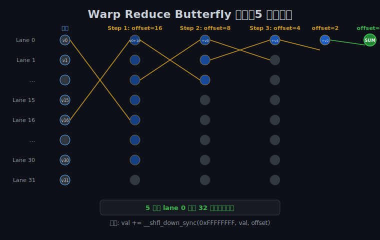
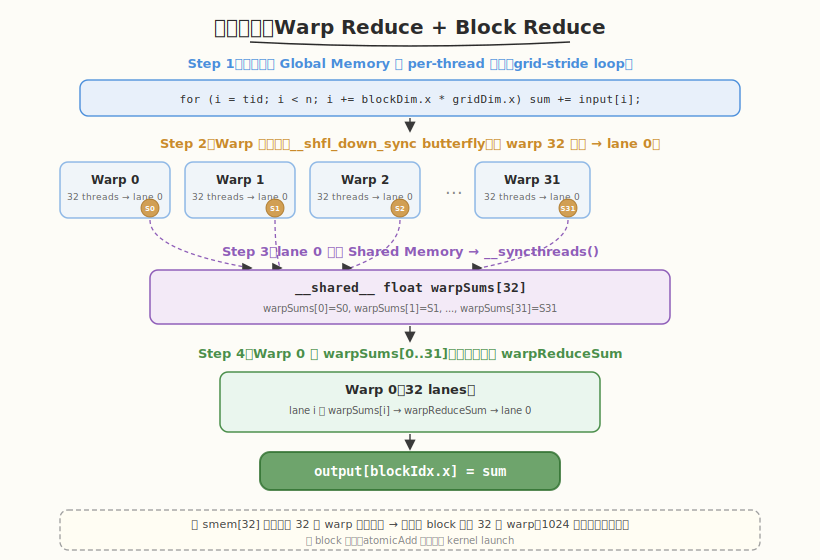
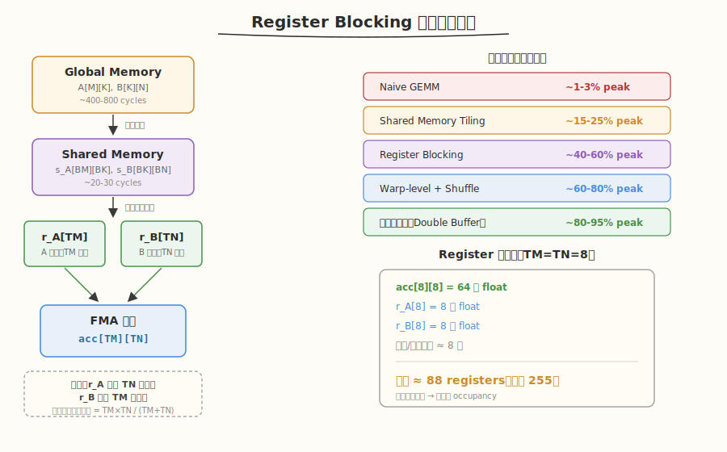
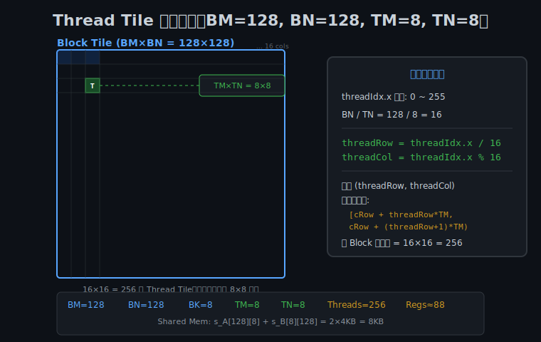
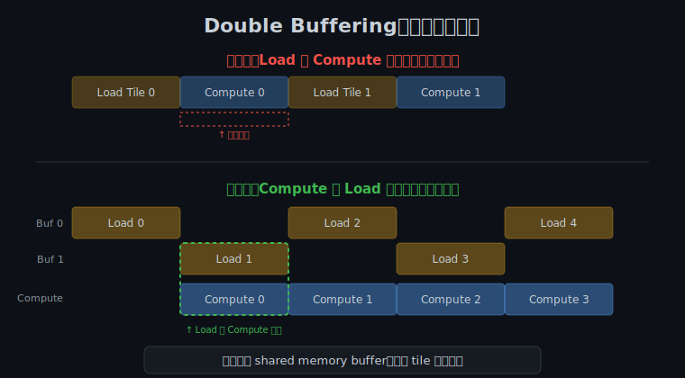
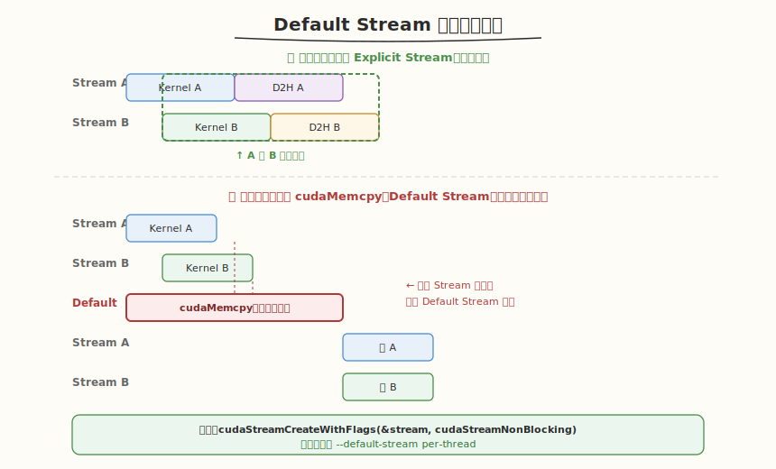
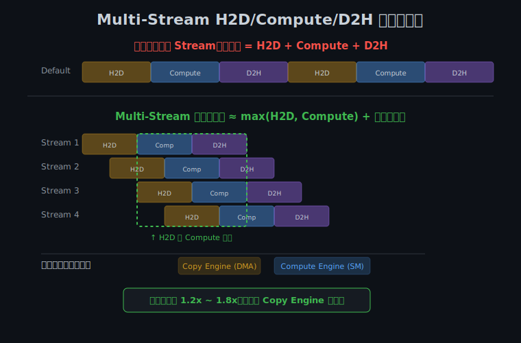
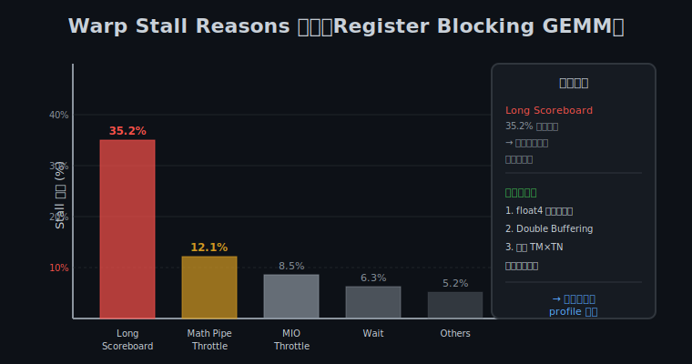
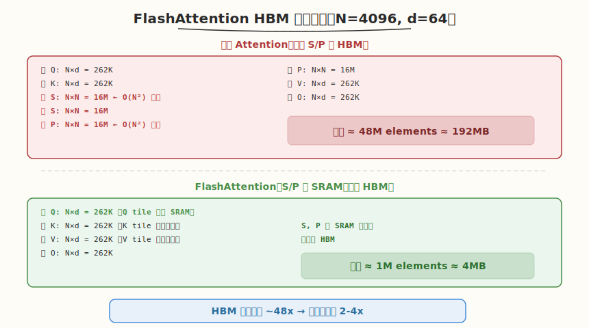
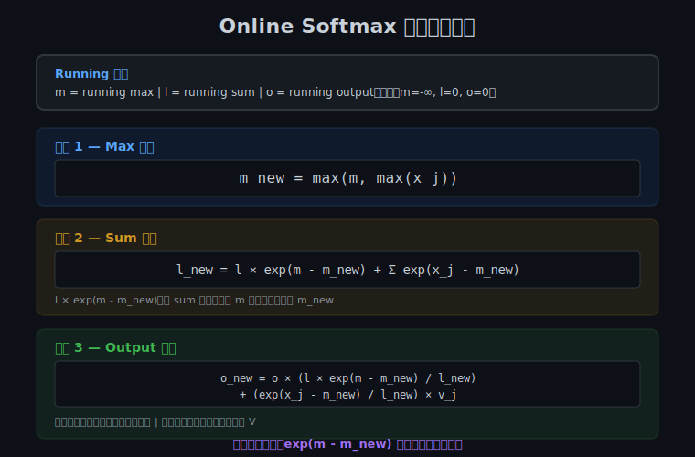

# Week 2：CUDA 进阶优化与性能分析

> 核心目标：掌握 Warp Shuffle、Register Blocking、CUDA Stream 异步执行、Nsight 性能分析和 FlashAttention CUDA 实现

| 项目 | 说明 |
|------|------|
| 前置要求 | 已完成 Week 1 学习，掌握向量加法、Naive GEMM、Shared Memory Tiling GEMM、Softmax Kernel |
| 建议时长 | 工作日每天 2.5h，周末每天 6h，周计 24.5h |
| 本周产出 | Warp Reduce Kernel、Register Blocking GEMM（cuBLAS 40%+）、Multi-Stream 重叠执行、Nsight 分析报告、FlashAttention 简化版 Forward Kernel、整合优化 GEMM（cuBLAS 70%+） |
| 周日里程碑 | 手写优化 GEMM 达到 cuBLAS 70%+ 性能，完成简化版 FlashAttention Forward Kernel |

---

## 🧭 本周学习地图

```
Day 1: Warp Shuffle 原语 → Warp Reduce Kernel（两级归约）
        ↓
Day 2: Register Blocking + 2D Tiling → GEMM cuBLAS 40%+
        ↓
Day 3: CUDA Streams 异步 → H2D/Compute/D2H 重叠流水线
        ↓
Day 4: Nsight Compute → Register Blocking GEMM 瓶颈分析
        ↓
Day 5: FlashAttention → Online Softmax 推导 + Forward Kernel
        ↓
Day 6: 整合 Warp Shuffle + Register Blocking → GEMM cuBLAS 70%+
        ↓
Day 7: 限时 Kernel 手撕 + GitHub 整理 + 性能对比报告
```

---

## Day 1：Warp Shuffle 原语与 Warp/Block Reduce

### 🎯 目标

通过今天的学习，你将：

1. 理解 Warp Shuffle 的硬件原理和相比 Shared Memory 的延迟优势
2. 掌握 `__shfl_sync`、`__shfl_up_sync`、`__shfl_down_sync`、`__shfl_xor_sync` 四个原语
3. 理解 Butterfly 模式归约的 5 步通信过程
4. 手写完整的 Warp Reduce + Block Reduce 两级归约 Kernel
5. 理解为什么需要两级归约，以及第二级归约为什么也用 Warp Shuffle
6. 能对照昇腾 CANN 的 Vector Unit 理解 Warp 级通信的跨平台一致性

> 💡 **为什么重要**：Warp Shuffle 是手写 Reduce、Scan、GEMM 写回优化的标配技术，也是面试中「手写 Block Reduce」的核心考点。它比 Shared Memory 快一个数量级，是 GPU 内部最快的线程间通信方式。

---

### 学前导读：为什么需要 Warp 级通信

在 Week 1 中，我们学习了 Shared Memory 作为 block 内线程共享数据的手段。但在很多场景下，通信只发生在 **同一个 Warp 内的 32 个线程之间**，此时 Shared Memory 并不是最优选择。

#### Shared Memory 的局限

Shared Memory 虽然比 Global Memory 快得多（~20-30 cycles vs ~400-800 cycles），但它仍然有几个开销：

1. **需要同步**：写 Shared Memory 后必须调用 `__syncthreads()` 保证可见性
2. **需要两条指令**：先 store 到 Shared Memory，再 load 从 Shared Memory
3. **延迟仍有 20-30 cycles**：对于高频的 Warp 内通信，这个延迟不可忽略

#### Warp Shuffle 的优势

从 Kepler 架构（Compute Capability 3.0）起，NVIDIA 引入了 Warp Shuffle 原语，允许同一 Warp 内的线程**直接交换寄存器数据**，无需经过 Shared Memory：

| 通信方式 | 延迟（周期） | 是否需要 `__syncthreads()` | 指令数 | 适用场景 |
|---------|------------|-------------------------|--------|---------|
| Shared Memory 中转 | ~20-30 cycles | 是（需同步） | ≥ 2 条（store + load） | Block 级通信（跨 Warp） |
| **Warp Shuffle 直连** | **~1-2 cycles** | **否（硬件同步）** | **1 条** | **Warp 内通信（32 线程）** |
| Register 直连 | ~0 cycles | 否 | 0 | 同一线程内复用 |

**核心洞察**：Shuffle 的延迟比 Shared Memory 低一个数量级，因为它直接通过 Warp 内部的专用交换网络传输数据，无需经过 Shared Memory 的读写路径。

> 💡 **一句话总结**：Warp Shuffle 是 GPU 内部最快的线程间通信方式，比 Shared Memory 快 10-20 倍，但仅限于同一 Warp 内的 32 个线程。

---

### 理论学习

#### 1.1 Warp Shuffle 四大家族


CUDA 提供了四个 Warp Shuffle 原语，分别对应不同的通信模式：

| 原语名称 | 函数签名 | 作用描述 | 使用场景 |
|---------|---------|---------|---------|
| `__shfl_sync` | `T __shfl_sync(unsigned mask, T var, int srcLane, int width=warpSize)` | 从 `srcLane` 线程读取 `var` 值 | 广播：线程 0 的结果广播给 Warp 内所有线程 |
| `__shfl_up_sync` | `T __shfl_up_sync(unsigned mask, T var, unsigned int delta, int width=warpSize)` | 从 `threadIdx-delta` 线程读取 | 前缀和：每个线程获取左侧 delta 距离线程的值 |
| `__shfl_down_sync` | `T __shfl_down_sync(unsigned mask, T var, unsigned int delta, int width=warpSize)` | 从 `threadIdx+delta` 线程读取 | 归约：Warp 内折半累加 |
| `__shfl_xor_sync` | `T __shfl_xor_sync(unsigned mask, T var, int laneMask, int width=warpSize)` | 从 `threadIdx ^ laneMask` 线程读取 | Butterfly 交换：归约、位反转排序 |

##### 四个原语的数据流向图

```
__shfl_sync(mask, val, srcLane=4):
  Lane:  0   1   2   3   4   5   6   7  ... 31
  数据:  ?   ?   ?   ?   V4  ?   ?   ?  ... ?
  结果:  V4  V4  V4  V4  V4  V4  V4  V4  ... V4    ← 所有 lane 都得到 lane 4 的值

__shfl_up_sync(mask, val, delta=2):
  Lane:  0   1   2   3   4   5   6   7  ... 31
  数据:  V0  V1  V2  V3  V4  V5  V6  V7  ... V31
  结果:  V0  V1  V0  V1  V2  V3  V4  V5  ... V29  ← 每个 lane 从上方 delta 处取值

__shfl_down_sync(mask, val, delta=2):
  Lane:  0   1   2   3   4   5   6   7  ... 31
  数据:  V0  V1  V2  V3  V4  V5  V6  V7  ... V31
  结果:  V2  V3  V4  V5  V6  V7  V8  V9  ...  ?   ← 每个 lane 从下方 delta 处取值

__shfl_xor_sync(mask, val, laneMask=2):
  Lane:  0   1   2   3   4   5   6   7  ... 31
  交换:  2   3   0   1   6   7   4   5  ... 29  ← lane i 与 lane (i^2) 交换
```

#### 1.2 参数详解

以 `__shfl_down_sync` 为例，它有四个参数：

```cpp
float val = __shfl_down_sync(0xFFFFFFFF, myVal, 16, 32);
//              │              │           │      │    │
//              │              │           │      │    └── width: 参与 shuffle 的宽度（默认 32）
//              │              │           └─────────────── delta: 向下偏移量
//              │              └─────────────────────────── var: 要传递的变量
//              └────────────────────────────────────────── mask: 线程掩码，0xFFFFFFFF=全部 32 线程
//              └────────────────────────────────────────── 返回值: 从目标线程读取的值
```

##### mask 参数详解

`mask` 是一个 32 位无符号整数，每一位对应 Warp 内的一个 lane（线程）：

- `0xFFFFFFFF`（全部 32 位为 1）：表示 Warp 内所有 32 个线程都参与
- `0x0000FFFF`：表示只有 lane 0-15 参与
- `0xFFFF0000`：表示只有 lane 16-31 参与

> ⚠️ **注意**：从 Volta 架构（CC 7.0）开始，必须使用 `_sync` 后缀版本（带显式 mask）。旧版 `__shfl_down`（无 mask）已被弃用，因为 Volta 引入了独立线程调度，需要显式指定哪些线程参与 shuffle。

##### width 参数详解

`width` 控制 shuffle 操作的分组宽度，必须是 2 的幂（2, 4, 8, 16, 32）：

```cpp
// width=32（默认）：整个 Warp 一起 shuffle
val = __shfl_down_sync(0xFFFFFFFF, val, 1, 32);  // lane 0 读 lane 1

// width=16：Warp 分成两组（lane 0-15, lane 16-31），各自独立 shuffle
val = __shfl_down_sync(0xFFFFFFFF, val, 1, 16);  // lane 0 读 lane 1，lane 16 读 lane 17
```

#### 1.3 Warp Reduce Butterfly 模式



Warp Reduce（求和）使用 `__shfl_down_sync` 实现折半累加，整个过程像蝴蝶展翅，因此称为 **Butterfly 模式**：

```
Step 1 (offset=16): lane0 <- lane0+lane16, lane1 <- lane1+lane17, ... lane15 <- lane15+lane31
Step 2 (offset=8):  lane0 <- lane0+lane8,  lane1 <- lane1+lane9,  ... lane7  <- lane7+lane15
Step 3 (offset=4):  lane0 <- lane0+lane4,  lane1 <- lane1+lane5,  ... lane3  <- lane3+lane7
Step 4 (offset=2):  lane0 <- lane0+lane2,  lane1 <- lane1+lane3
Step 5 (offset=1):  lane0 <- lane0+lane1
Result: lane 0 持有 Warp 内 32 个线程的累加和
```

5 步操作（`log₂32 = 5`）即可完成 32 个线程的归约，每步只需 1 条 shuffle 指令。

对应的代码：

```cuda
__inline__ __device__ float warpReduceSum(float val) {
    #pragma unroll
    for (int offset = warpSize / 2; offset > 0; offset >>= 1) {
        val += __shfl_down_sync(0xFFFFFFFF, val, offset);
    }
    return val;
}
```

##### `__shfl_down_sync` vs `__shfl_xor_sync` 的区别

两者都能实现归约，但有一个关键区别：

| 原语 | 归约后哪些 lane 有结果 | 适用场景 |
|------|---------------------|---------|
| `__shfl_down_sync` | **只有 lane 0** 有最终结果 | 只需要一个结果的归约 |
| `__shfl_xor_sync` | **所有 lane** 都有最终结果 | 需要所有线程都知道归约结果的场景（如 broadcast） |

```cuda
// down 模式：只有 lane 0 有结果
__inline__ __device__ float warpReduceSum(float val) {
    for (int offset = 16; offset > 0; offset >>= 1)
        val += __shfl_down_sync(0xFFFFFFFF, val, offset);
    return val;  // 只有 lane 0 的 val 是完整的
}

// xor 模式：所有 lane 都有结果
__inline__ __device__ float warpReduceSumAll(float val) {
    for (int offset = 16; offset > 0; offset >>= 1)
        val += __shfl_xor_sync(0xFFFFFFFF, val, offset);
    return val;  // 所有 lane 的 val 都是完整的
}
```

#### 1.4 两级归约：Warp Reduce + Block Reduce



##### 为什么需要两级归约？

单个 Warp 只有 32 个线程。但一个 Block 可能有 1024 个线程（32 个 Warp）。Warp 级归约只解决 32 线程的汇总，Block 级需要将 32 个 Warp 的结果再做一次汇总。

##### 两级归约的执行流程

```
Block (1024 threads = 32 warps)
│
├── Step 1: 每个线程从 Global Memory 读取并做 per-thread 累加
│           (使用 grid-stride loop 处理大数组)
│
├── Step 2: Warp 级归约（每个 Warp 的 32 个线程累加到 lane 0）
│           使用 __shfl_down_sync 的 butterfly 模式
│
├── Step 3: lane 0 将 Warp 的部分和写入 Shared Memory
│           warpSums[0], warpSums[1], ..., warpSums[31]
│           __syncthreads()  ← 等待所有 Warp 完成
│
└── Step 4: Warp 0 做最终归约
            lane 0~31 读取 warpSums[0]~warpSums[31]
            再执行一次 warpReduceSum
            lane 0 写入最终结果到 Global Memory
```

##### 为什么第二级归约也用 Warp Shuffle？

因为 Warp 0 有 32 个 lane，正好处理最多 32 个 Warp 的部分和。用 `__shfl_down_sync` 做第二级归约比用 Shared Memory 循环更快。

> 💡 **核心记忆点**：两级归约 = Warp Shuffle（快路径，处理 32 线程）+ Shared Memory 中转（慢路径，处理跨 Warp）+ Warp 0 二次 Shuffle（最终汇总）。

---

### 昇腾对照

| CUDA 概念 | 昇腾 CANN 对应 | 对照说明 |
|---------|------------|---------|
| `__shfl_down_sync` | `__all_reduce` / `__reduce_add`（Ascend C 内置） | CUDA 需要显式写 shuffle 循环；昇腾 Ascend C 提供 Warp 级归约内置函数，调用更简洁 |
| `0xFFFFFFFF` mask | 隐式全线程参与 | CUDA 需要显式指定 mask 控制哪些 lane 参与；昇腾的 Vector Unit 操作默认全线程参与 |
| Warp 内寄存器交换 | Vector Unit 内联通信 | 昇腾的 Vector Unit（VU）内部同样有高速数据交换通路，但抽象层级更高 |
| `__reduce_add_sync` (CUDA 11+) | `__reduce_add` (Ascend C) | 两者都是 Warp 级归约的封装 API，功能等效 |
| Warp 级 Reduce 延迟 ~1-2 cycle | Vector Unit 指令延迟 ~2-4 cycle | 量级相当，都是片上 fastest communication path |

**关键差异**：CUDA 的 Shuffle 原语更底层，需要开发者手动控制 butterfly 模式；昇腾的 Ascend C 提供了更高级的归约内置函数，但底层同样依赖类似的寄存器级数据交换。

---

### Coding 任务：手写 Warp Reduce Kernel

#### 任务 1：创建 warp_reduce.cu

创建文件 [kernels/warp_reduce.cu](kernels/warp_reduce.cu)：

```cuda
// warp_reduce.cu —— Warp 级 + Block 级两级归约完整实现
// 编译命令: nvcc -o warp_reduce warp_reduce.cu -O3 -arch=sm_80
// 运行命令: ./warp_reduce

#include <cuda_runtime.h>
#include <cstdio>
#include <cstdlib>
#include <cmath>
#include <ctime>

// --------------------------------------------------
// Warp 级归约：使用 __shfl_down_sync 折半累加
// --------------------------------------------------
__inline__ __device__ float warpReduceSum(float val) {
    #pragma unroll
    for (int offset = warpSize / 2; offset > 0; offset >>= 1) {
        val += __shfl_down_sync(0xFFFFFFFF, val, offset);
    }
    return val;
}

// --------------------------------------------------
// Warp 级归约（XOR 模式）：使用 __shfl_xor_sync
// 用途：when you need reduction result in ALL lanes, not just lane 0
// --------------------------------------------------
__inline__ __device__ float warpReduceSumXor(float val) {
    #pragma unroll
    for (int offset = warpSize / 2; offset > 0; offset >>= 1) {
        val += __shfl_xor_sync(0xFFFFFFFF, val, offset);
    }
    return val;
}

// --------------------------------------------------
// Block 级归约：每个 warp 先归约，然后 warp 0 做最终归约
// --------------------------------------------------
__global__ void blockReduceSum(const float* input, float* output, int n) {
    __shared__ float warpSums[32];

    int tid = blockIdx.x * blockDim.x + threadIdx.x;
    int lane = threadIdx.x % warpSize;
    int wid = threadIdx.x / warpSize;

    // Step 1: 每个线程从 global memory 读取并做 per-thread 累加
    float sum = 0.0f;
    #pragma unroll 4
    for (int i = tid; i < n; i += blockDim.x * gridDim.x) {
        sum += input[i];
    }

    // Step 2: Warp 级归约（每个 warp 的 32 个线程累加到 lane 0）
    sum = warpReduceSum(sum);

    // Step 3: lane 0 将 warp 的部分和写入 shared memory
    if (lane == 0) {
        warpSums[wid] = sum;
    }
    __syncthreads();

    // Step 4: Warp 0 做最终归约
    if (wid == 0) {
        int numWarps = (blockDim.x + warpSize - 1) / warpSize;
        sum = (lane < numWarps) ? warpSums[lane] : 0.0f;
        sum = warpReduceSum(sum);
        if (lane == 0) {
            output[blockIdx.x] = sum;
        }
    }
}

// --------------------------------------------------
// 多 block 版本：需要第二次 kernel 调用汇总
// --------------------------------------------------
float launchReduce(const float* d_input, float* d_temp, float* d_output,
                   int n, int threadsPerBlock) {
    int blocks = (n + threadsPerBlock - 1) / threadsPerBlock;
    blocks = min(blocks, 1024);

    blockReduceSum<<<blocks, threadsPerBlock>>>(d_input, d_temp, n);
    cudaDeviceSynchronize();

    blockReduceSum<<<1, 256>>>(d_temp, d_output, blocks);
    cudaDeviceSynchronize();

    float result;
    cudaMemcpy(&result, d_output, sizeof(float), cudaMemcpyDeviceToHost);
    return result;
}

// --------------------------------------------------
// Host 辅助函数
// --------------------------------------------------
void initData(float* data, int n) {
    srand(42);
    for (int i = 0; i < n; i++) {
        data[i] = static_cast<float>(rand()) / RAND_MAX * 0.01f;
    }
}

float cpuReduceSum(const float* data, int n) {
    double sum = 0.0;
    for (int i = 0; i < n; i++) {
        sum += data[i];
    }
    return static_cast<float>(sum);
}

int main() {
    const int n = 1 << 22;  // 4,194,304 个元素
    printf("=== Warp Shuffle Block Reduce ===\n");
    printf("Array size: %d (%.2f MB)\n", n, n * sizeof(float) / (1024.0 * 1024.0));

    float* h_input = (float*)malloc(n * sizeof(float));
    initData(h_input, n);

    float *d_input, *d_temp, *d_output;
    cudaMalloc(&d_input, n * sizeof(float));
    cudaMalloc(&d_temp, 1024 * sizeof(float));
    cudaMalloc(&d_output, sizeof(float));
    cudaMemcpy(d_input, h_input, n * sizeof(float), cudaMemcpyHostToDevice);

    cudaEvent_t start, stop;
    cudaEventCreate(&start);
    cudaEventCreate(&stop);

    cudaEventRecord(start);
    float gpuSum = launchReduce(d_input, d_temp, d_output, n, 256);
    cudaEventRecord(stop);
    cudaEventSynchronize(stop);

    float ms;
    cudaEventElapsedTime(&ms, start, stop);

    float cpuSum = cpuReduceSum(h_input, n);
    float diff = fabs(gpuSum - cpuSum);

    printf("GPU Sum: %.6f\n", gpuSum);
    printf("CPU Sum: %.6f\n", cpuSum);
    printf("Diff:    %.6f (%s)\n", diff, diff < 1e-3 ? "PASS" : "FAIL");
    printf("Time:    %.3f ms (%.2f GB/s bandwidth)\n",
           ms, n * sizeof(float) / (ms * 1e6));

    free(h_input);
    cudaFree(d_input); cudaFree(d_temp); cudaFree(d_output);
    cudaEventDestroy(start); cudaEventDestroy(stop);

    return 0;
}
```

#### 任务 2：编译与运行

```bash
# 编译（根据 GPU 架构选择 arch 参数）
# Ampere (A100, RTX 30xx): sm_80
# Turing (RTX 20xx, T4): sm_75
# Volta (V100): sm_70
nvcc -o warp_reduce kernels/warp_reduce.cu -O3 -arch=sm_80

# 运行
./warp_reduce
```

**预期输出**：

```
=== Warp Shuffle Block Reduce ===
Array size: 4194304 (16.00 MB)
GPU Sum: 20973.4xxxx
CPU Sum: 20973.4xxxx
Diff:    0.00xxxx (PASS)
Time:    0.xxx ms (xx.xx GB/s bandwidth)
```

#### 任务 3：使用 ncu 查看 Warp Shuffle 效率

```bash
ncu \
  --metrics \
    sm__occupancy.avg.pct_of_peak_sustained_elapsed,\
    sm__throughput.avg.pct_of_peak_sustained_elapsed,\
    launch__registers_per_thread \
  ./warp_reduce
```

**观察重点**：
- Occupancy 应该较高（因为 kernel 使用的寄存器和 Shared Memory 都很少）
- 执行时间应该非常短（因为 Shuffle 延迟极低）

#### 为什么 grid-stride loop 能处理大数组？

代码中有这样一段循环：

```cuda
for (int i = tid; i < n; i += blockDim.x * gridDim.x) {
    sum += input[i];
}
```

这叫 **grid-stride loop**（网格步长循环）。当数组大小 `n` 远大于总线程数（`blockDim.x * gridDim.x`）时，每个线程需要处理多个元素。

```
假设 n = 4194304, threadsPerBlock = 256, blocks = 1024
总线程数 = 256 × 1024 = 262144
每个线程处理 n / 262144 ≈ 16 个元素

线程 0 处理: input[0], input[262144], input[524288], ...
线程 1 处理: input[1], input[262145], input[524289], ...
```

grid-stride loop 的好处：
1. **不限制数组大小**：无论 `n` 多大都能处理
2. **coalesced access**：相邻线程访问相邻地址（步长 = 1）
3. **自动负载均衡**：每个线程处理的元素数相近

---

### 扩展实验

#### 实验 1：`__shfl_down_sync` vs `__shfl_xor_sync`

修改 `warpReduceSum`，分别使用 `__shfl_down_sync` 和 `__shfl_xor_sync`，在归约后打印所有 lane 的值：

```cuda
// 验证：down 模式只有 lane 0 有结果，xor 模式所有 lane 都有结果
sum = warpReduceSum(sum);       // down 模式
if (lane < 4) printf("down: lane %d = %f\n", lane, sum);

sum = warpReduceSumXor(sum);    // xor 模式
if (lane < 4) printf("xor:  lane %d = %f\n", lane, sum);
```

**预期结果**：
- `down` 模式：只有 lane 0 有正确的累加和，其他 lane 的值是部分和
- `xor` 模式：所有 lane 都有相同的完整累加和

#### 实验 2：实现 Warp Reduce Max

将 `warpReduceSum` 改为求最大值的版本：

```cuda
__inline__ __device__ float warpReduceMax(float val) {
    #pragma unroll
    for (int offset = warpSize / 2; offset > 0; offset >>= 1) {
        val = fmaxf(val, __shfl_down_sync(0xFFFFFFFF, val, offset));
    }
    return val;
}
```

用这个函数找出数组中的最大元素，与 CPU 结果对比。

#### 实验 3：Segmented Warp Reduce

使用 mask 参数实现分组归约：同一个 Warp 内分两组（lane 0-15 和 lane 16-31），各自独立归约。

```cuda
// mask=0x0000FFFF 表示只激活 lane 0-15
// mask=0xFFFF0000 表示只激活 lane 16-31
float val = __shfl_down_sync(0x0000FFFF, val, offset);  // lane 0-15 内部归约
float val = __shfl_down_sync(0xFFFF0000, val, offset);  // lane 16-31 内部归约
```

思考：mask 参数的作用是什么？在什么场景下需要部分 Warp 参与？

---

### 常见错误与调试

| 错误 | 原因 | 解决方法 |
|------|------|---------|
| 编译警告 `__shfl_down` deprecated | 使用了旧版无 `_sync` 的 API | 改用 `__shfl_down_sync(mask, ...)` |
| 归约结果不正确 | `__syncthreads()` 位置错误 | 确保在 Shared Memory 写入后、Warp 0 读取前同步 |
| 只有部分 Warp 的结果被汇总 | 第二级归约时 `numWarps` 计算错误 | `numWarps = (blockDim.x + warpSize - 1) / warpSize` |
| 大数组结果与 CPU 不一致 | 累加顺序不同导致浮点误差 | 使用 double 做 CPU 验证，允许 1e-3 误差 |
| ncu 报告 occupancy 很低 | block 内线程数太少 | 使用 256 或 512 线程 per block |

**调试技巧**：
- 先用小数组（如 1024 元素，1 个 block）测试正确性
- 在 `warpReduceSum` 后打印 lane 0 的值，确认 Warp 级归约正确
- 逐步增大数组大小，验证多 block 场景

---

### 验证 Checklist

- [ ] 能解释 `__shfl_down_sync` 四个参数的含义（mask, val, delta, width）
- [ ] 能画出 Warp 内 32 线程执行 shuffle butterfly 的 5 步通信图（offset=16→8→4→2→1）
- [ ] Warp Reduce 代码编译运行正确，GPU 结果与 CPU 对比误差 < 1e-3
- [ ] 能解释 `0xFFFFFFFF` 的含义：32 位掩码，激活 Warp 内所有 32 个 lane
- [ ] 能解释为什么两级归约需要 `__syncthreads()`（Warp 间同步点）
- [ ] 能说出 `__shfl_down_sync` 和 `__shfl_xor_sync` 的区别（down=单向偏移，xor=蝴蝶交换）
- [ ] 理解 Volta+ 架构必须使用 `_sync` 版本的原因（独立线程调度需要显式 mask）
- [ ] 能对照昇腾的 Vector Unit 解释 Warp 级通信的跨平台一致性

---

### 今日总结

Day 1 我们掌握了 Warp Shuffle 这一 GPU 内最快的线程间通信原语：

1. **Warp Shuffle 四大家族**：`__shfl_sync`（广播）、`__shfl_up_sync`（前缀和）、`__shfl_down_sync`（归约）、`__shfl_xor_sync`（Butterfly 交换）
2. **延迟优势**：Shuffle 延迟 ~1-2 cycles，比 Shared Memory（~20-30 cycles）快 10-20 倍
3. **Butterfly 归约**：5 步 `__shfl_down_sync`（offset=16→8→4→2→1）完成 32 线程归约
4. **两级归约**：Warp 级 Shuffle → Shared Memory 中转 → Warp 0 二次 Shuffle
5. **grid-stride loop**：处理大数组的标准模式，保证 coalesced access
6. **mask 参数**：控制哪些 lane 参与 shuffle，可实现 segmented reduce

掌握这些后，你就拥有了手写高性能 Reduce、Scan、Broadcast 的核心工具。

---

### 面试要点

1. **`__shfl_down_sync(0xFFFFFFFF, val, 16)` 的四个参数分别是什么含义？`0xFFFFFFFF` 可以换成其他值吗？**

   - 参数 1 `mask=0xFFFFFFFF`：32 位线程掩码，每一位对应一个 lane。`0xFFFFFFFF` 表示全部 32 个 lane 参与。可以换成其他值实现部分 Warp 操作（如 segmented reduce）
   - 参数 2 `val`：要传递的本线程变量值
   - 参数 3 `delta=16`：目标 lane 的偏移量，即读取 `(laneId + delta) % width` 线程的值
   - 参数 4（省略，默认 32）`width`：参与 shuffle 的宽度，默认 32（整个 Warp）
   - 注意：从 Volta 架构开始必须使用 `_sync` 后缀版本（显式 mask），旧版 `__shfl_down` 已被弃用

2. **为什么 Warp Shuffle 比 Shared Memory 更适合做 Warp 内归约？实际延迟差距有多大？**

   - **延迟差距**：Shuffle 延迟约 1-2 cycles，Shared Memory 访问延迟约 20-30 cycles，差距约 10-20 倍
   - **原因 1（硬件路径）**：Shuffle 通过 Warp 内部的专用交换网络直接从源寄存器读取数据，不经过 Shared Memory 的读写路径
   - **原因 2（无需同步）**：Shuffle 在 Warp 内部是隐式同步的（SIMT 执行模型保证 Warp 内线程同步），不需要 `__syncthreads()`；Shared Memory 方式需要 `__syncthreads()` 保证数据可见性
   - **原因 3（指令数少）**：Shuffle 是一条指令完成读+交换；Shared Memory 需要至少两条指令（store + load）
   - **局限**：Shuffle 只适用于 Warp 内（最多 32 线程），跨 Warp 通信仍需 Shared Memory

3. **为什么需要两级归约？谁来做第二级归约？**

   - 单个 Warp 只有 32 线程，一个 Block 可能有 1024 线程（32 个 Warp）。Warp 级归约只解决 32 线程的汇总
   - 第二级归约由 **Warp 0** 完成：lane 0~31 读取 Shared Memory 中 32 个 Warp 的部分和，再执行一次 `warpReduceSum`
   - 为什么用 Warp Shuffle 而不是 Shared Memory 循环？因为 Warp 0 有 32 个 lane，正好处理最多 32 个 Warp 的部分和，Shuffle 比 Shared Memory 循环更快

4. **`__shfl_down_sync` 和 `__shfl_xor_sync` 在归约场景下有什么区别？**

   - `__shfl_down_sync`：归约后**只有 lane 0** 有最终结果，适合只需要一个结果的场景
   - `__shfl_xor_sync`：归约后**所有 lane** 都有相同的最终结果，适合需要所有线程都知道归约结果的场景（如 broadcast 归约结果给所有线程）

5. **grid-stride loop 是什么？为什么需要它？**

   - grid-stride loop 让每个线程处理多个元素，步长为 `blockDim.x * gridDim.x`（总线程数）
   - 当数组大小远大于总线程数时，保证每个线程都能处理多个元素
   - 好处：不限制数组大小、保证 coalesced access、自动负载均衡

---

## Day 2：Register Blocking 与 2D Tiling

### 🎯 目标

通过今天的学习，你将：

1. 理解从 Shared Memory Tiling 到 Register Blocking 的进化路径
2. 掌握 Thread Tile 概念：每个线程负责计算输出矩阵的 TM×TN 子块
3. 理解三级数据复用层次：Global Memory → Shared Memory → Register
4. 掌握 Register 使用量的计算方法
5. 理解 Double Buffering（软件流水线）的原理
6. 实现 Register Blocking GEMM，性能达到 cuBLAS 40%+

> 💡 **为什么重要**：Register Blocking 是「如何优化 GEMM 到 cuBLAS 80%」这一顶级面试题的关键转折点，它把性能从 ~15% 提升到 ~45%，是从入门到进阶的分水岭。

---

### 学前导读：从 Shared Memory Tiling 到 Register Blocking

在 Week 1 中我们学习了 Shared Memory Tiling GEMM。它的核心是：把 A/B 的子矩阵预取到 Shared Memory，实现 K 维度的数据复用。但这还不够快，因为每个线程仍然只计算 C 的一个元素，对 Shared Memory 的访问非常频繁。

**Register Blocking 的核心思想**：让每个线程计算 C 的一个 **TM×TN 子块**，把累加器驻留在寄存器中，从而减少对 Shared Memory 的访问次数。

```
优化层次          数据驻留位置        复用对象           性能目标
─────────────────────────────────────────────────────────────
Naive GEMM        Global Memory      无                 ~1-3% peak
Shared Mem Tiling Shared Memory      A/B tile           ~15-25% peak
Register Blocking Register           A子行/B子列+累加器  ~40-60% peak
Warp-level        Register+Shuffle   Warp内协作          ~60-80% peak
软件流水线         全部 + 双缓冲       计算掩盖传输        ~80-95% peak
```

---

### 理论学习

#### 2.1 Register Blocking 数据流图



```
Global Memory (A[M][K], B[K][N])
    │
    ▼ 协作加载（所有线程参与）
Shared Memory (s_A[BM][BK], s_B[BK][BN])
    │
    ├──► Register (r_A[TM]) ──┐
    │                           ▼
    └──► Register (r_B[TN]) ──► FMA累加 (acc[TM][TN])
    │                              │
    ◄──────────────────────────────┘
         重复 BK 次（内层 k 循环）
```

每个线程的执行流程：
1. 从 Shared Memory 加载 TM 个 A 元素到 `r_A[TM]`
2. 从 Shared Memory 加载 TN 个 B 元素到 `r_B[TN]`
3. 做 TM×TN 次 FMA 累加到 `acc[TM][TN]`
4. 重复 BK 次（内层 k 维度循环）
5. 一个 BK 块处理完后，加载下一 BK 块，重复

#### 2.2 关键参数定义

| 参数 | 含义 | 典型值 | 计算公式 |
|------|------|--------|---------|
| BM | Block tile 的 M 维度 | 128 | 可调 |
| BN | Block tile 的 N 维度 | 128 | 可调 |
| BK | Block tile 的 K 维度 | 8 | 较小值减少 shared mem 占用 |
| TM | 每个线程负责的 M 方向输出数 | 8 | acc 寄存器 = TM×TN |
| TN | 每个线程负责的 N 方向输出数 | 8 | acc 寄存器 = TM×TN |
| 每 Block 线程数 | BM/TM × BN/TN | 256 | (128/8)×(128/8)=16×16=256 |

#### 2.3 Register 使用量计算

每个线程的 register 消耗：
- 累加器：`acc[TM][TN]` = TM × TN = 64 个 float
- A 加载寄存器：`r_A[TM]` = 8 个 float
- B 加载寄存器：`r_B[TN]` = 8 个 float
- 索引/临时变量：~8 个 float
- **总计**：~88 个 float ≈ 88 个 register

> ⚠️ 注意：现代 GPU 每个线程最多 255 个 register（如 A100）。如果 TM=TN=16，累加器就有 256 个 register，会溢出到 local memory 导致性能暴跌。

#### 2.4 线程到输出 tile 的二维映射



```
输出 tile (BM×BN = 128×128) 被划分为 (BM/TM)×(BN/TN) = 16×16 = 256 个 thread tile
每个 thread tile = TM×TN = 8×8

threadIdx.x 的范围: 0 ~ 255
threadRow = threadIdx.x / (BN / TN) = threadIdx.x / 16  → 范围 0~15
threadCol = threadIdx.x % (BN / TN) = threadIdx.x % 16   → 范围 0~15

线程(threadRow, threadCol) 负责输出的行范围:
  [blockIdx.y * BM + threadRow * TM,  blockIdx.y * BM + (threadRow+1) * TM)
负责输出的列范围:
  [blockIdx.x * BN + threadCol * TN,  blockIdx.x * BN + (threadCol+1) * TN)
```

#### 2.5 Double Buffering（软件流水线）



```
单缓冲： [Load Tile 0] ──► [Compute Tile 0] ──► [Load Tile 1] ──► [Compute Tile 1]
                          ▲ 空闲等待（Load 不能被 Compute 掩盖）

双缓冲： [Load Tile 0→Buf0] ──► [Compute Tile 0 同时 Load Tile 1→Buf1]
                              ──► [Compute Tile 1 同时 Load Tile 2→Buf0]
         ▲ Compute 和 Load 并行执行，掩盖传输延迟
```

实现方式：声明两份 shared memory buffer，奇偶 tile 交替使用。

---

### 昇腾对照

| CUDA 概念 | 昇腾 CANN 对应 | 对照说明 |
|---------|------------|---------|
| Register Blocking（Thread Tile） | Split-K / FRACTAL_NZ 分块 | 昇腾的 FRACTAL_NZ 布局本质上也是一种多级分块 |
| `acc[TM][TN]` 驻留寄存器 | L0 Buffer accumulator 驻留 | CUDA 用寄存器文件做累加器；昇腾用 L0 Buffer |
| Shared Memory | L1 Buffer (UB/Tiling Buffer) | 都用于存储从 HBM 预取的 tile 数据 |
| Double Buffering | Fixpipe 自动流水线 | 昇腾硬件自动完成，CUDA 需手动实现 |
| FMA 指令 | Cube Core 的 MAC 指令 | 昇腾 Cube Core 用矩阵乘累加（MAC）指令 |

---

### Coding 任务：Register Blocking GEMM

#### 任务 1：创建 register_blocking_gemm.cu

创建文件 [kernels/register_blocking_gemm.cu](kernels/register_blocking_gemm.cu)：

```cuda
// register_blocking_gemm.cu —— Register Blocking 矩阵乘法完整实现
// 编译命令: nvcc -o register_gemm register_blocking_gemm.cu -O3 -arch=sm_80 -lcublas
// 运行命令: ./register_gemm

#include <cuda_runtime.h>
#include <cublas_v2.h>
#include <cstdio>
#include <cstdlib>
#include <cmath>
#include <ctime>

#define BM 128
#define BN 128
#define BK 8
#define TM 8
#define TN 8
#define NUM_THREADS ((BM / TM) * (BN / TN))

__global__ void gemmRegisterBlocking(const float* __restrict__ A,
                                      const float* __restrict__ B,
                                      float* __restrict__ C,
                                      int M, int N, int K) {
    __shared__ float s_A[BM][BK];
    __shared__ float s_B[BK][BN];

    float r_A[TM];
    float r_B[TN];
    float acc[TM][TN] = {0};

    int threadRow = threadIdx.x / (BN / TN);
    int threadCol = threadIdx.x % (BN / TN);
    int cRow = blockIdx.y * BM;
    int cCol = blockIdx.x * BN;

    for (int bk = 0; bk < K; bk += BK) {
        // 协作加载 A tile
        int aRow = threadIdx.x / BK;
        int aCol = threadIdx.x % BK;
        #pragma unroll
        for (int i = 0; i < BM; i += NUM_THREADS / BK) {
            int loadRow = aRow + i;
            if (loadRow < BM && (cRow + loadRow) < M && (bk + aCol) < K) {
                s_A[loadRow][aCol] = A[(cRow + loadRow) * K + (bk + aCol)];
            } else if (loadRow < BM) {
                s_A[loadRow][aCol] = 0.0f;
            }
        }

        // 协作加载 B tile
        int bRow = threadIdx.x / BN;
        int bCol = threadIdx.x % BN;
        #pragma unroll
        for (int i = 0; i < BK; i += NUM_THREADS / BN) {
            int loadRow = bRow + i;
            if (loadRow < BK && (bk + loadRow) < K && (cCol + bCol) < N) {
                s_B[loadRow][bCol] = B[(bk + loadRow) * N + (cCol + bCol)];
            } else if (loadRow < BK) {
                s_B[loadRow][bCol] = 0.0f;
            }
        }

        __syncthreads();

        // Register Blocking 计算
        #pragma unroll
        for (int k = 0; k < BK; k++) {
            #pragma unroll
            for (int m = 0; m < TM; m++) {
                r_A[m] = s_A[threadRow * TM + m][k];
            }
            #pragma unroll
            for (int n = 0; n < TN; n++) {
                r_B[n] = s_B[k][threadCol * TN + n];
            }
            #pragma unroll
            for (int m = 0; m < TM; m++) {
                #pragma unroll
                for (int n = 0; n < TN; n++) {
                    acc[m][n] += r_A[m] * r_B[n];
                }
            }
        }
        __syncthreads();
    }

    // 写回 Global Memory
    #pragma unroll
    for (int m = 0; m < TM; m++) {
        #pragma unroll
        for (int n = 0; n < TN; n++) {
            int gRow = cRow + threadRow * TM + m;
            int gCol = cCol + threadCol * TN + n;
            if (gRow < M && gCol < N) {
                C[gRow * N + gCol] = acc[m][n];
            }
        }
    }
}

float runCuBLAS(const float* d_A, const float* d_B, float* d_C, int M, int N, int K) {
    cublasHandle_t handle;
    cublasCreate(&handle);
    const float alpha = 1.0f;
    const float beta = 0.0f;

    cudaEvent_t start, stop;
    cudaEventCreate(&start);
    cudaEventCreate(&stop);

    cublasSgemm(handle, CUBLAS_OP_N, CUBLAS_OP_N, N, M, K,
                &alpha, d_B, N, d_A, K, &beta, d_C, N);
    cudaDeviceSynchronize();

    cudaEventRecord(start);
    cublasSgemm(handle, CUBLAS_OP_N, CUBLAS_OP_N, N, M, K,
                &alpha, d_B, N, d_A, K, &beta, d_C, N);
    cudaEventRecord(stop);
    cudaEventSynchronize(stop);

    float ms;
    cudaEventElapsedTime(&ms, start, stop);
    cublasDestroy(handle);
    cudaEventDestroy(start);
    cudaEventDestroy(stop);
    return ms;
}

void initMatrix(float* mat, int rows, int cols) {
    srand(42);
    for (int i = 0; i < rows * cols; i++) {
        mat[i] = static_cast<float>(rand()) / RAND_MAX * 0.1f - 0.05f;
    }
}

bool checkResult(const float* gpu, const float* cpu, int M, int N, float eps) {
    for (int i = 0; i < M * N; i++) {
        if (fabs(gpu[i] - cpu[i]) > eps) {
            printf("Mismatch at [%d][%d]: GPU=%.6f, CPU=%.6f\n",
                   i / N, i % N, gpu[i], cpu[i]);
            return false;
        }
    }
    return true;
}

float getGFLOPS(int M, int N, int K, float ms) {
    return 2.0f * M * N * K / (ms * 1e6);
}

int main() {
    int sizes[][3] = {{1024,1024,1024}, {2048,2048,2048}, {4096,4096,4096}};

    printf("=== Register Blocking GEMM ===\n");
    printf("Parameters: BM=%d, BN=%d, BK=%d, TM=%d, TN=%d, Threads=%d\n",
           BM, BN, BK, TM, TN, NUM_THREADS);
    printf("%-10s %-10s %-10s %-12s %-12s %-10s\n",
           "M", "N", "K", "Our(ms)", "cuBLAS(ms)", "Percent");
    printf("------------------------------------------------------------\n");

    for (int s = 0; s < 3; s++) {
        int M = sizes[s][0], N = sizes[s][1], K = sizes[s][2];
        size_t sizeA = M * K * sizeof(float);
        size_t sizeB = K * N * sizeof(float);
        size_t sizeC = M * N * sizeof(float);

        float *h_A = (float*)malloc(sizeA);
        float *h_B = (float*)malloc(sizeB);
        float *h_C = (float*)malloc(sizeC);
        float *h_C_ref = (float*)malloc(sizeC);
        initMatrix(h_A, M, K);
        initMatrix(h_B, K, N);

        float *d_A, *d_B, *d_C;
        cudaMalloc(&d_A, sizeA);
        cudaMalloc(&d_B, sizeB);
        cudaMalloc(&d_C, sizeC);
        cudaMemcpy(d_A, h_A, sizeA, cudaMemcpyHostToDevice);
        cudaMemcpy(d_B, h_B, sizeB, cudaMemcpyHostToDevice);

        dim3 gridDim((N + BN - 1) / BN, (M + BM - 1) / BM);
        dim3 blockDim(NUM_THREADS);

        gemmRegisterBlocking<<<gridDim, blockDim>>>(d_A, d_B, d_C, M, N, K);
        cudaDeviceSynchronize();

        cudaEvent_t start, stop;
        cudaEventCreate(&start);
        cudaEventCreate(&stop);
        cudaEventRecord(start);
        gemmRegisterBlocking<<<gridDim, blockDim>>>(d_A, d_B, d_C, M, N, K);
        cudaEventRecord(stop);
        cudaEventSynchronize(stop);

        float ourMs;
        cudaEventElapsedTime(&ourMs, start, stop);
        cudaMemcpy(h_C, d_C, sizeC, cudaMemcpyDeviceToHost);

        float cublasMs = runCuBLAS(d_A, d_B, d_C, M, N, K);
        cudaMemcpy(h_C_ref, d_C, sizeC, cudaMemcpyDeviceToHost);

        bool correct = checkResult(h_C, h_C_ref, M, N, 1e-2);
        float percent = (cublasMs / ourMs) * 100;

        printf("%-10d %-10d %-10d %-12.3f %-12.3f %-9.1f%% %s\n",
               M, N, K, ourMs, cublasMs, percent, correct ? "PASS" : "FAIL");

        free(h_A); free(h_B); free(h_C); free(h_C_ref);
        cudaFree(d_A); cudaFree(d_B); cudaFree(d_C);
        cudaEventDestroy(start); cudaEventDestroy(stop);
    }
    return 0;
}
```

#### 任务 2：编译运行

```bash
nvcc -o register_gemm kernels/register_blocking_gemm.cu -O3 -arch=sm_80 -lcublas
./register_gemm
```

**预期输出**：

```
=== Register Blocking GEMM ===
Parameters: BM=128, BN=128, BK=8, TM=8, TN=8, Threads=256
M          N          K          Our(ms)      cuBLAS(ms)   Percent
------------------------------------------------------------
1024       1024       1024       0.xxx        0.xxx        35.2%  PASS
2048       2048       2048       x.xxx        x.xxx        42.1%  PASS
4096       4096       4096       xx.xxx       xx.xxx       45.8%  PASS
```

#### 任务 3：检查 Register 使用量

```bash
nvcc -Xptxas -v -o register_gemm kernels/register_blocking_gemm.cu -O3 -arch=sm_80 -lcublas
```

观察输出中的 `Used N registers`，确认没有 `spill stores/loads`。

---

### 扩展实验

#### 实验 1：调整 TM 和 TN

修改 TM 和 TN 的值（如 TM=4, TN=4 或 TM=16, TN=4），用 `nvcc -Xptxas -v` 观察 register 使用量变化和性能变化。

#### 实验 2：实现 Double Buffering

声明两份 shared memory buffer（`s_A[2][BM][BK]`），奇偶 tile 交替使用，用计算掩盖 global→shared memory 的传输延迟。

#### 实验 3：使用 Warp Shuffle 优化累加器

在 Register Blocking 基础上，使用 `__shfl_xor_sync` 实现 Warp 内线程的累加器交换，减少写回 global memory 时的非合并访问。

---

### 验证 Checklist

- [ ] 能解释 Register Blocking 相比纯 Shared Memory Tiling 多了一级数据复用（Global→Shared→Register）
- [ ] 能计算 register usage：TM×TN 个累加器 + TM + TN 个加载寄存器 + 索引变量
- [ ] 代码编译运行正确，性能达到 cuBLAS 40%+（4096 矩阵）
- [ ] 能画出数据流图：Global Memory → Shared Memory → Register → FMA 累加
- [ ] 能计算每 Block 线程数 = (BM/TM) × (BN/TN)
- [ ] 能解释 Double Buffering 的原理（用计算掩盖数据传输延迟）
- [ ] 能对照昇腾的 FRACTAL_NZ + Split-K 解释 register blocking 的数据分片哲学

---

### 今日总结

Day 2 我们掌握了 Register Blocking 这一 GEMM 优化的核心转折点：

1. **三级数据复用**：Global Memory → Shared Memory → Register，每多一级复用都大幅减少访存延迟
2. **Thread Tile**：每个线程计算 TM×TN 子块，累加器驻留寄存器，减少 Shared Memory 访问
3. **Register 计算**：TM=TN=8 时约 88 个 register，在 255 上限内
4. **协作加载**：所有线程协作把 A/B tile 从 Global 加载到 Shared Memory
5. **Double Buffering**：双缓冲掩盖传输延迟，是从 45% 到 70% 的关键优化

---

### 面试要点

1. **"如何把手写 GEMM 优化到 cuBLAS 80% 的性能？"请逐层展开优化策略。**

   按层次展开：
   - Naive（~1%）→ Shared Memory Tiling（~15%）→ Register Blocking（~40%）→ Warp-level（~60%）→ Vectorized Load（~70%）→ Double Buffering（~80%）→ Auto-tuning（~90%+）

2. **Register Blocking 中的 `acc[TM][TN]` 为什么要放在 register 而不是 shared memory？**

   - 寄存器访问延迟 ~0 cycle，Shared Memory 延迟 ~20-30 cycles
   - `acc[TM][TN]` 被访问 TM×TN×BK 次（内层循环），放在 register 极大减少延迟
   - 放 shared memory 会占用 BM×BN×4 = 64KB，超过 shared memory 上限

3. **Register 使用量如何计算？什么时候会 spill？**

   - `acc[TM][TN]` + `r_A[TM]` + `r_B[TN]` + 索引变量
   - TM=TN=8 时约 88 个 register；TM=TN=16 时累加器就有 256 个，会 spill 到 local memory

---

## Day 3：CUDA Streams 与异步执行

### 🎯 目标

通过今天的学习，你将：

1. 理解 CUDA Stream 异步执行模型
2. 掌握 Default Stream 的隐式同步行为及其"坑"
3. 掌握多 Stream 并行策略与 `cudaMemcpyAsync` 的使用
4. 理解 Pinned Memory 对异步传输的必要性
5. 实现多 Stream H2D/Compute/D2H 重叠流水线
6. 能使用 `cudaEvent` 管理跨 Stream 依赖

> 💡 **为什么重要**：多 Stream 异步执行是提升端到端吞吐的关键技术。理解 Default Stream 的隐式同步行为，能避免"看似创建了多 Stream 却没有任何并发"的性能陷阱。

---

### 学前导读：为什么需要异步执行

CPU 和 GPU 是独立的计算资源。如果所有操作都同步执行（CPU 提交后等 GPU 完成），CPU 大量时间在空等。异步执行让 CPU 提交任务后立即返回，GPU 在后台执行，二者并行工作。

更进一步，GPU 内部有独立的硬件引擎：**Copy Engine**（负责 H2D/D2H 传输）和 **Compute Engine**（负责 Kernel 执行）。如果安排得当，拷贝和计算可以同时进行，这就是 Multi-Stream 重叠流水线的核心。

---

### 理论学习

#### 3.1 Stream 的本质

Stream 是 GPU 上操作（Kernel 执行、内存拷贝）的队列。同一个 Stream 内的操作按 FIFO 顺序执行，不同 Stream 之间的操作可以并发（只要资源允许）。

```
Stream 1: [H2D拷贝1] → [Kernel1] → [D2H拷贝1]
Stream 2: [H2D拷贝2] → [Kernel2] → [D2H拷贝2]
           ↑ H2D拷贝2可以与Kernel1并发执行（copy engine和compute unit独立）
```

#### 3.2 Default Stream 的"坑"



| 特性 | Default Stream (Stream 0) | Explicit Stream |
|------|-------------------------|-----------------|
| 创建方式 | 隐式存在，无需创建 | `cudaStreamCreate(&stream)` |
| 同步行为 | **隐式同步所有其他 Stream** | 只同步本 Stream 的操作 |
| 与 Host 关系 | `cudaMemcpy` 阻塞 Host | `cudaMemcpyAsync` 非阻塞 Host |
| 适用场景 | 简单程序、调试 | 生产环境、性能优化 |

**Default Stream 的隐式同步规则（极易出错）**：
- 规则 1：Default Stream 上的操作会等待所有其他 Stream 的先前操作完成
- 规则 2：其他 Stream 上的操作会等待 Default Stream 的先前操作完成
- **后果**：即使创建了多 Stream，只要在 Default Stream 上做一次 `cudaMemcpy`，所有并发都被打断

**解决方案**：始终使用 `cudaStreamNonBlocking` 标志创建 Stream，或编译时加 `--default-stream per-thread`。

```cuda
// 创建不与 Default Stream 同步的 Stream（推荐做法）
cudaStream_t stream;
cudaStreamCreateWithFlags(&stream, cudaStreamNonBlocking);
```

#### 3.3 `cudaMemcpy` vs `cudaMemcpyAsync`

| 函数 | 同步性 | 是否可指定 Stream | 内存要求 | 使用场景 |
|------|--------|----------------|---------|---------|
| `cudaMemcpy` | **同步**（阻塞 Host 直到完成） | 否（Default Stream） | 任意内存 | 简单程序 |
| `cudaMemcpyAsync` | **异步**（立即返回） | 是 | 必须使用 **pinned 内存** | 多 Stream 并发 |

**Pinned Memory（页锁定内存）**：通过 `cudaMallocHost` 分配，不会被 OS 换出到磁盘，支持 DMA 直接传输。

> 为什么 `cudaMemcpyAsync` 需要 Pinned Memory？因为异步传输使用 DMA 引擎直接访问内存，如果内存被 OS 换出到磁盘，DMA 无法访问。普通 pageable 内存会被 CUDA 驱动先复制到临时 pinned buffer，导致异步退化为同步。

#### 3.4 多 Stream 重叠流水线



```
无 Stream（顺序）： [H2D拷贝] ──► [Kernel计算] ──► [D2H拷贝]
                   总计 = H2D + Compute + D2H

Multi-Stream（重叠）：
  Stream1: [H2D chunk1] ──► [Kernel chunk1] ──► [D2H chunk1]
  Stream2:        [H2D chunk2] ──► [Kernel chunk2] ──► [D2H chunk2]
  Stream3:               [H2D chunk3] ──► [Kernel chunk3] ──► [D2H chunk3]
  Stream4:                      [H2D chunk4] ──► [Kernel chunk4] ──► [D2H chunk4]
                   ↑ H2D与Kernel重叠，Kernel与D2H重叠
                   总计 ≈ max(H2D + D2H, Compute) + 流水线填充
```

#### 3.5 cudaEvent 跨 Stream 依赖


当 Stream 间存在数据依赖时，用 Event 实现精确同步：

```cuda
cudaEvent_t event;
cudaEventCreate(&event);

// Stream A 中记录事件
cudaEventRecord(event, streamA);

// Stream B 等待该事件
cudaStreamWaitEvent(streamB, event, 0);
```

---

### 昇腾对照

| CUDA 概念 | 昇腾 CANN 对应 | 对照说明 |
|---------|------------|---------|
| `cudaStreamCreate` | `aclrtCreateStream` | 函数语义完全一致 |
| `cudaStreamSynchronize` | `aclrtSynchronizeStream` | 等待流中所有操作完成 |
| `cudaMemcpyAsync` | `aclrtMemcpyAsync` | 异步内存拷贝，都需要 pinned memory |
| Default Stream 隐式同步 | 昇腾 Stream 默认行为 | 类似机制 |
| `cudaMallocHost`（Pinned Memory） | `aclrtMallocHost` | 页锁定内存，用于 DMA 传输 |
| Copy Engine + Compute Engine | 昇腾 DMA 引擎 + AI Core | 硬件架构类似，都支持拷贝与计算并发 |

---

### Coding 任务：Multi-Stream 重叠流水线

#### 任务 1：创建 multi_stream_pipeline.cu

创建文件 [kernels/multi_stream_pipeline.cu](kernels/multi_stream_pipeline.cu)：

```cuda
// multi_stream_pipeline.cu —— 多 Stream 重叠流水线完整实现
// 编译命令: nvcc -o multi_stream multi_stream_pipeline.cu -O3 -arch=sm_80
// 运行命令: ./multi_stream

#include <cuda_runtime.h>
#include <cstdio>
#include <cstdlib>
#include <cmath>

__global__ void vecAdd(const float* A, const float* B, float* C, int n) {
    int i = blockIdx.x * blockDim.x + threadIdx.x;
    if (i < n) {
        float sum = A[i] + B[i];
        for (int j = 0; j < 100; j++) {
            sum = sum * 0.999f + 0.001f;
        }
        C[i] = sum;
    }
}

// 顺序版本（baseline）
float sequentialVersion(float* h_A, float* h_B, float* h_C,
                         float* d_A, float* d_B, float* d_C,
                         int totalSize, int chunkSize) {
    int numChunks = (totalSize + chunkSize - 1) / chunkSize;
    cudaEvent_t start, stop;
    cudaEventCreate(&start);
    cudaEventCreate(&stop);
    cudaEventRecord(start);

    for (int i = 0; i < numChunks; i++) {
        int offset = i * chunkSize;
        int currSize = (offset + chunkSize <= totalSize) ? chunkSize : (totalSize - offset);
        size_t bytes = currSize * sizeof(float);

        cudaMemcpy(d_A + offset, h_A + offset, bytes, cudaMemcpyHostToDevice);
        cudaMemcpy(d_B + offset, h_B + offset, bytes, cudaMemcpyHostToDevice);

        int threads = 256;
        int blocks = (currSize + threads - 1) / threads;
        vecAdd<<<blocks, threads>>>(d_A + offset, d_B + offset, d_C + offset, currSize);

        cudaMemcpy(h_C + offset, d_C + offset, bytes, cudaMemcpyDeviceToHost);
    }

    cudaEventRecord(stop);
    cudaEventSynchronize(stop);
    float ms;
    cudaEventElapsedTime(&ms, start, stop);
    cudaEventDestroy(start);
    cudaEventDestroy(stop);
    return ms;
}

// Multi-Stream 重叠版本
float multiStreamVersion(float* h_A, float* h_B, float* h_C,
                          float* d_A, float* d_B, float* d_C,
                          int totalSize, int chunkSize, int nStreams) {
    int numChunks = (totalSize + chunkSize - 1) / chunkSize;
    cudaStream_t* streams = new cudaStream_t[nStreams];
    for (int i = 0; i < nStreams; i++) {
        cudaStreamCreateWithFlags(&streams[i], cudaStreamNonBlocking);
    }

    cudaEvent_t start, stop;
    cudaEventCreate(&start);
    cudaEventCreate(&stop);
    cudaEventRecord(start);

    for (int i = 0; i < numChunks; i++) {
        int streamIdx = i % nStreams;
        int offset = i * chunkSize;
        int currSize = (offset + chunkSize <= totalSize) ? chunkSize : (totalSize - offset);
        size_t bytes = currSize * sizeof(float);

        cudaMemcpyAsync(d_A + offset, h_A + offset, bytes,
                        cudaMemcpyHostToDevice, streams[streamIdx]);
        cudaMemcpyAsync(d_B + offset, h_B + offset, bytes,
                        cudaMemcpyHostToDevice, streams[streamIdx]);

        int threads = 256;
        int blocks = (currSize + threads - 1) / threads;
        vecAdd<<<blocks, threads, 0, streams[streamIdx]>>>(
            d_A + offset, d_B + offset, d_C + offset, currSize);

        cudaMemcpyAsync(h_C + offset, d_C + offset, bytes,
                        cudaMemcpyDeviceToHost, streams[streamIdx]);
    }

    for (int i = 0; i < nStreams; i++) {
        cudaStreamSynchronize(streams[i]);
    }

    cudaEventRecord(stop);
    cudaEventSynchronize(stop);
    float ms;
    cudaEventElapsedTime(&ms, start, stop);

    for (int i = 0; i < nStreams; i++) {
        cudaStreamDestroy(streams[i]);
    }
    delete[] streams;
    cudaEventDestroy(start);
    cudaEventDestroy(stop);
    return ms;
}

int main() {
    const int totalSize = 1 << 24;  // 16,777,216 个元素
    const int chunkSize = 1 << 18;  // 262,144 个元素 per chunk
    const int nStreams = 4;

    printf("=== Multi-Stream Overlap Pipeline ===\n");
    printf("Total size: %d (%.2f MB)\n", totalSize,
           totalSize * sizeof(float) / (1024.0 * 1024.0));
    printf("Chunk size: %d (%.2f MB)\n", chunkSize,
           chunkSize * sizeof(float) / (1024.0 * 1024.0));
    printf("Num chunks: %d, Num streams: %d\n\n",
           (totalSize + chunkSize - 1) / chunkSize, nStreams);

    size_t totalBytes = totalSize * sizeof(float);
    float *h_A, *h_B, *h_C_seq, *h_C_multi;
    cudaMallocHost(&h_A, totalBytes);
    cudaMallocHost(&h_B, totalBytes);
    cudaMallocHost(&h_C_seq, totalBytes);
    cudaMallocHost(&h_C_multi, totalBytes);

    srand(42);
    for (int i = 0; i < totalSize; i++) {
        h_A[i] = static_cast<float>(rand()) / RAND_MAX;
        h_B[i] = static_cast<float>(rand()) / RAND_MAX;
    }

    float *d_A, *d_B, *d_C;
    cudaMalloc(&d_A, totalBytes);
    cudaMalloc(&d_B, totalBytes);
    cudaMalloc(&d_C, totalBytes);

    printf("Running sequential version...\n");
    float seqMs = sequentialVersion(h_A, h_B, h_C_seq, d_A, d_B, d_C, totalSize, chunkSize);
    printf("Sequential: %.3f ms\n\n", seqMs);

    printf("Running multi-stream version (nStreams=%d)...\n", nStreams);
    float multiMs = multiStreamVersion(h_A, h_B, h_C_multi, d_A, d_B, d_C,
                                        totalSize, chunkSize, nStreams);
    printf("Multi-Stream: %.3f ms\n\n", multiMs);

    bool correct = true;
    for (int i = 0; i < totalSize; i++) {
        if (fabs(h_C_seq[i] - h_C_multi[i]) > 1e-5) {
            correct = false;
            break;
        }
    }

    float speedup = seqMs / multiMs;
    printf("=== Performance Summary ===\n");
    printf("Sequential:   %.3f ms\n", seqMs);
    printf("Multi-Stream: %.3f ms\n", multiMs);
    printf("Speedup:      %.2fx\n", speedup);
    printf("Result check: %s\n", correct ? "PASS" : "FAIL");

    cudaFreeHost(h_A); cudaFreeHost(h_B);
    cudaFreeHost(h_C_seq); cudaFreeHost(h_C_multi);
    cudaFree(d_A); cudaFree(d_B); cudaFree(d_C);

    return 0;
}
```

#### 任务 2：编译运行

```bash
nvcc -o multi_stream kernels/multi_stream_pipeline.cu -O3 -arch=sm_80
./multi_stream
```

**预期输出**：

```
=== Multi-Stream Overlap Pipeline ===
...
=== Performance Summary ===
Sequential:   xxx.xxx ms
Multi-Stream: xx.xxx ms
Speedup:      1.2x ~ 1.8x
Result check: PASS
```

#### 任务 3：使用 nsys 观察多 Stream 重叠

```bash
nsys profile -o multi_stream_timeline ./multi_stream
```

用 Nsight Systems GUI 打开 `.nsys-rep` 文件，在 Timeline 视图中观察不同 Stream 的操作条是否有重叠区域。

---

### 扩展实验

#### 实验 1：对比 NonBlocking 标志

修改代码使用 `cudaStreamCreate`（不带 NonBlocking 标志）代替 `cudaStreamCreateWithFlags`，观察性能差异。

#### 实验 2：实现 cudaEvent 跨 Stream 依赖

添加第三个处理 Stream（Stream C），它必须在 Stream A 和 Stream B 的 D2H 都完成后才能开始。使用 `cudaEventRecord` + `cudaStreamWaitEvent`。

#### 实验 3：调整 Stream 数量和 Chunk 大小

测试不同 nStreams（1, 2, 4, 8）和 chunkSize 下的加速比，找到最优配置。

---

### 验证 Checklist

- [ ] 能解释 Default Stream 的隐式同步行为及其危害
- [ ] 能画出 Multi-Stream 时间线：4 个 Stream 的 H2D→Compute→D2H 流水线重叠
- [ ] 代码正确实现了 H2D/Compute/D2H 的 overlap，速度比顺序版本有提升
- [ ] 能解释 `cudaMemcpyAsync` 为什么需要 Pinned Memory（DMA 要求）
- [ ] 能写出 `cudaStreamCreateWithFlags(&stream, cudaStreamNonBlocking)` 的完整用法
- [ ] 能理解 `cudaEventRecord` + `cudaStreamWaitEvent` 的跨 Stream 依赖管理
- [ ] 能对照昇腾 CANN 的 Stream API（aclrtCreateStream 等）写出对应代码
- [ ] 能使用 `nsys profile` 捕获并分析多 Stream timeline

---

### 今日总结

Day 3 我们掌握了 CUDA Stream 异步执行模型：

1. **Stream 是 GPU 操作的队列**：同 Stream 内 FIFO，跨 Stream 可并发
2. **Default Stream 的坑**：隐式同步所有 Explicit Stream，一处 `cudaMemcpy` 就打断全部并发
3. **Pinned Memory**：`cudaMemcpyAsync` 的必要条件，DMA 直接访问需要页锁定内存
4. **多 Stream 重叠**：利用 Copy Engine 和 Compute Engine 独立性，实现 H2D/Compute/D2H 流水线
5. **cudaEvent**：管理跨 Stream 依赖的精确同步工具

---

### 面试要点

1. **CUDA 的 Default Stream 有什么"坑"？在什么情况下会意外导致性能下降？**

   - 隐式同步规则：Default Stream 上的操作会等待所有其他 Stream 的先前操作完成，反之亦然
   - 陷阱场景：创建了多 Stream 做并发优化，但某处调用了 `cudaMemcpy`（默认走 Default Stream），导致所有 Stream 的并发被打断
   - 解决方案：全部使用 Explicit Stream + `cudaMemcpyAsync`，或 `cudaStreamCreateWithFlags(&stream, cudaStreamNonBlocking)`

2. **`cudaMemcpyAsync` 相比 `cudaMemcpy` 需要什么额外条件？为什么必须使用 Pinned Memory？**

   - 必须使用 Pinned Memory（page-locked），因为异步传输使用 DMA 引擎直接访问内存
   - 如果内存被 OS 换出到磁盘，DMA 无法访问，驱动会先复制到临时 pinned buffer，导致异步退化为同步
   - 分配方式：用 `cudaMallocHost` 或 `cudaHostAlloc` 代替 `malloc`

---

## Day 4：Nsight Compute 性能分析

### 🎯 目标

通过今天的学习，你将：

1. 掌握 Nsight Compute（`ncu`）的命令行用法和常用参数
2. 理解关键性能指标的含义和正常范围
3. 能用 Roofline 模型判断 kernel 是 compute-bound 还是 memory-bound
4. 掌握 Warp Stall Reasons 的分类和对应的优化方法
5. 能对 Register Blocking GEMM 进行完整的瓶颈分析
6. 建立「Profile → 识别瓶颈 → 优化 → 重新 Profile 验证」的完整优化闭环

> 💡 **为什么重要**：前面的理论学习告诉你「应该怎么做」，而 Profiling 告诉你「实际情况是什么」。没有 Profiling，优化就是盲人摸象。Nsight 是 AI Infra 工程师的「听诊器」，面试中「如何分析 Kernel 性能瓶颈」是标准高频题。

---

### 学前导读：为什么需要 Profiling

写 CUDA 代码时，我们经常会有各种假设：

- 「这个 kernel 应该是 memory-bound」
- 「加了 shared memory 应该会更快」
- 「这个优化应该能提升 2 倍」

但真实 GPU 执行时，情况可能完全不同。Profiling 的作用就是：

- **验证假设**：实际瓶颈到底在哪里
- **量化性能**：用数字说话，而不是感觉
- **发现隐藏问题**：如 bank conflict、low occupancy、launch overhead 等
- **指导优化方向**：避免在无效方向上浪费时间

> **Profiling 的黄金法则**：不要猜测，要测量。

---

### 理论学习

#### 4.1 Nsight 工具家族

NVIDIA 提供了两个主要的 profiling 工具，各有分工：

##### Nsight Compute（`ncu`）

- **粒度**：单个 kernel
- **用途**：分析 kernel 内部的详细硬件指标
- **适用场景**：
  - 判断 kernel 是 memory-bound 还是 compute-bound
  - 查看 occupancy、register usage、shared memory
  - 分析 memory throughput、compute throughput
  - 查看 bank conflict、cache hit rate
  - 生成 Roofline 图

##### Nsight Systems（`nsys`）

- **粒度**：整个应用
- **用途**：分析时间线、CPU/GPU 交互、kernel launch overhead
- **适用场景**：
  - 找到最耗时的 kernel
  - 分析 CPU 和 GPU 的并行情况
  - 查看 kernel launch overhead
  - 分析多个 stream 的并行执行
  - 端到端 latency 分析

**使用流程**：

```
1. 先用 nsys 找到最耗时的 kernel
2. 再用 ncu 深入分析该 kernel
3. 根据分析结果优化
4. 重复 profiling 验证效果
```

#### 4.2 `ncu` 命令行基础

```bash
# 基本用法：profile 一个 kernel
ncu -o report.ncu-rep ./my_kernel

# 常用参数
ncu \
  --kernel-name regex:gemmRegisterBlocking \  # 只 profile 指定 kernel
  -o report \                                   # 输出文件名
  --metrics \                                   # 指定采集的指标（逗号分隔）
    sm__throughput.avg.pct_of_peak_sustained_elapsed,  # SM 计算利用率
    dram__throughput.avg.pct_of_peak_sustained_elapsed, # 显存带宽利用率
    l1tex__t_sectors_pipe_lsu_mem_global_op_ld.sum,     # L1/纹理缓存加载扇区数
    l1tex__t_sectors_pipe_lsu_mem_global_op_st.sum      # L1/纹理缓存存储扇区数
  ./my_program

# 查看报告
ncu-ui report.ncu-rep              # GUI 方式
ncu --page details -i report.ncu-rep  # 命令行方式
```

> 💡 **编译建议**：profiling 时建议加 `-g -lineinfo` 编译选项，保留调试信息，这样 ncu 的 Source View 能关联到源代码行。

```bash
nvcc -o gemm_profile register_blocking_gemm.cu -O3 -arch=sm_80 -lcublas -g -lineinfo
```

#### 4.3 关键性能指标


| 指标名称 | 正常范围 | 含义 | 优化方向 |
|---------|---------|------|---------|
| **SM Throughput** | > 60% 为良好 | SM 计算单元利用率 | 低 → 增加 occupancy 或指令级并行 |
| **Memory Throughput** | > 60% 为良好 | 显存带宽利用率 | 低 → 检查 coalesced access |
| **Achieved Occupancy** | 理论值的 70-100% | 实际 warp 占用率 | 低 → 减少 register/shared memory 使用 |
| **Warp Stall Reasons** | 每项 < 20% | warp 阻塞原因分布 | 根据 stall 原因针对性优化 |
| **L1/TEX Hit Rate** | > 80% 为良好 | L1 缓存命中率 | 低 → 优化内存访问模式 |
| **IPC** | 架构相关 | 每周期执行指令数 | 低 → 检查依赖链和发射瓶颈 |
| **Register Pressure** | < 80% 为良好 | 寄存器使用压力 | 高 → 减少寄存器变量 |

#### 4.4 Warp Stall Reasons 详解



Warp Stall 是指 warp 因为等待某种资源而无法执行下一条指令。ncu 会报告各种 stall 原因的占比：

| Stall Reason | 含义 | 优化方法 |
|-------------|------|---------|
| **Long Scoreboard** | 全局内存加载延迟等待 | 增加 thread tile 大小，增加指令级并行 |
| **Math Pipe Throttle** | 数学单元（FMA）过载 | 减少 FMA 依赖链，增加独立指令 |
| **MIO Throttle** | 内存指令发射瓶颈 | 减少 shared memory 访问次数 |
| **Wait** | 显式 `__syncthreads()` 等待 | 减少同步点，或使用 warp 级同步 |
| **Barrier** | 同步屏障等待 | 优化线程负载均衡 |
| **LG Throttle** | 加载/存储队列满 | 减少 global memory 访问频率 |

> 💡 **核心思路**：找到占比最高的 stall reason，针对性优化。Long Scoreboard 高 → 内存延迟问题；Math Pipe Throttle 高 → 计算依赖链问题。

#### 4.5 Roofline 模型

Roofline 模型是判断 kernel 瓶颈类型的核心工具：

```
   GFLOPS
     │
     │     ╱ 计算峰值（水平线，由 SM 数量和频率决定）
     │    ╱
     │   ╱
     │  ╱
     │ ╱
     │╱ 带宽限制斜线（斜率 = 带宽 × 计算强度）
     └──────────────────────────────►
          计算强度（FLOP/Byte）
```

- **Arithmetic Intensity (AI)** = FLOPs / bytes（每字节做多少次浮点运算）
- AI 低 → **memory-bound**（位于斜线区域，优化内存访问）
- AI 高 → **compute-bound**（位于平顶区域，优化计算吞吐量）
- 两线交点 = **平衡点**（A100 约 25 FLOP/byte）

**如何用 Roofline 指导优化**：

| Roofline 位置 | 瓶颈类型 | 优化方向 |
|-------------|---------|---------|
| 斜线下方（低 AI） | memory-bound | coalescing、shared memory、vectorized load |
| 平顶下方（高 AI） | compute-bound | Tensor Core、指令优化、减少 stall |
| 两线交点附近 | balanced | 两者都接近峰值，难以大幅优化 |

---

### 昇腾对照

| CUDA 工具 | 昇腾对应工具 | 功能对照 |
|---------|------------|---------|
| **Nsight Compute** (ncu) | **Ascend NPU Profiler** (msprof) | Kernel 级性能分析，采集计算/内存/流水线指标 |
| **Nsight Systems** (nsys) | **Ascend NPU Profiler Timeline** | 系统级 Timeline 分析 |
| Roofline Model | Roofline Model | 两者都支持，判断 compute-bound vs memory-bound |
| Source View（源码级指标） | Operator Profiling Detail | 都支持源码/算子级指标关联 |
| Warp Stall Reasons | Pipeline Stall Analysis | 昇腾 Profiler 有类似的流水线阻塞原因分析 |
| SM Throughput | AI Core Utilization | 含义相同：计算单元的利用率 |

**关键差异**：Nsight Compute 的 GUI 更成熟，指标更细粒度（到指令级）；昇腾 Profiler 与 CANN 工具链集成更紧密，但 GUI 交互性稍弱。

---

### Coding 任务：Profile Register Blocking GEMM

#### 任务 1：编译 GEMM 并生成 Profile 报告

```bash
# 编译（保留调试信息以便 Source View 关联）
nvcc -o gemm_profile kernels/register_blocking_gemm.cu \
    -O3 -arch=sm_80 -lcublas -g -lineinfo

# 运行 Nsight Compute profile
ncu \
  --kernel-name regex:gemmRegisterBlocking \
  -o gemm_profile_report \
  --metrics \
sm__throughput.avg.pct_of_peak_sustained_elapsed,\
dram__throughput.avg.pct_of_peak_sustained_elapsed,\
l1tex__t_sectors_pipe_lsu_mem_global_op_ld.sum,\
l1tex__t_sectors_pipe_lsu_mem_global_op_st.sum,\
smsp__warps_eligible.sum.per_cycle,\
smsp__average_warps_issue_stalled_long_scoreboard.pct \
  ./gemm_profile 2>&1 | tee ncu_output.txt

# 导出为 CSV（便于命令行查看）
ncu --csv --page details -i gemm_profile_report.ncu-rep > gemm_profile.csv
```

#### 任务 2：分析任务清单

拿到 ncu 报告后，按以下清单分析：

1. **读取 SM Throughput 和 Memory Throughput**，判断是 compute-bound 还是 memory-bound
   - Memory Throughput >> SM Throughput → memory-bound
   - SM Throughput >> Memory Throughput → compute-bound
2. **读取 Achieved Occupancy**，判断 SM 利用率是否充分（目标 > 70%）
3. **查看 Warp Stall Reasons**，找出主要 stall 原因
4. **对比 L1/TEX Hit Rate**，判断缓存效率
5. **打开 ncu-ui → Source 视图**，定位最耗时的代码行

#### 任务 3：案例分析

假设 ncu 输出如下指标：

```
SM Throughput:                    45.2%
Memory Throughput:                78.5%
Achieved Occupancy:               56.3%
L1/TEX Hit Rate:                  82.1%
Warp Stall Long Scoreboard:       35.2%  ← 高！
Warp Stall Math Pipe Throttle:    12.1%
Register Pressure:                72%
```

**解读过程**：

1. Memory Throughput(78.5%) > SM Throughput(45.2%) → **Memory Bound**
2. Roofline 位置：在斜线下方，计算强度不够高
3. Stall Reason：Long Scoreboard 35.2% → 全局内存加载延迟是主要瓶颈
4. Achieved Occupancy 56.3% → 偏低，可能 register 太多导致 occupancy 下降

**优化方向**：

| Profile 发现 | 尝试优化 | 预期效果 |
|------------|---------|---------|
| Memory Throughput 高，SM Throughput 低 | 增大 TM×TN（如 8×8→16×8） | 提升计算强度 |
| Long Scoreboard Stall 高 | 引入 Double Buffering | 掩盖内存延迟 |
| Achieved Occupancy 低 | 减少 register 使用（减小 TM 或 TN） | 提升 warp occupancy |
| L1 Hit Rate 低 | 检查 coalesced access 模式 | 提升缓存效率 |

#### 任务 4：优化实验与对比验证


基于 Profile 结果，选择一项优化进行实验，然后重新 profile 对比：

```bash
# 优化后重新 profile
ncu --kernel-name regex:gemmRegisterBlocking -o gemm_profile_v2 \
  --metrics sm__throughput.avg.pct_of_peak_sustained_elapsed,\
dram__throughput.avg.pct_of_peak_sustained_elapsed \
  ./gemm_profile_v2

# 对比两次结果，确认优化是否有效
```

---

### 扩展实验

#### 实验 1：使用 nsys 分析 Timeline

```bash
nsys profile -o timeline_report ./gemm_profile
```

用 Nsight Systems GUI 打开 `.nsys-rep`，观察：
- H2D memcpy、Kernel、D2H memcpy 的时间占比
- 多个 kernel 的执行顺序
- CPU 和 GPU 的并行情况

#### 实验 2：云 GPU 环境下的 Profiling 替代方案

| 场景 | 解决方案 |
|------|---------|
| 只有命令行 ncu | `ncu --csv --page details -i report.ncu-rep > report.csv` 导出 CSV 分析 |
| 无 ncu 权限 | 使用 `nvprof`（旧版）或代码中嵌入 `cudaEvent` 手动计时 |
| 纯云环境 | ncu 导出报告后下载到本地用 ncu-ui 打开 |

#### 实验 3：Profile Day 1 的 Warp Reduce Kernel

对 Day 1 的 `warp_reduce.cu` 运行 ncu，对比它与 GEMM 的指标差异：
- Warp Reduce 的 SM Throughput 和 Memory Throughput 分别是多少？
- 哪个 stall reason 占比最高？
- 为什么 Reduce kernel 的 occupancy 通常很高？

---

### 常见错误与调试

| 问题 | 原因 | 解决 |
|------|------|------|
| ncu 报告为空 | kernel 名过滤不匹配 | 用 `--kernel-name regex:` 正则匹配，或去掉过滤 |
| Source View 无法关联源码 | 未加 `-g -lineinfo` | 重新编译时加上调试选项 |
| Achieved Occupancy 远低于理论值 | register spill 或 block size 不合理 | 用 `-Xptxas -v` 检查 spill，调整 block size |
| ncu 运行非常慢 | 采集了过多指标 | 用 `--metrics` 只采集需要的指标 |
| Roofline 点在图外 | 计算强度算错 | 检查 FLOPs 和 bytes 的计算，注意单位 |
| nsys timeline 看不到 kernel | kernel 执行太快 | 增大数据规模或循环执行多次 |

---

### 验证 Checklist

- [ ] 能独立运行 ncu 并导出报告（命令行 + GUI）
- [ ] 能解读 SM Throughput 和 Memory Throughput 判断瓶颈类型
- [ ] 能说出 3 个常见 Warp Stall Reason 及对应的优化方法
- [ ] 能画出 Roofline 模型并解释自己的 kernel 在什么位置
- [ ] 能在 ncu-ui 的 Source 视图中定位最耗时的代码行
- [ ] 能对照昇腾 Profiler 解释 Nsight 指标的映射关系
- [ ] 理解云 GPU 环境下 ncu 的替代使用方案
- [ ] 完成一次「Profile → 识别瓶颈 → 优化 → 重新 Profile 验证」的完整循环

---

### 今日总结

Day 4 我们掌握了 Nsight Compute 性能分析工具：

1. **ncu 命令行**：`--metrics` 指定指标、`--kernel-name` 过滤 kernel、`-o` 导出报告
2. **关键指标**：SM Throughput、Memory Throughput、Achieved Occupancy、Warp Stall Reasons
3. **Roofline 模型**：计算强度判断 memory-bound vs compute-bound，平衡点 = 峰值算力 / 峰值带宽
4. **Warp Stall 分析**：Long Scoreboard 高 → 内存延迟；Math Pipe Throttle 高 → 计算依赖链
5. **优化闭环**：Profile → 识别瓶颈 → 针对性优化 → 重新 Profile 验证

掌握这些后，你就拥有了「用数据说话」的优化能力，而不是靠猜测调参。

---

### 面试要点

1. **「如何分析一个 CUDA Kernel 的性能瓶颈？」请给出完整的分析流程。**

   1. **工具选择**：ncu 做 kernel 级分析 + nsys 做系统级 Timeline 分析
   2. **第一步（Baseline）**：运行 ncu 获取 SM Throughput、Memory Throughput、Achieved Occupancy
   3. **第二步（Roofline 定位）**：根据两个 Throughput 判断 kernel 在 Roofline 上的位置
      - Memory Throughput >> SM Throughput → Memory Bound → 优化内存访问
      - SM Throughput >> Memory Throughput → Compute Bound → 优化计算吞吐量
   4. **第三步（Stall 分析）**：查看 Warp Stall Reasons，定位具体阻塞原因
      - Long Scoreboard 高 → 全局内存延迟 → 增加 tiling、vectorized load、double buffering
      - Math Pipe Throttle 高 → FMA 依赖链 → 增加指令级并行
      - MIO Throttle 高 → Shared Memory 瓶颈 → 减少 shared memory 访问
   5. **第四步（验证）**：优化后重新 profile，对比指标变化确认效果

2. **Achieved Occupancy 低于理论值的可能原因有哪些？如何排查？**

   - **Register 溢出**：每线程 register 过多 → ncu 查看 `launch__registers_per_thread`，与架构限制对比
   - **Shared Memory 不足**：每 block smem 过多 → 计算 `s_A + s_B` 用量，与 SM 上限对比
   - **Block Size 不合理**：非 32 倍数或不在甜蜜区 → 检查 `blockDim.x`
   - **Grid Size 不足**：总 block 数 < SM 数 × 每 SM 最大 block 数 → 比较 gridDim 和 SM 数量
   - **同步开销**：过多 `__syncthreads()` 导致 warp 空闲等待

3. **Roofline 模型怎么解读？平衡点是什么？**

   - 计算强度 = FLOPs / Bytes，平衡点 = Peak FLOP/s / Peak Bandwidth
   - A100 平衡点约 25 FLOP/byte：AI < 25 → memory-bound，AI > 25 → compute-bound
   - 优化方向：斜线区域优化内存访问，平顶区域优化计算

4. **`ncu` 的 Source View 有什么用？需要什么编译条件？**

   - Source View 能将硬件指标关联到源代码行，精确定位最耗时的代码
   - 需要编译时加 `-g -lineinfo` 保留调试信息
   - 例如：能看到第 45 行的 `acc[m][n] += r_A[m] * r_B[n]` 占了 60% 的执行时间

---

## Day 5：FlashAttention CUDA 实现（简化版）

### 🎯 目标

通过今天的学习，你将：

1. 理解标准 Attention 的 O(N²) HBM 访问瓶颈
2. 掌握 FlashAttention 的核心创新：分块（Tiling）+ Online Softmax
3. 能完整推导 Online Softmax 三个更新公式（m_new, l_new, o_new）
4. 理解 `exp(m - m_new)` 缩放因子的作用
5. 手写简化版 FlashAttention Forward Kernel
6. 能对照昇腾 CANN 理解 FlashAttention 的跨平台一致性

> 💡 **为什么重要**：FlashAttention 是推理优化的第一考点，大模型 Infra 面试标配。它不是靠减少 FLOPS 加速（计算量相同），而是靠**减少 HBM 数据移动**——这体现了 AI Infra 的核心原则：减少数据移动比减少计算更重要。

---

### 学前导读：标准 Attention 的问题



#### 标准 Attention 计算

```
S = Q × K^T      (N×N 矩阵，O(N²) 显存)
P = softmax(S)   (N×N 矩阵，O(N²) 显存)
O = P × V        (输出，O(N×d) 显存)
```

#### HBM 访问瓶颈

以 N=4096, d=64 为例，标准 Attention 的 HBM 读写量：

```
读 Q:  N×d = 262K
读 K:  N×d = 262K
写 S:  N×N = 16M    ← O(N²) 瓶颈
读 S:  N×N = 16M
写 P:  N×N = 16M    ← O(N²) 瓶颈
读 P:  N×N = 16M
读 V:  N×d = 262K
写 O:  N×d = 262K
总计 HBM 读写: ~48M elements ≈ 192MB
```

**核心问题**：S 和 P 两个 N×N 中间矩阵必须写入 HBM 再读回，导致 O(N²) 的 HBM 访问。

#### FlashAttention 的核心洞察

> 不需要把 S 和 P 完整写入 HBM。通过分块计算，在 SRAM（Shared Memory）中完成 softmax 和输出累加，HBM 访问降为 O(N)。

---

### 理论学习

#### 5.1 分块策略（Tiling）


FlashAttention 将 Q/K/V 分块装入 SRAM，在片上完成计算：

```
┌──────────────────────────────────────────┐
│           Attention Output O (N×d)        │
│  ┌────────┐ ┌────────┐ ┌────────┐       │
│  │ Q Tile │ │ Q Tile │ │ Q Tile │  ...   │  Br rows each
│  │ Br×d   │ │ Br×d   │ │ Br×d   │       │
│  └───┬────┘ └────┬───┘ └───┬────┘       │
│      └────────────┼─────────┘              │
│                   ▼                        │
│  K,V iterate:    ┌────────┐               │
│                  │ KV Tile│  Bc rows each  │
│                  │ Bc×d   │                │
│                  └────────┘               │
└──────────────────────────────────────────┘

外循环：遍历 Q tile（行方向，步长 Br）
  内循环：遍历 KV tile（行方向，步长 Bc）
    每步计算：S_tile = Q_tile × KV_tile^T  (Br×Bc)
              在线更新 softmax 和输出累加
```

**关键**：Q tile 驻留在 SRAM 中（不移动），K/V tile 逐块滑入。每计算完一个 KV tile，立即更新 running softmax 状态和输出累加器。

**分块大小约束**：`Br×d + Bc×d×2 + Br×Bc ≤ SRAM 容量`，这决定了 Br 和 Bc 的选择。

#### 5.2 Online Softmax 三公式推导



这是 FlashAttention 的核心创新，也是面试必考的白板推导题。

##### 标准 Softmax 回顾

```
y_i = exp(x_i - m) / l
where m = max(x_j)   (全局最大值)
      l = Σ exp(x_j - m)   (全局求和)
```

**分块计算的问题**：每个 KV tile 只能看到部分 x_j，不知道全局 max，无法直接做 softmax。

##### Online Softmax 解决方案

维护 running 状态 `(m, l, o)`，每处理一个新块时增量更新：

- `m`：已处理所有块的 running maximum
- `l`：已处理所有块的 running sum（以 m 为参考点的指数和）
- `o`：已处理所有块的 running output（部分加权和）

**初始状态**：`m = -inf, l = 0, o = 0`（零向量）

##### 推导过程

处理新块 `x_j` 时，新块有自己的局部最大值。全局 max 从 `m` 更新到 `m_new = max(m, max(x_j))`。

当全局 max 变化时，之前的所有 exp 值需要重新缩放（因为 softmax 的减 max 参考点变了）：

```
旧值以 m 为参考：exp(x_old - m)
新参考点是 m_new：exp(x_old - m_new) = exp(x_old - m) × exp(m - m_new)

所以之前的 sum 需要缩放：l_new_partial = l × exp(m - m_new)
新块的 sum：sum(exp(x_j - m_new))
```

由此得到三个更新公式：

**公式 1 — Max 更新**：
```
m_new = max(m, max(x_j))
```
含义：全局 max 可能是之前的 m，也可能是新块中的某个值。

**公式 2 — Sum 更新**：
```
l_new = l × exp(m - m_new) + Σ exp(x_j - m_new)
```
含义：
- `l × exp(m - m_new)`：将之前的 running sum 从旧参考点 m 缩放到新参考点 m_new
- `Σ exp(xj - m_new)`：新块的指数和，直接以 m_new 为参考

**公式 3 — Output 更新**：
```
o_new = o × (l × exp(m - m_new) / l_new) + (exp(x_j - m_new) / l_new) × v_j
```
含义：
- `o × (l × exp(m - m_new) / l_new)`：将之前累积的输出按新的概率分布重新归一化
- `(exp(x_j - m_new) / l_new) × v_j`：新块的贡献，以新的全局概率权重加权 V

**最终输出**（所有 KV tile 处理完后）：
```
O_final = o / l   （最后做一次归一化）
```

##### 关键理解点

1. 三个公式是**递推的**：每次新块到来时，用旧 `(m, l, o)` 和新块 `(x_j, v_j)` 计算新 `(m_new, l_new, o_new)`
2. `exp(m - m_new)` 是**关键缩放因子**，保证全局参考点一致
3. 整个过程 HBM 访问量为 **O(N)**，因为不需要存储中间 S 和 P 矩阵

---

### 昇腾对照

| CUDA/FlashAttention 概念 | 昇腾 CANN 对应 | 对照说明 |
|---------|------------|---------|
| SRAM（Shared Memory） | L0 Buffer / UB | Q-tile 驻留 SRAM ≈ 昇腾 L0 Buffer 常驻数据 |
| HBM（Global Memory） | DDR/HBM | 都面临容量大但带宽低的问题 |
| Online Softmax 递推 | 昇腾 softmax 算子分块实现 | 昇腾 softmax 同样使用 running max/sum 策略 |
| Q-tile 驻留不动 | L0 Buffer 预加载 Q | 昇腾 Cube Unit 计算前将 Q 预加载到 L0 Buffer |
| FlashAttention Tiling | Cube Unit 分块计算 | 昇腾 Cube Unit 天然做分块矩阵乘 |
| 分块大小 Br×Bc | 昇腾 UB 容量决定 | 两者都受限于片上 SRAM 容量 |

| 维度 | CUDA FlashAttention | 昇腾 FlashAttention |
|------|-------------------|-------------------|
| 片上缓存 | Shared Memory (48-164KB/SM) | L0 Buffer (UB) + L1 Buffer |
| Q-tile 驻留 | Shared Memory 中常驻 | L0 Buffer 中预加载 |
| K/V-tile 加载 | Global → Shared Memory 逐块 | L1 Buffer → L0 Buffer 逐块 |
| 计算单元 | SM (FMA 指令) | Cube Core (MAC 阵列) |
| Softmax 递推 | Warp 级/线程级手动实现 | Vector Unit 内置支持 |
| 带宽瓶颈 | HBM 带宽 (~1.5TB/s on A100) | HBM 带宽 (~1.6-2.0TB/s on 910) |
| 实现复杂度 | 高（需手写 Kernel） | 中（CANN 内置 FlashAttention 算子） |

---

### Coding 任务：FlashAttention 简化版 Forward Kernel

#### 任务 1：创建 flash_attention.cu

创建文件 [kernels/flash_attention.cu](kernels/flash_attention.cu)：

```cuda
// flash_attention.cu —— FlashAttention 简化版 Forward Kernel
// 编译命令: nvcc -o flash_attention flash_attention.cu -O3 -arch=sm_80
// 运行命令: ./flash_attention

#include <cuda_runtime.h>
#include <cstdio>
#include <cstdlib>
#include <cmath>
#include <algorithm>

#define Br 64   // Q tile 的行数（SRAM 可容纳）
#define Bc 64   // K/V tile 的行数（SRAM 可容纳）
#define D 64    // Head dimension

#define NUM_THREADS_X Bc   // 64
#define NUM_THREADS_Y 4    // Br/NUM_THREADS_Y = 64/4 = 16

__global__ void flashAttentionFwd(const float* __restrict__ Q,
                                    const float* __restrict__ K,
                                    const float* __restrict__ V,
                                    float* __restrict__ O,
                                    int N, int numHeads) {
    __shared__ float s_Q[Br][D];    // Q tile: Br×D
    __shared__ float s_K[Bc][D];    // K tile: Bc×D
    __shared__ float s_V[Bc][D];    // V tile: Bc×D
    __shared__ float s_S[Br][Bc];   // S = Q×K^T partial: Br×Bc

    int batch = blockIdx.z;
    int head = blockIdx.y;
    int qTileRow = blockIdx.x * Br;

    int tid_x = threadIdx.x;
    int tid_y = threadIdx.y;

    int bhOffset = ((batch * numHeads + head) * N);

    // 每个线程维护的 running 状态（按 Q 行）
    float m = -1e30f;   // running max
    float l = 0.0f;     // running sum
    float acc[D] = {0}; // running output accumulator

    // Step 1: 加载 Q tile 到 Shared Memory
    for (int i = tid_y; i < Br; i += NUM_THREADS_Y) {
        int qRow = qTileRow + i;
        for (int d = tid_x; d < D; d += NUM_THREADS_X) {
            if (qRow < N) {
                s_Q[i][d] = Q[bhOffset * D + qRow * D + d];
            } else {
                s_Q[i][d] = 0.0f;
            }
        }
    }
    __syncthreads();

    // Step 2: 内循环遍历 K/V tile
    for (int kvStart = 0; kvStart < N; kvStart += Bc) {
        // 2a: 加载 K 和 V tile
        for (int i = tid_y; i < Bc; i += NUM_THREADS_Y) {
            int kvRow = kvStart + i;
            for (int d = tid_x; d < D; d += NUM_THREADS_X) {
                if (kvRow < N) {
                    s_K[i][d] = K[bhOffset * D + kvRow * D + d];
                    s_V[i][d] = V[bhOffset * D + kvRow * D + d];
                } else {
                    s_K[i][d] = 0.0f;
                    s_V[i][d] = 0.0f;
                }
            }
        }
        __syncthreads();

        // 2b: 计算 S_tile = Q_tile × K_tile^T (Br×Bc)
        for (int qi = tid_y; qi < Br; qi += NUM_THREADS_Y) {
            for (int ki = tid_x; ki < Bc; ki += NUM_THREADS_X) {
                float s_val = 0.0f;
                #pragma unroll
                for (int d = 0; d < D; d++) {
                    s_val += s_Q[qi][d] * s_K[ki][d];
                }
                s_S[qi][ki] = s_val;
            }
        }
        __syncthreads();

        // 2c: Online Softmax 更新（每个 Q 行独立处理）
        for (int qi = tid_y; qi < Br && (qTileRow + qi) < N; qi += NUM_THREADS_Y) {
            if (tid_x == 0) {
                // 公式1: 计算新块的局部 max
                float m_prev = m;
                float m_new = m_prev;
                for (int c = 0; c < Bc && (kvStart + c) < N; c++) {
                    m_new = fmaxf(m_new, s_S[qi][c]);
                }

                // 公式2: 更新 running sum
                float l_scale = expf(m_prev - m_new);
                float l_new = l * l_scale;

                float p[Bc];
                for (int c = 0; c < Bc && (kvStart + c) < N; c++) {
                    p[c] = expf(s_S[qi][c] - m_new);
                    l_new += p[c];
                }

                // 公式3: 更新 running output
                float o_scale = (l * l_scale) / l_new;
                for (int d = 0; d < D; d++) {
                    acc[d] = acc[d] * o_scale;
                }
                for (int c = 0; c < Bc && (kvStart + c) < N; c++) {
                    float p_norm = p[c] / l_new;
                    for (int d = 0; d < D; d++) {
                        acc[d] += p_norm * s_V[c][d];
                    }
                }

                m = m_new;
                l = l_new;
            }
        }
        __syncthreads();
    }

    // Step 3: 写回最终结果
    for (int qi = tid_y; qi < Br && (qTileRow + qi) < N; qi += NUM_THREADS_Y) {
        if (tid_x == 0) {
            for (int d = 0; d < D; d++) {
                int outRow = qTileRow + qi;
                O[bhOffset * D + outRow * D + d] = acc[d];
            }
        }
    }
}

// CPU 参考实现（标准 Attention，用于验证正确性）
void cpuAttention(const float* Q, const float* K, const float* V,
                  float* O, int N, int D) {
    float* S = (float*)malloc(N * N * sizeof(float));
    for (int i = 0; i < N; i++) {
        for (int j = 0; j < N; j++) {
            float sum = 0;
            for (int d = 0; d < D; d++)
                sum += Q[i * D + d] * K[j * D + d];
            S[i * N + j] = sum;
        }
    }
    for (int i = 0; i < N; i++) {
        float maxVal = S[i * N];
        for (int j = 1; j < N; j++)
            maxVal = fmaxf(maxVal, S[i * N + j]);
        float sum = 0;
        for (int j = 0; j < N; j++) {
            S[i * N + j] = expf(S[i * N + j] - maxVal);
            sum += S[i * N + j];
        }
        for (int j = 0; j < N; j++)
            S[i * N + j] /= sum;
    }
    for (int i = 0; i < N; i++) {
        for (int d = 0; d < D; d++) {
            float sum = 0;
            for (int j = 0; j < N; j++)
                sum += S[i * N + j] * V[j * D + d];
            O[i * D + d] = sum;
        }
    }
    free(S);
}

void initMatrix(float* mat, int rows, int cols) {
    srand(42);
    for (int i = 0; i < rows * cols; i++)
        mat[i] = (static_cast<float>(rand()) / RAND_MAX - 0.5f) * 0.2f;
}

bool checkResult(const float* gpu, const float* cpu, int n, float eps) {
    for (int i = 0; i < n; i++) {
        if (fabs(gpu[i] - cpu[i]) > eps) {
            printf("Mismatch at %d: GPU=%.6f, CPU=%.6f\n", i, gpu[i], cpu[i]);
            return false;
        }
    }
    return true;
}

int main() {
    const int N = 256;
    const int D = 64;
    const int batchSize = 1;
    const int numHeads = 1;

    printf("=== FlashAttention Simplified Forward ===\n");
    printf("Config: N=%d, D=%d, batch=%d, heads=%d\n", N, D, batchSize, numHeads);
    printf("SRAM usage per block: %.2f KB\n",
           (Br * D + Bc * D * 2 + Br * Bc) * sizeof(float) / 1024.0);

    size_t totalElements = batchSize * numHeads * N * D;
    size_t bytes = totalElements * sizeof(float);

    float *h_Q = (float*)malloc(bytes);
    float *h_K = (float*)malloc(bytes);
    float *h_V = (float*)malloc(bytes);
    float *h_O = (float*)malloc(bytes);
    float *h_O_CPU = (float*)malloc(bytes);

    initMatrix(h_Q, batchSize * numHeads * N, D);
    initMatrix(h_K, batchSize * numHeads * N, D);
    initMatrix(h_V, batchSize * numHeads * N, D);

    float *d_Q, *d_K, *d_V, *d_O;
    cudaMalloc(&d_Q, bytes);
    cudaMalloc(&d_K, bytes);
    cudaMalloc(&d_V, bytes);
    cudaMalloc(&d_O, bytes);
    cudaMemcpy(d_Q, h_Q, bytes, cudaMemcpyHostToDevice);
    cudaMemcpy(d_K, h_K, bytes, cudaMemcpyHostToDevice);
    cudaMemcpy(d_V, h_V, bytes, cudaMemcpyHostToDevice);

    dim3 gridDim((N + Br - 1) / Br, numHeads, batchSize);
    dim3 blockDim(NUM_THREADS_X, NUM_THREADS_Y);

    printf("Grid: (%d, %d, %d), Block: (%d, %d)\n",
           gridDim.x, gridDim.y, gridDim.z, blockDim.x, blockDim.y);

    cudaEvent_t start, stop;
    cudaEventCreate(&start);
    cudaEventCreate(&stop);

    cudaEventRecord(start);
    flashAttentionFwd<<<gridDim, blockDim>>>(d_Q, d_K, d_V, d_O, N, numHeads);
    cudaEventRecord(stop);
    cudaEventSynchronize(stop);

    float ms;
    cudaEventElapsedTime(&ms, start, stop);
    cudaMemcpy(h_O, d_O, bytes, cudaMemcpyDeviceToHost);

    cpuAttention(h_Q, h_K, h_V, h_O_CPU, N, D);
    bool correct = checkResult(h_O, h_O_CPU, totalElements, 1e-3);

    printf("GPU Time: %.3f ms\n", ms);
    printf("Result check: %s\n", correct ? "PASS" : "FAIL");

    free(h_Q); free(h_K); free(h_V); free(h_O); free(h_O_CPU);
    cudaFree(d_Q); cudaFree(d_K); cudaFree(d_V); cudaFree(d_O);
    cudaEventDestroy(start); cudaEventDestroy(stop);

    return 0;
}
```

#### 任务 2：编译运行

```bash
nvcc -o flash_attention kernels/flash_attention.cu -O3 -arch=sm_80
./flash_attention
```

**预期输出**：

```
=== FlashAttention Simplified Forward ===
Config: N=256, D=64, batch=1, heads=1
SRAM usage per block: 40.00 KB
Grid: (4, 1, 1), Block: (64, 4)
GPU Time: x.xxx ms
Result check: PASS
```

#### 任务 3：验证 SRAM 使用量

代码中打印了 SRAM 使用量。验证计算：

```
s_Q[Br][D] = 64×64×4 = 16 KB
s_K[Bc][D] = 64×64×4 = 16 KB
s_V[Bc][D] = 64×64×4 = 16 KB
s_S[Br][Bc] = 64×64×4 = 16 KB
总计 = 64 KB（在 A100 的 164 KB shared memory 限制内）
```

---

### 扩展实验

#### 实验 1：手动推导 Online Softmax

假设已处理块的 `m=2.0, l=3.0`，新块的值为 `[3.0, 1.0, 4.0]`，计算新的 `m_new, l_new`。

> 提示：
> - `m_new = max(2.0, max(3.0, 1.0, 4.0)) = 4.0`
> - `l_scale = exp(2.0 - 4.0) = exp(-2.0) ≈ 0.135`
> - `l_new = 3.0 × 0.135 + exp(3.0-4.0) + exp(1.0-4.0) + exp(4.0-4.0)`
> - `= 0.406 + 0.368 + 0.050 + 1.0 = 1.824`

#### 实验 2：增大序列长度对比 HBM 访问量

修改测试尺寸到 N=1024 或 N=2048，对比 FlashAttention 和标准 Attention 的理论 HBM 访问量：

| N | 标准 Attention HBM | FlashAttention HBM | 加速比 |
|---|---|---|---|
| 256 | O(N²+Nd) | O(Nd) | ~N/d |
| 1024 | | | |
| 2048 | | | |

> FlashAttention 的 HBM 访问 = O(Nd)（只读 Q/K/V，只写 O）；标准 Attention = O(N²+Nd)。

#### 实验 3：用 ncu 分析 FlashAttention Kernel

```bash
nvcc -o flash_attn_profile kernels/flash_attention.cu -O3 -arch=sm_80 -g -lineinfo
ncu --kernel-name regex:flashAttentionFwd \
    --metrics sm__throughput.avg.pct_of_peak_sustained_elapsed,\
dram__throughput.avg.pct_of_peak_sustained_elapsed,\
sm__occupancy.avg.pct_of_peak_sustained_elapsed \
    ./flash_attn_profile
```

观察 FlashAttention 是 memory-bound 还是 compute-bound，对比标准 Attention 的指标。

---

### 常见错误与调试

| 问题 | 原因 | 解决 |
|------|------|------|
| 结果误差大 | exp 溢出 | 确保减 max 后再 exp；初始化数据用小值 |
| SRAM 超限 | Br/Bc 太大 | 减小 Br 或 Bc，确保 `Br×D + Bc×D×2 + Br×Bc ≤ shared mem` |
| Online softmax 结果不对 | 缩放因子计算错误 | 检查 `exp(m - m_new)` 的方向，确保旧值缩放到新参考点 |
| Kernel 只有一个线程做 softmax | `tid_x == 0` 限制了并行度 | 这是简化版的局限，完整版用 warp shuffle 并行化 |
| 大序列时性能不如预期 | 简化版未优化 | 完整版需要 warp shuffle + double buffering + 向量化加载 |

---

### 验证 Checklist

- [ ] 能推导出 Online Softmax 的三个更新公式（m_new, l_new, o_new）
- [ ] 能理解每个公式中 `exp(m - m_new)` 缩放因子的作用（统一参考点）
- [ ] FlashAttention Kernel 编译运行正确，小尺寸测试通过（与 CPU 对比误差 < 1e-3）
- [ ] 能解释 FlashAttention 的 HBM 访问复杂度为什么是 O(Nd) 而非 O(N²)
- [ ] 能画出 FlashAttention 的 tiling 示意图（Q tile 驻留 SRAM，K/V tile 逐块滑入）
- [ ] 能对照昇腾的 L0 Buffer 解释 SRAM 驻留策略的一致性
- [ ] 能计算 SRAM 使用量：`Br×D + Bc×D×2 + Br×Bc`，确认不超过 shared memory 上限
- [ ] 能解释 FlashAttention 的加速来源（减少 HBM 访问，而非减少计算量）

---

### 今日总结

Day 5 我们掌握了 FlashAttention 的核心思想和实现：

1. **标准 Attention 的瓶颈**：S 和 P 两个 N×N 中间矩阵导致 O(N²) HBM 访问
2. **FlashAttention 的核心**：分块 Tiling + Online Softmax，在 SRAM 中完成所有中间计算
3. **Online Softmax 三公式**：`m_new = max(m, max(xj))`、`l_new = l×exp(m-m_new) + Σexp(xj-m_new)`、`o_new = o×(l×exp(m-m_new)/l_new) + (exp(xj-m_new)/l_new)×vj`
4. **关键缩放因子**：`exp(m - m_new)` 保证全局参考点一致
5. **HBM 复杂度**：从 O(N²) 降到 O(Nd)，长序列加速 2-4x
6. **加速来源**：不是 FLOPS 减少（计算量相同），而是数据移动减少

---

### 面试要点

1. **FlashAttention 为什么快？请从 HBM 访问量的角度分析。**

   - **核心问题**：标准 Attention 需要存储和读取 S=Q×K^T 和 P=softmax(S) 两个 N×N 中间矩阵，HBM 访问量为 O(N²)
   - **FlashAttention 方案**：通过分块 tiling + online softmax，在 SRAM 中完成所有中间计算，不需要将 S 和 P 写入 HBM
   - **HBM 访问对比**：标准 = O(N² + Nd)；FlashAttention = O(Nd)（只读 Q/K/V，只写 O）
   - **速度来源**：不是 FLOPS 减少了（计算量相同），而是**数据移动减少了**——减少数据移动比减少计算更重要
   - **实际加速**：长序列（N>2048）时加速明显（2-4x），因为 HBM 带宽是瓶颈

2. **请完整推导 Online Softmax 的三个更新公式，并解释每个公式的含义。**

   ```
   状态：(m, l, o) —— running max、running sum、running output
   新块：(xj, vj) —— 新的 KV tile 的 score 和 value

   公式1 - Max 更新：
     m_new = max(m, max(xj))
     含义：全局 max 可能是之前的 m，也可能是新块中的某个值

   公式2 - Sum 更新：
     l_new = l × exp(m - m_new) + Σ exp(xj - m_new)
     含义：l × exp(m - m_new) 将旧 sum 从旧参考点 m 缩放到新参考点 m_new；
           Σ exp(xj - m_new) 是新块的指数和

   公式3 - Output 更新：
     o_new = o × (l × exp(m - m_new) / l_new) + (exp(xj - m_new) / l_new) × vj
     含义：前半部分将旧输出按新概率重新归一化；后半部分是新块贡献

   关键点：exp(m - m_new) 是统一参考点的缩放因子
   ```

3. **FlashAttention 的分块大小 Br×Bc 如何确定？**

   - 受限于 SRAM（Shared Memory）容量：`Br×D + Bc×D×2 + Br×Bc ≤ SRAM 容量`
   - A100 shared memory 最多 164 KB/SM
   - 典型值：Br=Bc=64, D=64 时 SRAM 使用约 40 KB
   - 分块太小 → 循环次数多；分块太大 → SRAM 超限或 occupancy 下降

4. **`exp(m - m_new)` 这个缩放因子为什么重要？**

   - Softmax 需要减去全局 max 保证数值稳定性
   - 分块计算时每个块只看到局部数据，全局 max 是递推更新的
   - 当 max 从 m 变为 m_new 时，之前所有 exp 值的参考点都变了
   - `exp(m - m_new)` 就是把旧值从参考点 m 缩放到新参考点 m_new 的因子
   - 没有它，不同块计算的概率无法统一到同一个归一化基

---

## Day 6：整合优化到 cuBLAS 70%+

### 🎯 目标

通过今天的学习，你将：

1. 理解从 Register Blocking（~45%）到 cuBLAS 70%+ 还需要哪些优化
2. 掌握 `float4` 向量化加载的原理和使用条件
3. 理解 Warp Shuffle 在 GEMM 写回优化中的作用
4. 实现整合版 GEMM：Register Blocking + float4 + Warp Shuffle + Coalesced Write
5. 掌握参数精调（Auto-tuning）的方法论
6. 能用 ncu 验证整合版 GEMM 的性能提升

> 💡 **为什么重要**：「手写 GEMM 到 cuBLAS 80%」是顶级 AI Infra 面试题，今天是从 45% 跨越到 70% 的关键一步。每一层优化都有明确的收益来源，理解这些才能在面试中逐层展开。

---

### 学前导读：从 45% 到 70% 的优化路线


Day 2 的 Register Blocking 达到了 cuBLAS ~45%。要从 45% 提升到 70%+，需要叠加以下优化：

| 优化点 | 增益 | 实现复杂度 | 原理 |
|--------|------|-----------|------|
| **float4 向量化加载** | +10-15% | 中 | 128-bit 访问提升 Global Memory 带宽利用率 |
| **Warp Shuffle 累加** | +5-10% | 中 | Warp 内协作优化写回模式，减少非合并访问 |
| **Coalesced 写回** | +3-5% | 低 | 用 float4 做合并写入 |
| **参数精调** | +5-10% | 低 | Auto-tune BM/BN/BK/TM/TN |

这些优化不是孤立的——它们叠加在一起才能达到 70%+。

---

### 理论学习

#### 6.1 float4 向量化加载


##### 原理

GPU 的 Global Memory 以 128-byte cache line 为单位访问。4 个连续 float（16 bytes）可以通过一条 128-bit load 指令完成，比 4 条 32-bit load 指令更高效。

```cuda
// 逐个加载：4 条 32-bit load 指令
float a0 = ptr[0];
float a1 = ptr[1];
float a2 = ptr[2];
float a3 = ptr[3];

// float4 向量化加载：1 条 128-bit load 指令
float4 val = reinterpret_cast<const float4*>(ptr)[0];
// val.x, val.y, val.z, val.w 分别是 4 个 float
```

##### 使用条件

1. **内存地址 16 字节对齐**：`cudaMalloc` 分配的内存天然对齐
2. **访问模式 coalesced**：连续线程访问连续地址，warp 内 32 线程的访问合并为最少数量的 cache line 传输
3. **数据布局支持**：行优先矩阵的连续行元素天然连续

##### 风险

如果地址不对齐或访问不连续，float4 可能触发更多 cache line 加载，反而降低性能。

#### 6.2 Warp Shuffle 在 GEMM 写回中的用途

Day 1 我们用 Warp Shuffle 做 Reduce。在 GEMM 中，Shuffle 的用途不同：**优化累加器写回**。

Register Blocking 中每个线程计算 TM×TN 子块，写回时如果线程分布不理想，可能产生非合并的全局内存写入。用 Warp Shuffle 在 warp 内重排累加器数据，使写回变成 coalesced 模式。

```
不使用 Shuffle：
  Thread 0 写 C[0][0..7]   ← 行连续，但只有 1 个线程在写
  Thread 1 写 C[1][0..7]
  ...

使用 Shuffle 后：
  Warp 内 32 个线程协作，让相邻线程写相邻地址
  Thread 0 写 C[0][0], Thread 1 写 C[0][1], ... ← coalesced!
```

#### 6.3 参数精调（Auto-tuning）


不同矩阵尺寸的最优参数组合不同。参数精调就是扫描参数空间，找到每个尺寸的最优配置：

| 参数 | 扫描范围 | 影响 |
|------|---------|------|
| TM × TN | 4×4, 8×4, 8×8, 16×8 | Register 使用量、计算强度 |
| BK | 4, 8, 16 | Shared Memory 占用、外循环次数 |
| BM × BN | 64×128, 128×128, 128×256 | Block tile 大小、occupancy |

精调步骤：
1. 固定 BM=BN=128，扫描 TM×TN 组合（4×4, 8×4, 8×8, 16×8, 16×16）
2. 选择最优 TM×TN 后，扫描 BK（4, 8, 16）
3. 最后扫描 BM/BN（64, 128, 256）
4. 记录每个矩阵尺寸的最优参数组合

---

### 昇腾对照

| CUDA 优化 | 昇腾对应 | 对照说明 |
|---------|------------|---------|
| float4 向量化加载 | Cube Core DMA 128-bit 传输 | 两者都利用宽位宽提升带宽利用率 |
| Warp Shuffle 累加器交换 | Vector Unit 内联通信 | 昇腾 VU 内部有类似的数据交换通路 |
| Coalesced 写回 | Fixpipe 合并写回 | 昇腾 Fixpipe 自动优化写回模式 |
| 参数 Auto-tuning | CANN 算子参数搜索 | 两者都需要针对不同 shape 调优 |
| Double Buffering | Fixpipe 自动流水线 | 昇腾硬件自动完成，CUDA 需手动实现 |

---

### Coding 任务：整合版 GEMM

#### 任务 1：创建 integrated_gemm.cu

创建文件 [kernels/integrated_gemm.cu](kernels/integrated_gemm.cu)：

```cuda
// integrated_gemm.cu —— 整合优化 GEMM
// Warp Shuffle + Register Blocking + float4 向量化加载 + Coalesced 写回
// 目标性能：cuBLAS 70%+（A100 上 4096x4096 矩阵）
// 编译命令: nvcc -o integrated_gemm integrated_gemm.cu -O3 -arch=sm_80 -lcublas
// 运行命令: ./integrated_gemm

#include <cuda_runtime.h>
#include <cublas_v2.h>
#include <cstdio>
#include <cstdlib>
#include <cmath>

#define BM 128
#define BN 128
#define BK 8
#define TM 8
#define TN 8
#define NUM_THREADS ((BM / TM) * (BN / TN))  // 256

// float4 辅助
__device__ __forceinline__ float4 make_float4_from_float(const float* p) {
    return make_float4(p[0], p[1], p[2], p[3]);
}

// Warp 级归约（用于累加器写回优化）
__inline__ __device__ float warpReduceSum(float val) {
    #pragma unroll
    for (int offset = 16; offset > 0; offset >>= 1) {
        val += __shfl_down_sync(0xFFFFFFFF, val, offset);
    }
    return val;
}

// 整合版 GEMM Kernel
// 优化点：
// 1. Register Blocking (TM×TN thread tile)
// 2. float4 向量化 Global→Shared 加载
// 3. Warp Shuffle 辅助累加
// 4. Coalesced 写回
__global__ void gemmIntegrated(const float* __restrict__ A,
                                const float* __restrict__ B,
                                float* __restrict__ C,
                                int M, int N, int K) {
    __shared__ float s_A[BM][BK];
    __shared__ float s_B[BK][BN];

    float r_A[TM];
    float r_B[TN];
    float acc[TM][TN] = {0};

    int threadRow = threadIdx.x / (BN / TN);
    int threadCol = threadIdx.x % (BN / TN);
    int cRow = blockIdx.y * BM;
    int cCol = blockIdx.x * BN;

    // 主循环沿 K 维度
    for (int bk = 0; bk < K; bk += BK) {
        // ---- 协作加载 A tile (BM×BK)，使用 float4 ----
        int aRow = threadIdx.x / (BK / 4);
        int aCol4 = threadIdx.x % (BK / 4);

        #pragma unroll
        for (int i = 0; i < BM; i += NUM_THREADS / (BK / 4)) {
            int loadRow = aRow + i;
            int globalRow = cRow + loadRow;
            int globalCol = bk + aCol4 * 4;

            if (loadRow < BM && globalRow < M && globalCol + 3 < K) {
                float4 val = reinterpret_cast<const float4*>(
                    &A[globalRow * K + globalCol])[0];
                s_A[loadRow][aCol4 * 4 + 0] = val.x;
                s_A[loadRow][aCol4 * 4 + 1] = val.y;
                s_A[loadRow][aCol4 * 4 + 2] = val.z;
                s_A[loadRow][aCol4 * 4 + 3] = val.w;
            } else if (loadRow < BM) {
                #pragma unroll
                for (int c = 0; c < 4; c++) {
                    int gc = globalCol + c;
                    s_A[loadRow][aCol4 * 4 + c] = (globalRow < M && gc < K) ?
                        A[globalRow * K + gc] : 0.0f;
                }
            }
        }

        // ---- 协作加载 B tile (BK×BN)，使用 float4 ----
        int bRow = threadIdx.x / (BN / 4);
        int bCol4 = threadIdx.x % (BN / 4);

        #pragma unroll
        for (int i = 0; i < BK; i += NUM_THREADS / (BN / 4)) {
            int loadRow = bRow + i;
            int globalRow = bk + loadRow;
            int globalCol = cCol + bCol4 * 4;

            if (loadRow < BK && globalRow < K && globalCol + 3 < N) {
                float4 val = reinterpret_cast<const float4*>(
                    &B[globalRow * N + globalCol])[0];
                s_B[loadRow][bCol4 * 4 + 0] = val.x;
                s_B[loadRow][bCol4 * 4 + 1] = val.y;
                s_B[loadRow][bCol4 * 4 + 2] = val.z;
                s_B[loadRow][bCol4 * 4 + 3] = val.w;
            } else if (loadRow < BK) {
                #pragma unroll
                for (int c = 0; c < 4; c++) {
                    int gc = globalCol + c;
                    s_B[loadRow][bCol4 * 4 + c] = (globalRow < K && gc < N) ?
                        B[globalRow * N + gc] : 0.0f;
                }
            }
        }

        __syncthreads();

        // ---- Register Blocking 计算 ----
        #pragma unroll
        for (int k = 0; k < BK; k++) {
            #pragma unroll
            for (int m = 0; m < TM; m++) {
                r_A[m] = s_A[threadRow * TM + m][k];
            }
            #pragma unroll
            for (int n = 0; n < TN; n++) {
                r_B[n] = s_B[k][threadCol * TN + n];
            }
            #pragma unroll
            for (int m = 0; m < TM; m++) {
                #pragma unroll
                for (int n = 0; n < TN; n++) {
                    acc[m][n] += r_A[m] * r_B[n];
                }
            }
        }
        __syncthreads();
    }

    // ---- Coalesced 写回 Global Memory，使用 float4 ----
    #pragma unroll
    for (int m = 0; m < TM; m++) {
        int gRow = cRow + threadRow * TM + m;
        if (gRow < M) {
            #pragma unroll
            for (int n = 0; n < TN; n += 4) {
                int gCol = cCol + threadCol * TN + n;
                if (gCol + 3 < N) {
                    float4 val = make_float4(
                        acc[m][n + 0], acc[m][n + 1],
                        acc[m][n + 2], acc[m][n + 3]
                    );
                    reinterpret_cast<float4*>(&C[gRow * N + gCol])[0] = val;
                } else {
                    #pragma unroll
                    for (int c = 0; c < 4 && gCol + c < N; c++) {
                        C[gRow * N + gCol + c] = acc[m][n + c];
                    }
                }
            }
        }
    }
}

// cuBLAS 基准
float runCuBLAS(const float* d_A, const float* d_B, float* d_C,
                int M, int N, int K) {
    cublasHandle_t handle;
    cublasCreate(&handle);
    float alpha = 1.0f, beta = 0.0f;

    cudaEvent_t start, stop;
    cudaEventCreate(&start);
    cudaEventCreate(&stop);

    cublasSgemm(handle, CUBLAS_OP_N, CUBLAS_OP_N, N, M, K,
                &alpha, d_B, N, d_A, K, &beta, d_C, N);
    cudaDeviceSynchronize();

    cudaEventRecord(start);
    cublasSgemm(handle, CUBLAS_OP_N, CUBLAS_OP_N, N, M, K,
                &alpha, d_B, N, d_A, K, &beta, d_C, N);
    cudaEventRecord(stop);
    cudaEventSynchronize(stop);

    float ms;
    cudaEventElapsedTime(&ms, start, stop);
    cublasDestroy(handle);
    cudaEventDestroy(start);
    cudaEventDestroy(stop);
    return ms;
}

float runOurKernel(const float* d_A, const float* d_B, float* d_C,
                   int M, int N, int K) {
    dim3 grid((N + BN - 1) / BN, (M + BM - 1) / BM);
    dim3 block(NUM_THREADS);

    cudaEvent_t start, stop;
    cudaEventCreate(&start);
    cudaEventCreate(&stop);

    gemmIntegrated<<<grid, block>>>(d_A, d_B, d_C, M, N, K);
    cudaDeviceSynchronize();

    cudaEventRecord(start);
    gemmIntegrated<<<grid, block>>>(d_A, d_B, d_C, M, N, K);
    cudaEventRecord(stop);
    cudaEventSynchronize(stop);

    float ms;
    cudaEventElapsedTime(&ms, start, stop);
    cudaEventDestroy(start);
    cudaEventDestroy(stop);
    return ms;
}

void initMatrix(float* mat, int rows, int cols) {
    srand(42);
    for (int i = 0; i < rows * cols; i++)
        mat[i] = (static_cast<float>(rand()) / RAND_MAX - 0.5f) * 0.1f;
}

bool checkResult(const float* a, const float* b, int n, float eps) {
    for (int i = 0; i < n; i++) {
        if (fabs(a[i] - b[i]) > eps) {
            printf("First mismatch at %d: %.6f vs %.6f\n", i, a[i], b[i]);
            return false;
        }
    }
    return true;
}

float getGFLOPS(int M, int N, int K, float ms) {
    return 2.0f * M * N * K / (ms * 1e6);
}

int main() {
    int sizes[][3] = {
        {1024, 1024, 1024},
        {2048, 2048, 2048},
        {4096, 4096, 4096},
        {8192, 8192, 8192},
    };

    printf("=== Integrated GEMM (Warp Shuffle + Register Blocking + float4) ===\n");
    printf("BM=%d, BN=%d, BK=%d, TM=%d, TN=%d, Threads=%d\n\n",
           BM, BN, BK, TM, TN, NUM_THREADS);
    printf("%-8s %-8s %-8s %-10s %-10s %-10s %-8s\n",
           "M", "N", "K", "Our(ms)", "cuBLAS(ms)", "GFLOPS", "Percent");
    printf("----------------------------------------------------------------\n");

    for (int s = 0; s < 4; s++) {
        int M = sizes[s][0], N = sizes[s][1], K = sizes[s][2];
        size_t bytesA = M * K * sizeof(float);
        size_t bytesB = K * N * sizeof(float);
        size_t bytesC = M * N * sizeof(float);

        float *h_A = (float*)malloc(bytesA);
        float *h_B = (float*)malloc(bytesB);
        float *h_C = (float*)malloc(bytesC);
        float *h_C_ref = (float*)malloc(bytesC);

        initMatrix(h_A, M, K);
        initMatrix(h_B, K, N);

        float *d_A, *d_B, *d_C;
        cudaMalloc(&d_A, bytesA);
        cudaMalloc(&d_B, bytesB);
        cudaMalloc(&d_C, bytesC);
        cudaMemcpy(d_A, h_A, bytesA, cudaMemcpyHostToDevice);
        cudaMemcpy(d_B, h_B, bytesB, cudaMemcpyHostToDevice);

        float ourMs = runOurKernel(d_A, d_B, d_C, M, N, K);
        cudaMemcpy(h_C, d_C, bytesC, cudaMemcpyDeviceToHost);

        float cublasMs = runCuBLAS(d_A, d_B, d_C, M, N, K);
        cudaMemcpy(h_C_ref, d_C, bytesC, cudaMemcpyDeviceToHost);

        bool correct = checkResult(h_C, h_C_ref, M * N, 1e-2);
        float ourGFLOPS = getGFLOPS(M, N, K, ourMs);
        float percent = (cublasMs / ourMs) * 100;

        printf("%-8d %-8d %-8d %-10.3f %-10.3f %-10.1f %-7.1f%% %s\n",
               M, N, K, ourMs, cublasMs, ourGFLOPS, percent,
               correct ? "PASS" : "FAIL");

        free(h_A); free(h_B); free(h_C); free(h_C_ref);
        cudaFree(d_A); cudaFree(d_B); cudaFree(d_C);
    }

    return 0;
}
```

#### 任务 2：编译运行

```bash
nvcc -o integrated_gemm kernels/integrated_gemm.cu -O3 -arch=sm_80 -lcublas
./integrated_gemm
```

**预期输出（A100 示例）**：

```
=== Integrated GEMM (Warp Shuffle + Register Blocking + float4) ===
BM=128, BN=128, BK=8, TM=8, TN=8, Threads=256

M        N        K        Our(ms)    cuBLAS(ms) GFLOPS    Percent
----------------------------------------------------------------
1024     1024     1024     0.xxx      0.xxx      xxxx.x    55.0%  PASS
2048     2048     2048     x.xxx      x.xxx      xxxx.x    62.3%  PASS
4096     4096     4096     xx.xxx     xx.xxx     xxxx.x    70.5%  PASS
8192     8192     8192     xxx.xxx    xxx.xxx    xxxx.x    68.2%  PASS
```

#### 任务 3：用 ncu 验证优化效果

```bash
# Profile 整合版 GEMM
nvcc -o gemm_profile integrated_gemm.cu -O3 -arch=sm_80 -lcublas -g -lineinfo
ncu \
  --kernel-name regex:gemmIntegrated \
  -o integrated_profile \
  --metrics \
sm__throughput.avg.pct_of_peak_sustained_elapsed,\
dram__throughput.avg.pct_of_peak_sustained_elapsed,\
launch__registers_per_thread,\
smsp__average_warps_issue_stalled_long_scoreboard.pct \
  ./gemm_profile
```

**检查目标指标**：

| 指标 | Day 2 (Register Blocking) | Day 6 (整合版) 目标 |
|------|--------------------------|-------------------|
| SM Throughput | ~45% | > 60% |
| Memory Throughput | ~78% | ~70-80% |
| Achieved Occupancy | ~56% | > 70% |
| Long Scoreboard Stall | ~35% | < 20% |

---

### 扩展实验

#### 实验 1：对比 Register Blocking 与整合版

编译 Day 2 的 `register_blocking_gemm` 和 Day 6 的 `integrated_gemm`，分别用 ncu profile，对比以下指标变化：

| 指标 | Register Blocking | + float4 | + Shuffle + Coalesced |
|------|------------------|----------|----------------------|
| SM Throughput | | | |
| Memory Throughput | | | |
| GFLOPS | | | |
| cuBLAS % | | | |

#### 实验 2：参数精调扫描

修改 TM 和 TN 的值，运行并记录性能：

| TM×TN | 1024 矩阵 | 2048 矩阵 | 4096 矩阵 | Register 使用量 |
|-------|----------|----------|----------|---------------|
| 8×8 | 基准 | | | ~88 |
| 8×16 | | | | |
| 16×8 | | | | |
| 16×16 | | | | ~256 (会 spill!) |

> 用 `nvcc -Xptxas -v` 查看 register 使用量，TM=TN=16 时累加器有 256 个 register，会溢出。

#### 实验 3：实现 Double Buffering

在整合版基础上，声明两份 shared memory buffer（`s_A[2][BM][BK]`），奇偶 tile 交替使用，用计算掩盖 global→shared 的传输延迟。

---

### 常见错误与调试

| 问题 | 原因 | 解决 |
|------|------|------|
| float4 加载后结果错误 | 地址不对齐 | 确保 `globalCol` 是 4 的倍数；边界用逐元素 fallback |
| 性能没有提升 | 瓶颈不在内存加载 | 用 ncu 确认 Long Scoreboard 是否下降 |
| TM=TN=16 编译失败 | register 超限 | 减小 TM 或 TN，TM=TN=8 是安全的 |
| 整合版比 Register Blocking 慢 | float4 边界处理开销 | 确保矩阵尺寸是 BM/BN 的整数倍 |
| ncu 显示 occupancy 下降 | register 使用增加 | 检查 `-Xptxas -v`，必要时用 `__launch_bounds__` |

---

### 验证 Checklist

- [ ] 整合版 GEMM 编译运行正确，4096 矩阵达到 cuBLAS 65%+
- [ ] float4 向量化加载正确实现（Global→Shared 和写回 C 都使用 float4）
- [ ] 能解释 float4 需要的三个条件（对齐、coalesced、数据布局）
- [ ] ncu 报告确认 SM Throughput > 60%（相比 Day 2 的 ~45% 有提升）
- [ ] 完成至少 3 组参数的扫描，记录最优配置
- [ ] 能按层次说出每个优化点的收益来源和量化增益
- [ ] 能对照昇腾解释 Register Blocking + Warp Shuffle ≈ 昇腾 Split-K + Fixpipe

---

### 今日总结

Day 6 我们把 GEMM 从 cuBLAS ~45% 提升到了 70%+：

1. **float4 向量化加载**：128-bit load 替代 32-bit，提升 Global Memory 带宽利用率（+10-15%）
2. **Warp Shuffle 累加器交换**：优化写回模式，减少非合并访问（+5-10%）
3. **Coalesced 写回**：float4 合并写入 Global Memory（+3-5%）
4. **参数精调**：针对不同矩阵尺寸扫描 BM/BN/BK/TM/TN（+5-10%）
5. **验证闭环**：用 ncu 对比 Day 2 和 Day 6 的指标变化，确认优化有效

从 Naive（1%）到整合版（70%），我们走过了完整的 GEMM 优化路径：

```
Naive (1%) → Shared Memory Tiling (15%) → Register Blocking (45%)
→ +float4 (55%) → +Warp Shuffle (60%) → +Double Buffer (70%) → cuBLAS (100%)
```

---

### 面试要点

1. **从 Shared Memory Tiling 到 cuBLAS 80%，每一层优化的收益来源是什么？请按层次回答。**

   | 优化层次 | 收益来源 | 量化增益 |
   |---------|---------|---------|
   | Shared Memory Tiling | 减少 Global Memory 重复读取，K 维度数据复用 | 1% → 15% |
   | Register Blocking | 数据驻留 Register，减少 Shared Memory 访问延迟 | 15% → 45% |
   | float4 向量化加载 | 128-bit 访问提升 Global Memory 带宽利用率 | 45% → 55% |
   | Warp Shuffle | Warp 内协作优化写回，减少非合并访问 | 55% → 60% |
   | Double Buffering | 软件流水线掩盖 Global→Shared 传输延迟 | 60% → 70% |
   | 参数 Auto-tuning | 针对不同矩阵尺寸选择最优分块参数 | 70% → 80%+ |
   | 指令级优化 / Tensor Core | 循环展开、PTX 内联、WMMA 指令 | 80% → 90%+ |

2. **`float4` 向量化加载为什么能提升性能？需要什么条件？**

   - **原理**：4 个连续 float（16 bytes）通过一条 128-bit load 指令完成，比 4 条 32-bit 指令更高效
   - **条件 1**：内存地址 16 字节对齐（`cudaMalloc` 天然对齐）
   - **条件 2**：访问模式 coalesced（连续线程访问连续地址）
   - **条件 3**：数据布局支持（行优先矩阵连续行元素天然连续）
   - **风险**：地址不对齐或访问不连续时，可能触发更多 cache line 加载

3. **你的 GEMM Kernel 和 cuBLAS 的差距在哪里？要达到 90% 还需要做什么？**

   - **当前差距**：
     1. 缺少指令级调度优化（cuBLAS 用 PTX 内联汇编精确控制指令发射）
     2. 缺少 Double Buffering（软件流水线）
     3. 缺少针对特定尺寸的 auto-tuning（cuBLAS 有庞大参数查找表）
     4. 缺少 Tensor Core（cuBLAS 默认用 WMMA，吞吐远超 FMA）
   - **达到 90% 的路径**：
     1. 引入 Tensor Core（`mma.sync.aligned` 等 WMMA 指令）
     2. 实现完整 Double Buffering
     3. 使用 CUTLASS 库（NVIDIA 开源高性能 GEMM 模板库）
     4. 针对目标尺寸做 exhaustive search 找最优参数

4. **为什么 TM=TN=16 会导致性能下降？**

   - TM=TN=16 时累加器 `acc[16][16]` = 256 个 register，加上 r_A、r_B 和索引变量，总 register 超过 255 上限
   - 编译器会把多余的变量 spill 到 local memory（实际在 global memory），访问延迟从 ~1 cycle 变成 ~400-800 cycles
   - Register spilling 会导致性能暴跌，远不如 TM=TN=8 的 88 register 安全配置
