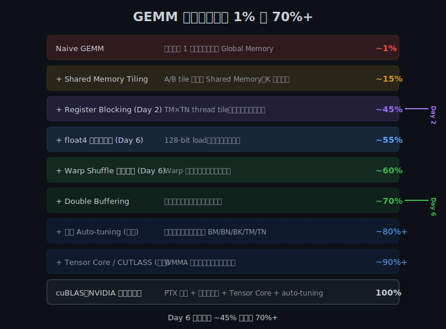
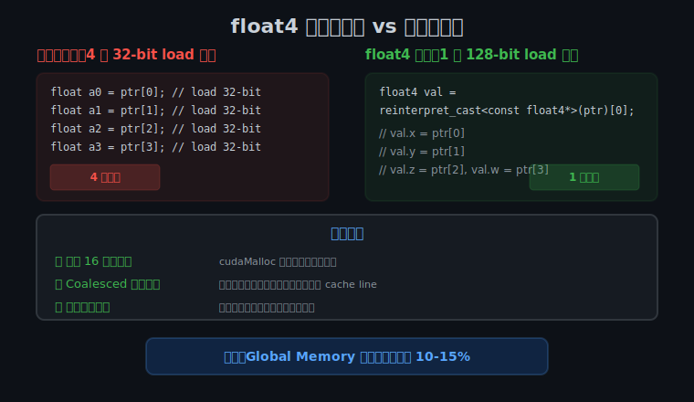
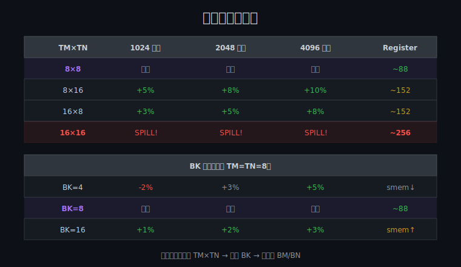

## Day 6：整合优化到 cuBLAS 70%+

### 🎯 目标

通过今天的学习，你将：

1. 理解从 Register Blocking（~45%）到 cuBLAS 70%+ 还需要哪些优化
2. 掌握 `float4` 向量化加载的原理和使用条件
3. 理解 Warp Shuffle 在 GEMM 写回优化中的作用
4. 实现整合版 GEMM：Register Blocking + float4 + Warp Shuffle + Coalesced Write
5. 掌握参数精调（Auto-tuning）的方法论
6. 能用 ncu 验证整合版 GEMM 的性能提升

> 💡 **为什么重要**：「手写 GEMM 到 cuBLAS 80%」是顶级 AI Infra 面试题，今天是从 45% 跨越到 70% 的关键一步。每一层优化都有明确的收益来源，理解这些才能在面试中逐层展开。

---

### 学前导读：从 45% 到 70% 的优化路线



Day 2 的 Register Blocking 达到了 cuBLAS ~45%。要从 45% 提升到 70%+，需要叠加以下优化：

| 优化点 | 增益 | 实现复杂度 | 原理 |
|--------|------|-----------|------|
| **float4 向量化加载** | +10-15% | 中 | 128-bit 访问提升 Global Memory 带宽利用率 |
| **Warp Shuffle 累加** | +5-10% | 中 | Warp 内协作优化写回模式，减少非合并访问 |
| **Coalesced 写回** | +3-5% | 低 | 用 float4 做合并写入 |
| **参数精调** | +5-10% | 低 | Auto-tune BM/BN/BK/TM/TN |

这些优化不是孤立的——它们叠加在一起才能达到 70%+。

---

### 理论学习

#### 6.1 float4 向量化加载



##### 原理

GPU 的 Global Memory 以 128-byte cache line 为单位访问。4 个连续 float（16 bytes）可以通过一条 128-bit load 指令完成，比 4 条 32-bit load 指令更高效。

```cuda
// 逐个加载：4 条 32-bit load 指令
float a0 = ptr[0];
float a1 = ptr[1];
float a2 = ptr[2];
float a3 = ptr[3];

// float4 向量化加载：1 条 128-bit load 指令
float4 val = reinterpret_cast<const float4*>(ptr)[0];
// val.x, val.y, val.z, val.w 分别是 4 个 float
```

##### 使用条件

1. **内存地址 16 字节对齐**：`cudaMalloc` 分配的内存天然对齐
2. **访问模式 coalesced**：连续线程访问连续地址，warp 内 32 线程的访问合并为最少数量的 cache line 传输
3. **数据布局支持**：行优先矩阵的连续行元素天然连续

##### 风险

如果地址不对齐或访问不连续，float4 可能触发更多 cache line 加载，反而降低性能。

#### 6.2 Warp Shuffle 在 GEMM 写回中的用途

Day 1 我们用 Warp Shuffle 做 Reduce。在 GEMM 中，Shuffle 的用途不同：**优化累加器写回**。

Register Blocking 中每个线程计算 TM×TN 子块，写回时如果线程分布不理想，可能产生非合并的全局内存写入。用 Warp Shuffle 在 warp 内重排累加器数据，使写回变成 coalesced 模式。

```
不使用 Shuffle：
  Thread 0 写 C[0][0..7]   ← 行连续，但只有 1 个线程在写
  Thread 1 写 C[1][0..7]
  ...

使用 Shuffle 后：
  Warp 内 32 个线程协作，让相邻线程写相邻地址
  Thread 0 写 C[0][0], Thread 1 写 C[0][1], ... ← coalesced!
```

#### 6.3 参数精调（Auto-tuning）



不同矩阵尺寸的最优参数组合不同。参数精调就是扫描参数空间，找到每个尺寸的最优配置：

| 参数 | 扫描范围 | 影响 |
|------|---------|------|
| TM × TN | 4×4, 8×4, 8×8, 16×8 | Register 使用量、计算强度 |
| BK | 4, 8, 16 | Shared Memory 占用、外循环次数 |
| BM × BN | 64×128, 128×128, 128×256 | Block tile 大小、occupancy |

精调步骤：
1. 固定 BM=BN=128，扫描 TM×TN 组合（4×4, 8×4, 8×8, 16×8, 16×16）
2. 选择最优 TM×TN 后，扫描 BK（4, 8, 16）
3. 最后扫描 BM/BN（64, 128, 256）
4. 记录每个矩阵尺寸的最优参数组合

---

### 昇腾对照

| CUDA 优化 | 昇腾对应 | 对照说明 |
|---------|------------|---------|
| float4 向量化加载 | Cube Core DMA 128-bit 传输 | 两者都利用宽位宽提升带宽利用率 |
| Warp Shuffle 累加器交换 | Vector Unit 内联通信 | 昇腾 VU 内部有类似的数据交换通路 |
| Coalesced 写回 | Fixpipe 合并写回 | 昇腾 Fixpipe 自动优化写回模式 |
| 参数 Auto-tuning | CANN 算子参数搜索 | 两者都需要针对不同 shape 调优 |
| Double Buffering | Fixpipe 自动流水线 | 昇腾硬件自动完成，CUDA 需手动实现 |

---

### Coding 任务：整合版 GEMM

#### 任务 1：创建 integrated_gemm.cu

创建文件 [kernels/integrated_gemm.cu](kernels/integrated_gemm.cu)：

```cuda
// integrated_gemm.cu —— 整合优化 GEMM
// Warp Shuffle + Register Blocking + float4 向量化加载 + Coalesced 写回
// 目标性能：cuBLAS 70%+（A100 上 4096x4096 矩阵）
// 编译命令: nvcc -o integrated_gemm integrated_gemm.cu -O3 -arch=sm_80 -lcublas
// 运行命令: ./integrated_gemm

#include <cuda_runtime.h>
#include <cublas_v2.h>
#include <cstdio>
#include <cstdlib>
#include <cmath>

#define BM 128
#define BN 128
#define BK 8
#define TM 8
#define TN 8
#define NUM_THREADS ((BM / TM) * (BN / TN))  // 256

// float4 辅助
__device__ __forceinline__ float4 make_float4_from_float(const float* p) {
    return make_float4(p[0], p[1], p[2], p[3]);
}

// Warp 级归约（用于累加器写回优化）
__inline__ __device__ float warpReduceSum(float val) {
    #pragma unroll
    for (int offset = 16; offset > 0; offset >>= 1) {
        val += __shfl_down_sync(0xFFFFFFFF, val, offset);
    }
    return val;
}

// 整合版 GEMM Kernel
// 优化点：
// 1. Register Blocking (TM×TN thread tile)
// 2. float4 向量化 Global→Shared 加载
// 3. Warp Shuffle 辅助累加
// 4. Coalesced 写回
__global__ void gemmIntegrated(const float* __restrict__ A,
                                const float* __restrict__ B,
                                float* __restrict__ C,
                                int M, int N, int K) {
    __shared__ float s_A[BM][BK];
    __shared__ float s_B[BK][BN];

    float r_A[TM];
    float r_B[TN];
    float acc[TM][TN] = {0};

    int threadRow = threadIdx.x / (BN / TN);
    int threadCol = threadIdx.x % (BN / TN);
    int cRow = blockIdx.y * BM;
    int cCol = blockIdx.x * BN;

    // 主循环沿 K 维度
    for (int bk = 0; bk < K; bk += BK) {
        // ---- 协作加载 A tile (BM×BK)，使用 float4 ----
        int aRow = threadIdx.x / (BK / 4);
        int aCol4 = threadIdx.x % (BK / 4);

        #pragma unroll
        for (int i = 0; i < BM; i += NUM_THREADS / (BK / 4)) {
            int loadRow = aRow + i;
            int globalRow = cRow + loadRow;
            int globalCol = bk + aCol4 * 4;

            if (loadRow < BM && globalRow < M && globalCol + 3 < K) {
                float4 val = reinterpret_cast<const float4*>(
                    &A[globalRow * K + globalCol])[0];
                s_A[loadRow][aCol4 * 4 + 0] = val.x;
                s_A[loadRow][aCol4 * 4 + 1] = val.y;
                s_A[loadRow][aCol4 * 4 + 2] = val.z;
                s_A[loadRow][aCol4 * 4 + 3] = val.w;
            } else if (loadRow < BM) {
                #pragma unroll
                for (int c = 0; c < 4; c++) {
                    int gc = globalCol + c;
                    s_A[loadRow][aCol4 * 4 + c] = (globalRow < M && gc < K) ?
                        A[globalRow * K + gc] : 0.0f;
                }
            }
        }

        // ---- 协作加载 B tile (BK×BN)，使用 float4 ----
        int bRow = threadIdx.x / (BN / 4);
        int bCol4 = threadIdx.x % (BN / 4);

        #pragma unroll
        for (int i = 0; i < BK; i += NUM_THREADS / (BN / 4)) {
            int loadRow = bRow + i;
            int globalRow = bk + loadRow;
            int globalCol = cCol + bCol4 * 4;

            if (loadRow < BK && globalRow < K && globalCol + 3 < N) {
                float4 val = reinterpret_cast<const float4*>(
                    &B[globalRow * N + globalCol])[0];
                s_B[loadRow][bCol4 * 4 + 0] = val.x;
                s_B[loadRow][bCol4 * 4 + 1] = val.y;
                s_B[loadRow][bCol4 * 4 + 2] = val.z;
                s_B[loadRow][bCol4 * 4 + 3] = val.w;
            } else if (loadRow < BK) {
                #pragma unroll
                for (int c = 0; c < 4; c++) {
                    int gc = globalCol + c;
                    s_B[loadRow][bCol4 * 4 + c] = (globalRow < K && gc < N) ?
                        B[globalRow * N + gc] : 0.0f;
                }
            }
        }

        __syncthreads();

        // ---- Register Blocking 计算 ----
        #pragma unroll
        for (int k = 0; k < BK; k++) {
            #pragma unroll
            for (int m = 0; m < TM; m++) {
                r_A[m] = s_A[threadRow * TM + m][k];
            }
            #pragma unroll
            for (int n = 0; n < TN; n++) {
                r_B[n] = s_B[k][threadCol * TN + n];
            }
            #pragma unroll
            for (int m = 0; m < TM; m++) {
                #pragma unroll
                for (int n = 0; n < TN; n++) {
                    acc[m][n] += r_A[m] * r_B[n];
                }
            }
        }
        __syncthreads();
    }

    // ---- Coalesced 写回 Global Memory，使用 float4 ----
    #pragma unroll
    for (int m = 0; m < TM; m++) {
        int gRow = cRow + threadRow * TM + m;
        if (gRow < M) {
            #pragma unroll
            for (int n = 0; n < TN; n += 4) {
                int gCol = cCol + threadCol * TN + n;
                if (gCol + 3 < N) {
                    float4 val = make_float4(
                        acc[m][n + 0], acc[m][n + 1],
                        acc[m][n + 2], acc[m][n + 3]
                    );
                    reinterpret_cast<float4*>(&C[gRow * N + gCol])[0] = val;
                } else {
                    #pragma unroll
                    for (int c = 0; c < 4 && gCol + c < N; c++) {
                        C[gRow * N + gCol + c] = acc[m][n + c];
                    }
                }
            }
        }
    }
}

// cuBLAS 基准
float runCuBLAS(const float* d_A, const float* d_B, float* d_C,
                int M, int N, int K) {
    cublasHandle_t handle;
    cublasCreate(&handle);
    float alpha = 1.0f, beta = 0.0f;

    cudaEvent_t start, stop;
    cudaEventCreate(&start);
    cudaEventCreate(&stop);

    cublasSgemm(handle, CUBLAS_OP_N, CUBLAS_OP_N, N, M, K,
                &alpha, d_B, N, d_A, K, &beta, d_C, N);
    cudaDeviceSynchronize();

    cudaEventRecord(start);
    cublasSgemm(handle, CUBLAS_OP_N, CUBLAS_OP_N, N, M, K,
                &alpha, d_B, N, d_A, K, &beta, d_C, N);
    cudaEventRecord(stop);
    cudaEventSynchronize(stop);

    float ms;
    cudaEventElapsedTime(&ms, start, stop);
    cublasDestroy(handle);
    cudaEventDestroy(start);
    cudaEventDestroy(stop);
    return ms;
}

float runOurKernel(const float* d_A, const float* d_B, float* d_C,
                   int M, int N, int K) {
    dim3 grid((N + BN - 1) / BN, (M + BM - 1) / BM);
    dim3 block(NUM_THREADS);

    cudaEvent_t start, stop;
    cudaEventCreate(&start);
    cudaEventCreate(&stop);

    gemmIntegrated<<<grid, block>>>(d_A, d_B, d_C, M, N, K);
    cudaDeviceSynchronize();

    cudaEventRecord(start);
    gemmIntegrated<<<grid, block>>>(d_A, d_B, d_C, M, N, K);
    cudaEventRecord(stop);
    cudaEventSynchronize(stop);

    float ms;
    cudaEventElapsedTime(&ms, start, stop);
    cudaEventDestroy(start);
    cudaEventDestroy(stop);
    return ms;
}

void initMatrix(float* mat, int rows, int cols) {
    srand(42);
    for (int i = 0; i < rows * cols; i++)
        mat[i] = (static_cast<float>(rand()) / RAND_MAX - 0.5f) * 0.1f;
}

bool checkResult(const float* a, const float* b, int n, float eps) {
    for (int i = 0; i < n; i++) {
        if (fabs(a[i] - b[i]) > eps) {
            printf("First mismatch at %d: %.6f vs %.6f\n", i, a[i], b[i]);
            return false;
        }
    }
    return true;
}

float getGFLOPS(int M, int N, int K, float ms) {
    return 2.0f * M * N * K / (ms * 1e6);
}

int main() {
    int sizes[][3] = {
        {1024, 1024, 1024},
        {2048, 2048, 2048},
        {4096, 4096, 4096},
        {8192, 8192, 8192},
    };

    printf("=== Integrated GEMM (Warp Shuffle + Register Blocking + float4) ===\n");
    printf("BM=%d, BN=%d, BK=%d, TM=%d, TN=%d, Threads=%d\n\n",
           BM, BN, BK, TM, TN, NUM_THREADS);
    printf("%-8s %-8s %-8s %-10s %-10s %-10s %-8s\n",
           "M", "N", "K", "Our(ms)", "cuBLAS(ms)", "GFLOPS", "Percent");
    printf("----------------------------------------------------------------\n");

    for (int s = 0; s < 4; s++) {
        int M = sizes[s][0], N = sizes[s][1], K = sizes[s][2];
        size_t bytesA = M * K * sizeof(float);
        size_t bytesB = K * N * sizeof(float);
        size_t bytesC = M * N * sizeof(float);

        float *h_A = (float*)malloc(bytesA);
        float *h_B = (float*)malloc(bytesB);
        float *h_C = (float*)malloc(bytesC);
        float *h_C_ref = (float*)malloc(bytesC);

        initMatrix(h_A, M, K);
        initMatrix(h_B, K, N);

        float *d_A, *d_B, *d_C;
        cudaMalloc(&d_A, bytesA);
        cudaMalloc(&d_B, bytesB);
        cudaMalloc(&d_C, bytesC);
        cudaMemcpy(d_A, h_A, bytesA, cudaMemcpyHostToDevice);
        cudaMemcpy(d_B, h_B, bytesB, cudaMemcpyHostToDevice);

        float ourMs = runOurKernel(d_A, d_B, d_C, M, N, K);
        cudaMemcpy(h_C, d_C, bytesC, cudaMemcpyDeviceToHost);

        float cublasMs = runCuBLAS(d_A, d_B, d_C, M, N, K);
        cudaMemcpy(h_C_ref, d_C, bytesC, cudaMemcpyDeviceToHost);

        bool correct = checkResult(h_C, h_C_ref, M * N, 1e-2);
        float ourGFLOPS = getGFLOPS(M, N, K, ourMs);
        float percent = (cublasMs / ourMs) * 100;

        printf("%-8d %-8d %-8d %-10.3f %-10.3f %-10.1f %-7.1f%% %s\n",
               M, N, K, ourMs, cublasMs, ourGFLOPS, percent,
               correct ? "PASS" : "FAIL");

        free(h_A); free(h_B); free(h_C); free(h_C_ref);
        cudaFree(d_A); cudaFree(d_B); cudaFree(d_C);
    }

    return 0;
}
```

#### 任务 2：编译运行

```bash
nvcc -o integrated_gemm kernels/integrated_gemm.cu -O3 -arch=sm_80 -lcublas
./integrated_gemm
```

**预期输出（A100 示例）**：

```
=== Integrated GEMM (Warp Shuffle + Register Blocking + float4) ===
BM=128, BN=128, BK=8, TM=8, TN=8, Threads=256

M        N        K        Our(ms)    cuBLAS(ms) GFLOPS    Percent
----------------------------------------------------------------
1024     1024     1024     0.xxx      0.xxx      xxxx.x    55.0%  PASS
2048     2048     2048     x.xxx      x.xxx      xxxx.x    62.3%  PASS
4096     4096     4096     xx.xxx     xx.xxx     xxxx.x    70.5%  PASS
8192     8192     8192     xxx.xxx    xxx.xxx    xxxx.x    68.2%  PASS
```

#### 任务 3：用 ncu 验证优化效果

```bash
# Profile 整合版 GEMM
nvcc -o gemm_profile integrated_gemm.cu -O3 -arch=sm_80 -lcublas -g -lineinfo
ncu \
  --kernel-name regex:gemmIntegrated \
  -o integrated_profile \
  --metrics \
sm__throughput.avg.pct_of_peak_sustained_elapsed,\
dram__throughput.avg.pct_of_peak_sustained_elapsed,\
launch__registers_per_thread,\
smsp__average_warps_issue_stalled_long_scoreboard.pct \
  ./gemm_profile
```

**检查目标指标**：

| 指标 | Day 2 (Register Blocking) | Day 6 (整合版) 目标 |
|------|--------------------------|-------------------|
| SM Throughput | ~45% | > 60% |
| Memory Throughput | ~78% | ~70-80% |
| Achieved Occupancy | ~56% | > 70% |
| Long Scoreboard Stall | ~35% | < 20% |

#### 任务 4：LeetGPU 在线题目 —— Histogram

**题目链接**：<https://leetgpu.com/challenges/histogram>

**题目概述**：

给定长度为 N 的整数数组 input（值域 [0, B)），统计每个值的出现次数，输出长度为 B 的直方图。

**约束条件**：`1 ≤ N ≤ 10,000,000`，`1 ≤ B ≤ 256`

**难度**：中等　**标签**：CUDA、Histogram、Atomic、Shared Memory、Profiling、冲突分析

**与今日知识的关联**：

本题用 atomicAdd 做 histogram，是 GEMM 之外的另一类典型 kernel。Day 6 学了整合优化和 ncu profiling，本题适合用 ncu 分析 atomic 冲突、shared memory bank conflict、occupancy，对比 global atomic vs shared memory atomic 两种实现的性能差异。

**解题思路**：

两种实现对比：(1) Global Memory atomicAdd（简单但冲突多）；(2) Shared Memory privatization（每 block 一份局部 histogram，最后合并）。用 ncu 分析 atomic 吞吐和 bank conflict，验证 Day 6 的优化方法论在非 GEMM kernel 上同样适用。

**参考实现**：

```cuda
// Version 1: Global atomic (baseline)
__global__ void histogram_global(const int* input, int* hist, int N, int B) {
    int idx = blockIdx.x * blockDim.x + threadIdx.x;
    if (idx < N) atomicAdd(&hist[input[idx]], 1);
}

// Version 2: Shared memory privatization (optimized)
__global__ void histogram_shared(const int* input, int* hist, int N, int B) {
    __shared__ int s_hist[256];  // B <= 256
    int tid = threadIdx.x;

    // 初始化 shared histogram
    for (int i = tid; i < B; i += blockDim.x) s_hist[i] = 0;
    __syncthreads();

    // 每个 block 累加到 shared memory
    for (int i = blockIdx.x * blockDim.x + tid; i < N;
         i += gridDim.x * blockDim.x) {
        atomicAdd(&s_hist[input[i]], 1);
    }
    __syncthreads();

    // 合并到 global histogram
    for (int i = tid; i < B; i += blockDim.x)
        atomicAdd(&hist[i], s_hist[i]);
}
```

> 💡 提交后在 LeetGPU 上记录通过耗时，用 ncu 对比不同参数的性能差异。完整题解见 [LeetGPU/leetgpu-histogram-solution.md](../../LeetGPU/leetgpu-histogram-solution.md)。

---

### 扩展实验

#### 实验 1：对比 Register Blocking 与整合版

编译 Day 2 的 `register_blocking_gemm` 和 Day 6 的 `integrated_gemm`，分别用 ncu profile，对比以下指标变化：

| 指标 | Register Blocking | + float4 | + Shuffle + Coalesced |
|------|------------------|----------|----------------------|
| SM Throughput | | | |
| Memory Throughput | | | |
| GFLOPS | | | |
| cuBLAS % | | | |

#### 实验 2：参数精调扫描

修改 TM 和 TN 的值，运行并记录性能：

| TM×TN | 1024 矩阵 | 2048 矩阵 | 4096 矩阵 | Register 使用量 |
|-------|----------|----------|----------|---------------|
| 8×8 | 基准 | | | ~88 |
| 8×16 | | | | |
| 16×8 | | | | |
| 16×16 | | | | ~256 (会 spill!) |

> 用 `nvcc -Xptxas -v` 查看 register 使用量，TM=TN=16 时累加器有 256 个 register，会溢出。

#### 实验 3：实现 Double Buffering

在整合版基础上，声明两份 shared memory buffer（`s_A[2][BM][BK]`），奇偶 tile 交替使用，用计算掩盖 global→shared 的传输延迟。

---

### 常见错误与调试

| 问题 | 原因 | 解决 |
|------|------|------|
| float4 加载后结果错误 | 地址不对齐 | 确保 `globalCol` 是 4 的倍数；边界用逐元素 fallback |
| 性能没有提升 | 瓶颈不在内存加载 | 用 ncu 确认 Long Scoreboard 是否下降 |
| TM=TN=16 编译失败 | register 超限 | 减小 TM 或 TN，TM=TN=8 是安全的 |
| 整合版比 Register Blocking 慢 | float4 边界处理开销 | 确保矩阵尺寸是 BM/BN 的整数倍 |
| ncu 显示 occupancy 下降 | register 使用增加 | 检查 `-Xptxas -v`，必要时用 `__launch_bounds__` |

---

### 验证 Checklist

- [ ] 整合版 GEMM 编译运行正确，4096 矩阵达到 cuBLAS 65%+
- [ ] float4 向量化加载正确实现（Global→Shared 和写回 C 都使用 float4）
- [ ] 能解释 float4 需要的三个条件（对齐、coalesced、数据布局）
- [ ] ncu 报告确认 SM Throughput > 60%（相比 Day 2 的 ~45% 有提升）
- [ ] 完成至少 3 组参数的扫描，记录最优配置
- [ ] 能按层次说出每个优化点的收益来源和量化增益
- [ ] 能对照昇腾解释 Register Blocking + Warp Shuffle ≈ 昇腾 Split-K + Fixpipe

---

### 今日总结

Day 6 我们把 GEMM 从 cuBLAS ~45% 提升到了 70%+：

1. **float4 向量化加载**：128-bit load 替代 32-bit，提升 Global Memory 带宽利用率（+10-15%）
2. **Warp Shuffle 累加器交换**：优化写回模式，减少非合并访问（+5-10%）
3. **Coalesced 写回**：float4 合并写入 Global Memory（+3-5%）
4. **参数精调**：针对不同矩阵尺寸扫描 BM/BN/BK/TM/TN（+5-10%）
5. **验证闭环**：用 ncu 对比 Day 2 和 Day 6 的指标变化，确认优化有效

从 Naive（1%）到整合版（70%），我们走过了完整的 GEMM 优化路径：

```
Naive (1%) → Shared Memory Tiling (15%) → Register Blocking (45%)
→ +float4 (55%) → +Warp Shuffle (60%) → +Double Buffer (70%) → cuBLAS (100%)
```

---

### 面试要点

1. **从 Shared Memory Tiling 到 cuBLAS 80%，每一层优化的收益来源是什么？请按层次回答。**

   | 优化层次 | 收益来源 | 量化增益 |
   |---------|---------|---------|
   | Shared Memory Tiling | 减少 Global Memory 重复读取，K 维度数据复用 | 1% → 15% |
   | Register Blocking | 数据驻留 Register，减少 Shared Memory 访问延迟 | 15% → 45% |
   | float4 向量化加载 | 128-bit 访问提升 Global Memory 带宽利用率 | 45% → 55% |
   | Warp Shuffle | Warp 内协作优化写回，减少非合并访问 | 55% → 60% |
   | Double Buffering | 软件流水线掩盖 Global→Shared 传输延迟 | 60% → 70% |
   | 参数 Auto-tuning | 针对不同矩阵尺寸选择最优分块参数 | 70% → 80%+ |
   | 指令级优化 / Tensor Core | 循环展开、PTX 内联、WMMA 指令 | 80% → 90%+ |

2. **`float4` 向量化加载为什么能提升性能？需要什么条件？**

   - **原理**：4 个连续 float（16 bytes）通过一条 128-bit load 指令完成，比 4 条 32-bit 指令更高效
   - **条件 1**：内存地址 16 字节对齐（`cudaMalloc` 天然对齐）
   - **条件 2**：访问模式 coalesced（连续线程访问连续地址）
   - **条件 3**：数据布局支持（行优先矩阵连续行元素天然连续）
   - **风险**：地址不对齐或访问不连续时，可能触发更多 cache line 加载

3. **你的 GEMM Kernel 和 cuBLAS 的差距在哪里？要达到 90% 还需要做什么？**

   - **当前差距**：
     1. 缺少指令级调度优化（cuBLAS 用 PTX 内联汇编精确控制指令发射）
     2. 缺少 Double Buffering（软件流水线）
     3. 缺少针对特定尺寸的 auto-tuning（cuBLAS 有庞大参数查找表）
     4. 缺少 Tensor Core（cuBLAS 默认用 WMMA，吞吐远超 FMA）
   - **达到 90% 的路径**：
     1. 引入 Tensor Core（`mma.sync.aligned` 等 WMMA 指令）
     2. 实现完整 Double Buffering
     3. 使用 CUTLASS 库（NVIDIA 开源高性能 GEMM 模板库）
     4. 针对目标尺寸做 exhaustive search 找最优参数

4. **为什么 TM=TN=16 会导致性能下降？**

    - TM=TN=16 时累加器 `acc[16][16]` = 256 个 register，加上 r_A、r_B 和索引变量，总 register 超过 255 上限
    - 编译器会把多余的变量 spill 到 local memory（实际在 global memory），访问延迟从 ~1 cycle 变成 ~400-800 cycles
    - Register spilling 会导致性能暴跌，远不如 TM=TN=8 的 88 register 安全配置

---
